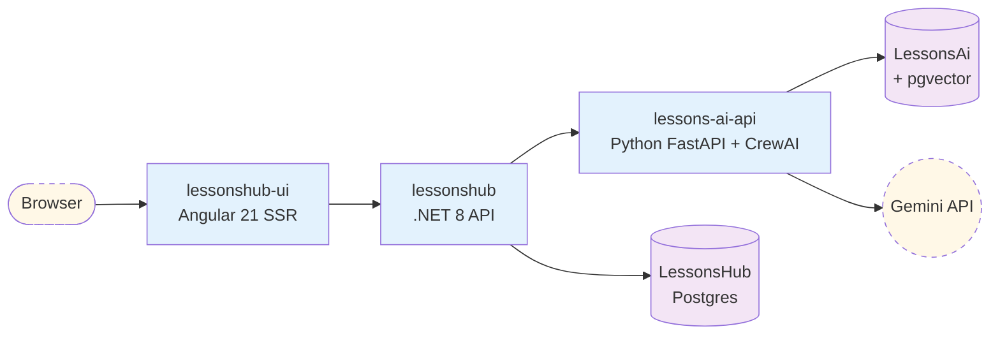

# LessonsHub

Generate personalized study plans on any topic with an AI, then walk through them lesson-by-lesson with exercises and feedback. The user describes what they want to learn (e.g. "Modern Angular 20+", "Spanish A2", "Distributed systems"); a curriculum agent designs the plan; per-lesson content, exercises, and reviews are generated on demand. Technical lessons are grounded in fresh framework documentation (analyzer agent → DDG search); language lessons branch on a *native vs. immersive* mode; user-uploaded books can ground any plan via RAG (pgvector).

> Looking for the documentation? Start at [diagrams/](diagrams/) — every diagram is a Mermaid block that GitHub renders inline. Or browse the same content on the [project Wiki](https://github.com/Dockdep/LessonsHub/wiki).

## Architecture at a glance

Three services + two Postgres databases. Users hit the Angular SSR frontend; the .NET API owns lesson/plan/share state; the Python AI service does all LLM work via CrewAI agents.



Full diagrams: [diagrams/01-cloud-architecture.md](diagrams/01-cloud-architecture.md).

## Repository layout

| Path | What |
|---|---|
| [`LessonsHub/`](LessonsHub/) | ASP.NET host — controllers, DI registration, JWT auth |
| [`LessonsHub.Application/`](LessonsHub.Application/) | Service facades, DTOs, abstractions, `ServiceResult<T>` |
| [`LessonsHub.Domain/`](LessonsHub.Domain/) | Entity classes (POCOs, no behaviour) |
| [`LessonsHub.Infrastructure/`](LessonsHub.Infrastructure/) | EF Core `DbContext`, repos, external clients, EF migrations |
| [`LessonsHub.Tests/`](LessonsHub.Tests/) | xUnit + SQLite-in-memory integration tests |
| [`lessonshub-ui/`](lessonshub-ui/) | Angular 21 SSR frontend (standalone components + signals) |
| [`lessons-ai-api/`](lessons-ai-api/) | Python FastAPI + CrewAI service |
| [`terraform/`](terraform/) | GCP infrastructure (Cloud Run × 3, Cloud SQL, GCS, WIF) |
| [`diagrams/`](diagrams/) | Mermaid architecture docs (auto-syncable to the Wiki) |
| [`scripts/`](scripts/) | Repo tooling — currently `sync-wiki.py` |
| [`docker-compose.example.yml`](docker-compose.example.yml) | Local-dev orchestration template |
| [`Caddyfile`](Caddyfile) | Local reverse-proxy config (single-origin for browser) |

## Getting started (local)

The local-dev setup runs all 3 services + Caddy + Postgres in containers. Browser hits `http://localhost`; Caddy splits `/api/*` to the .NET service and everything else to the Angular SSR.

1. Install [Docker Desktop](https://www.docker.com/products/docker-desktop/) (or Docker Engine + Compose).
2. Copy the compose template (it's gitignored to keep secrets out):
   ```bash
   cp docker-compose.example.yml docker-compose.yml
   ```
3. Fill in the placeholders — your local Postgres password, your Google OAuth client ID, and a JWT secret. Read the comments in the file for the why.
4. Start a local Postgres (one-time; not managed by compose so the data outlives `compose down`):
   ```bash
   docker run -d --name lessonshub-postgres \
     -e POSTGRES_USER=postgres -e POSTGRES_PASSWORD=<your-password> \
     -p 5432:5432 -v lessonshub-pg-data:/var/lib/postgresql/data \
     postgres:17
   ```
   Create both databases:
   ```bash
   docker exec -it lessonshub-postgres psql -U postgres \
     -c "CREATE DATABASE \"LessonsHub\"; CREATE DATABASE \"LessonsAi\";"
   ```
5. Bring everything up:
   ```bash
   docker compose up -d --build
   ```
6. Open [http://localhost](http://localhost). The .NET service auto-applies EF migrations on startup; the Python service bootstraps its `LessonsAi` tables via the FastAPI `lifespan` hook.

`docker compose down` to stop. `docker compose up --build` (no `-d`) to follow logs.

### Running individual services without Docker

Each project has its own README/instructions; see:

- [`LessonsHub/`](LessonsHub/) — `dotnet run` from the project directory.
- [`lessons-ai-api/`](lessons-ai-api/) — `uvicorn main:app --reload --port 8000` inside the project's `.venv`.
- [`lessonshub-ui/`](lessonshub-ui/) — `npm run dev:ssr` (or `ng serve` for SPA-only mode without SSR).

You'll need to set the cross-service URLs in env vars; the docker-compose values are the canonical reference.

## Tests

```bash
# .NET integration tests
dotnet test LessonsHub.sln

# Python unit/integration tests
cd lessons-ai-api && .venv/Scripts/python -m pytest tests/

# Angular type-check (no test runner wired up yet)
cd lessonshub-ui && npx tsc --noEmit -p tsconfig.json
```

## Documentation

- **[diagrams/](diagrams/)** — comprehensive Mermaid architecture documentation. Renders inline on GitHub. Per-tier deep-dives ([backend/](diagrams/backend/), [ai/](diagrams/ai/), [frontend/](diagrams/frontend/)) plus end-to-end flows ([flows/](diagrams/flows/)) and the RAG pipeline ([rag/](diagrams/rag/)).
- **[GitHub Wiki](https://github.com/Dockdep/LessonsHub/wiki)** — same content, mirrored from `diagrams/` via [scripts/sync-wiki.py](scripts/sync-wiki.py). Browseable, cross-linkable, and editable in the GitHub UI.
- **[diagrams/PROMPT.md](diagrams/PROMPT.md)** — the regeneration spec. Run when the codebase has drifted enough that the docs are misleading: `rm -rf diagrams/` and feed `PROMPT.md` to a coding agent.

To re-sync the Wiki after editing diagrams:

```bash
python scripts/sync-wiki.py            # commit locally for review
python scripts/sync-wiki.py --push     # publish to the Wiki
```

## Deployment

Production runs on Google Cloud Run (3 services) backed by Cloud SQL Postgres 17 (one instance, two logical databases) and a GCS bucket for uploaded documents. Infrastructure is fully Terraformed under [terraform/](terraform/); deploys are driven by [.github/workflows/deploy.yml](.github/workflows/deploy.yml) using Workload Identity Federation (no long-lived JSON keys).

For per-resource details and the WIF flow, see [diagrams/02-infrastructure-terraform.md](diagrams/02-infrastructure-terraform.md).

## Project conventions

See [CLAUDE.md](CLAUDE.md) for the workflow rules I follow when working on this codebase (plan-mode-by-default, repo + facade architecture, lessons captured in `.claude/tasks/lessons.md`, etc.).
