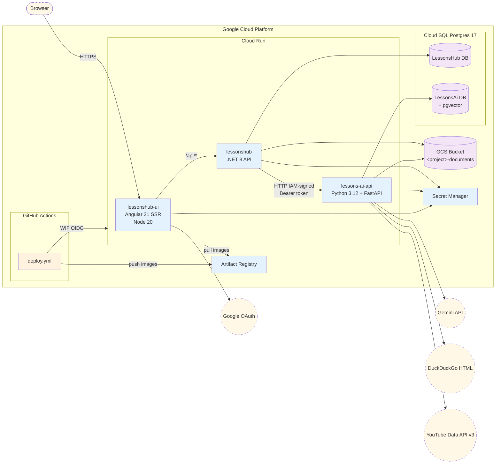
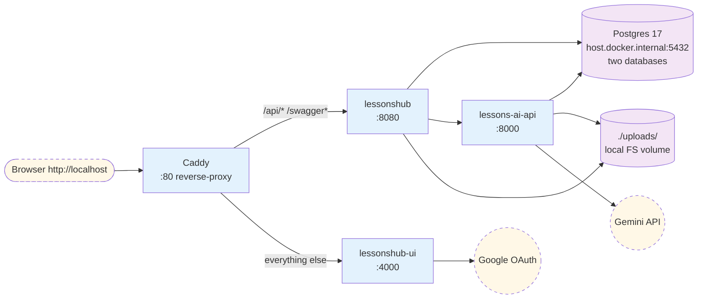
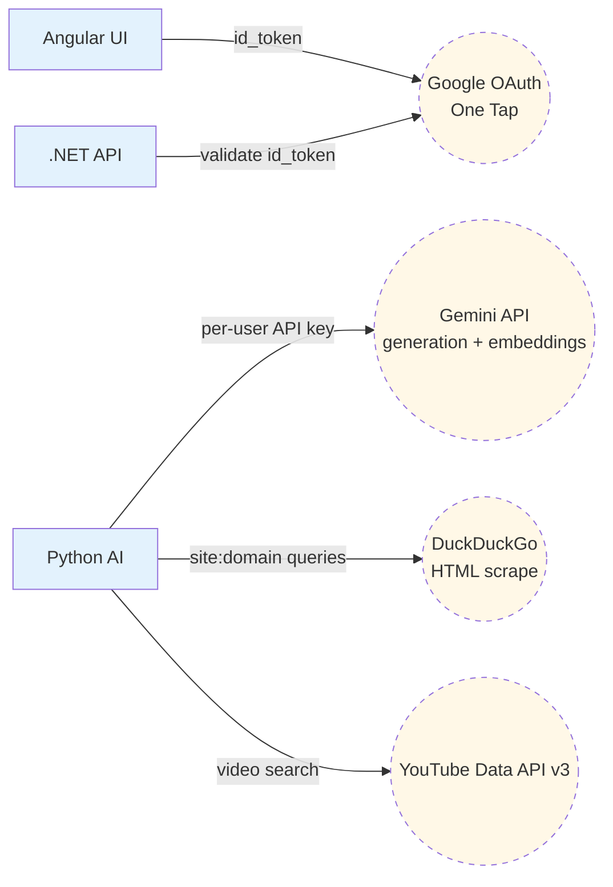
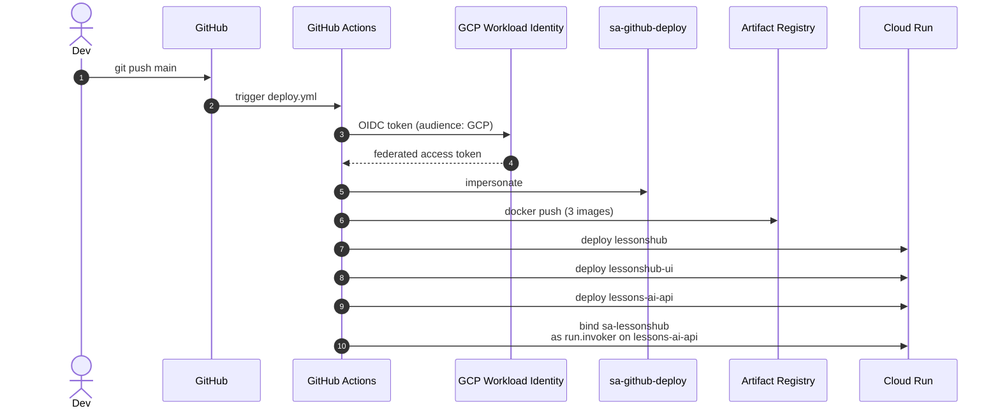

# 01 — Cloud Architecture

The runtime topology of LessonsHub. Three Cloud Run services, one Cloud SQL instance with two databases, one GCS bucket, and a handful of external integrations.

> **Source files**: [docker-compose.example.yml](../docker-compose.example.yml), [terraform/](../terraform/), [Caddyfile](../Caddyfile), [.github/workflows/deploy.yml](../.github/workflows/deploy.yml). For per-resource Terraform inventory see [02-infrastructure-terraform.md](02-infrastructure-terraform.md).

## Production topology (GCP)

**Notes**

- The Angular UI runs as Server-Side-Rendered Node, *not* as a static SPA. Browsers hit it directly for the initial render; subsequent calls are XHR.
- `.NET` → Python AI is **service-to-service** via a Google ID token (the .NET service uses `IamAuthHandler` to mint tokens; Cloud Run validates them). The AI service is not publicly reachable.
- All three Cloud Run services connect to Postgres via the **Cloud SQL Auth Proxy** (`/cloudsql/<instance>` Unix socket); no public-IP allowlist.
- Workload Identity Federation lets GitHub Actions impersonate `sa-github-deploy` *without* a long-lived JSON key.

## Local-dev topology (docker-compose)

For development on a laptop, the same containers run behind a Caddy reverse-proxy on `:80`. Postgres is a single instance the developer runs locally with two databases (`LessonsHub`, `LessonsAi`) — same shape as prod, different connection details.

**Routing rules** (verbatim from [Caddyfile](../Caddyfile)):

- `/api/*` → `lessonshub:8080` (the .NET API)
- `/swagger*` → `lessonshub:8080` (Swagger UI for the .NET API)
- everything else → `lessonshub-ui:4000` (Angular SSR)

The single-origin trick means the browser sees one host (`http://localhost`), so there are no CORS preflights. The Angular `/api/*` URLs work as-is.

## External integrations

| Integration | Used by | Purpose |
|---|---|---|
| Google OAuth (One Tap) | `lessonshub-ui` (issue) + `lessonshub` (validate via `IGoogleTokenValidator`) | Auth |
| Gemini (`google-genai` SDK) | `lessons-ai-api` | LLM calls (CrewAI agents) + text embeddings (`text-embedding-004`) |
| DuckDuckGo (`ddgs`) | `lessons-ai-api` (`tools/documentation_search.py`) | Free web search for Technical-lesson framework grounding |
| YouTube Data API | `lessons-ai-api` (`tools/youtube_search_tool.py`) | Video resource lookups |

## CI/CD pipeline

The WIF binding is locked to a single GitHub repo via an `attribute_condition` on the OIDC pool provider — other repos cannot mint tokens for this project even if they aim at the same audience. See [terraform/wif.tf](../terraform/wif.tf).
