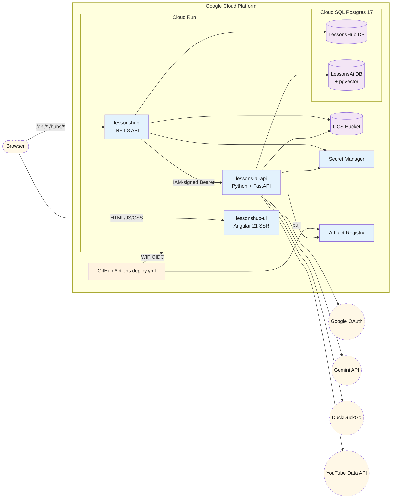
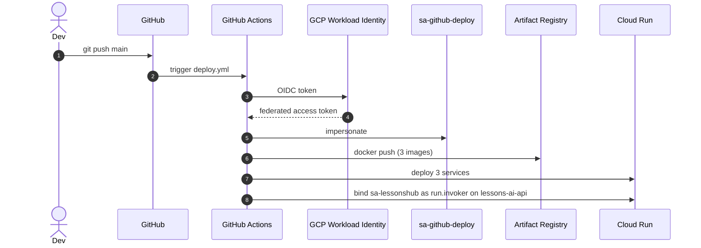

# 01 — Cloud Architecture

Three Cloud Run services, one Cloud SQL instance with two databases, one GCS bucket, and a handful of external integrations.

> **Source files**: [terraform/](../terraform/), [.github/workflows/deploy.yml](../.github/workflows/deploy.yml). For per-resource Terraform inventory see [02-infrastructure-terraform.md](02-infrastructure-terraform.md).

## Production topology

## Key facts

- **No reverse proxy in front of Cloud Run.** Each service has its own `*.a.run.app` URL. The Angular SSR server injects `API_BASE_URL` into rendered HTML as `<meta name="api-base-url">`; browser-side code reads it and prefixes `/api/*` and `/hubs/*` URLs. The browser talks **directly** to the API service cross-origin. CORS is configured on the .NET side with `AllowCredentials()` (required for SignalR negotiate).
- **`.NET → Python AI` is service-to-service** via a Google ID token (`IamAuthHandler` mints, Cloud Run validates). The AI service is not publicly reachable.
- **Postgres** is reached via the Cloud SQL Auth Proxy (Unix socket), no public-IP allowlist.
- The `lessonshub` service runs `--min-instances=1 --no-cpu-throttling --max-instances=1` because SignalR needs an always-warm CPU and the in-memory job queue can't span instances without a Redis backplane.
- **WIF** lets GitHub Actions impersonate `sa-github-deploy` without long-lived JSON keys, locked to a single repo via `attribute_condition`.

## External integrations

| Integration | Used by | Purpose |
| --- | --- | --- |
| Google OAuth (One Tap) | UI (issue) + .NET (validate) | Auth |
| Gemini (`google-genai`) | Python AI | LLM calls + embeddings (`text-embedding-004`) |
| DuckDuckGo (`ddgs`) | Python AI | Free web search for Technical-lesson framework grounding |
| YouTube Data API | Python AI | Video resource lookups |

## CI/CD pipeline

WIF binding is locked to a single GitHub repo via `attribute_condition` on the OIDC pool provider — see [terraform/wif.tf](../terraform/wif.tf).
