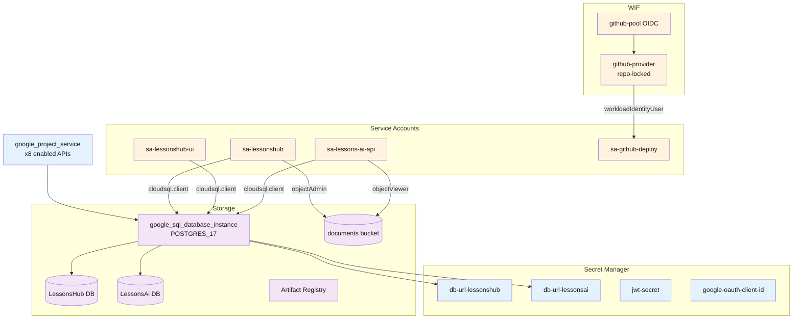
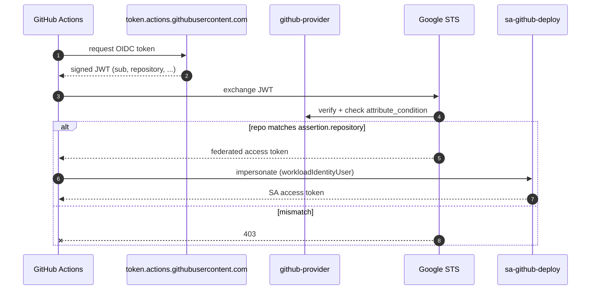

# 02 — Infrastructure (Terraform)

Per-resource inventory of [terraform/](../terraform/). All GCP resources are defined here; nothing is created by-hand in the GCP console.

> **Source files**: [terraform/](../terraform/) (apis.tf, cloud_sql.tf, secrets.tf, service_accounts.tf, wif.tf, document_storage.tf, artifact_registry.tf, main.tf, variables.tf, outputs.tf).

## Resource graph

## Cloud SQL

One `POSTGRES_17` instance with `deletion_protection = true`, daily backup, and query insights enabled. Two databases share a single `app` user with a 64-char `random_password` regenerated on apply:

- **`LessonsHub`** — .NET app data (entities, plans, lessons, exercises, shares, jobs). Schema migrated by EF Core on app startup.
- **`LessonsAi`** — Python AI data: `DocumentationCache`, `DocumentChunks` (pgvector). Schema bootstrapped by `init_schema()` calls.

Connection strings are composed in [terraform/secrets.tf](../terraform/secrets.tf) and stored in Secret Manager. Cloud Run reaches the instance via the Cloud SQL Auth Proxy (Unix socket); `ipv4_enabled = true` is required by Cloud SQL but no `authorized_networks` are set, so the public IP accepts zero connections.

## Service accounts and IAM

Four service accounts with role separation:

| SA | Roles |
| --- | --- |
| `sa-lessonshub` | `cloudsql.client`, `secretAccessor`, GCS `objectAdmin`, plus `run.invoker` on the AI service (bound by deploy workflow, not Terraform) |
| `sa-lessonshub-ui` | `cloudsql.client`, `secretAccessor` |
| `sa-lessons-ai-api` | `cloudsql.client`, `secretAccessor`, GCS `objectViewer` |
| `sa-github-deploy` | `run.admin`, `artifactregistry.writer`, `iam.serviceAccountUser`, `cloudsql.client` |

GCS access is asymmetric: the .NET service writes (uploads/deletes) and the Python service only reads (chunk + embed at ingest).

## Secret Manager

| Secret | Source | Consumer |
| --- | --- | --- |
| `db-url-lessonshub` | composed from SQL instance + user | .NET API (Npgsql) |
| `db-url-lessonsai` | composed from SQL instance + user | Python AI (asyncpg) |
| `jwt-secret` | `random_password` (64 chars) | .NET API (signs JWTs) |
| `google-oauth-client-id` | tfvars input | UI (One Tap) + .NET (validation) |

Secrets are injected into Cloud Run via `--set-secrets` at deploy time — the running container sees plain env vars, no SDK fetches at runtime.

## Workload Identity Federation

The `attribute_condition` (`assertion.repository == '${var.github_repo}'`) is the single line that stops other GitHub repos from minting tokens for this project even if audience and subject pattern match.

## What Terraform does NOT manage

- Cloud Run **services themselves** — created/updated by [.github/workflows/deploy.yml](../.github/workflows/deploy.yml). Terraform only sets up the SAs and IAM bindings they need.
- `sa-lessonshub` → `run.invoker` on the AI service — the AI service doesn't exist until the workflow runs, so the workflow adds it idempotently.
- DNS / custom domains, VPC, Cloud NAT — not currently used. Cloud Run ships `*.run.app` URLs and managed networking.
