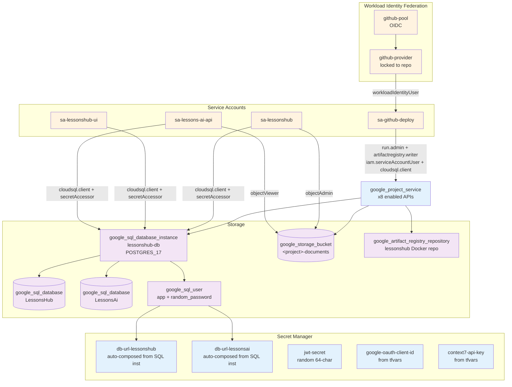
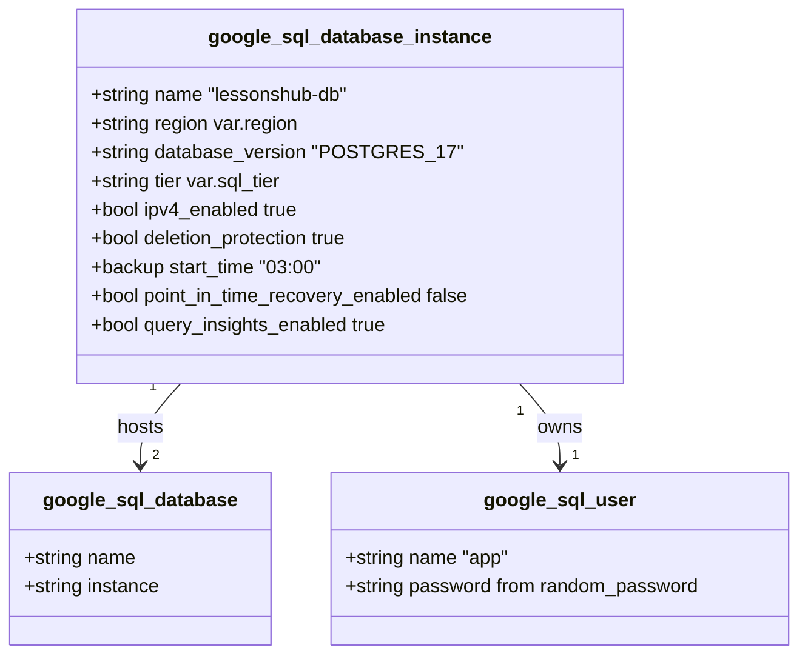
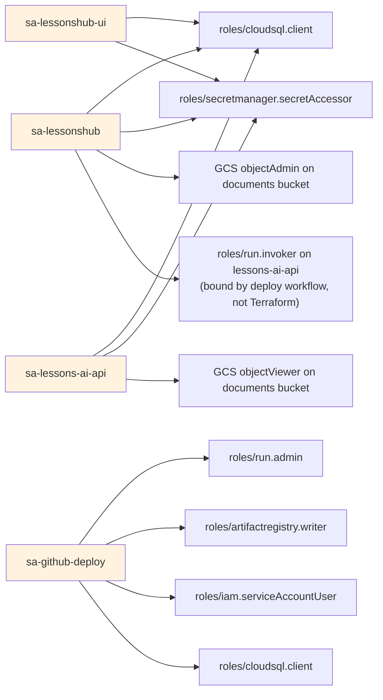
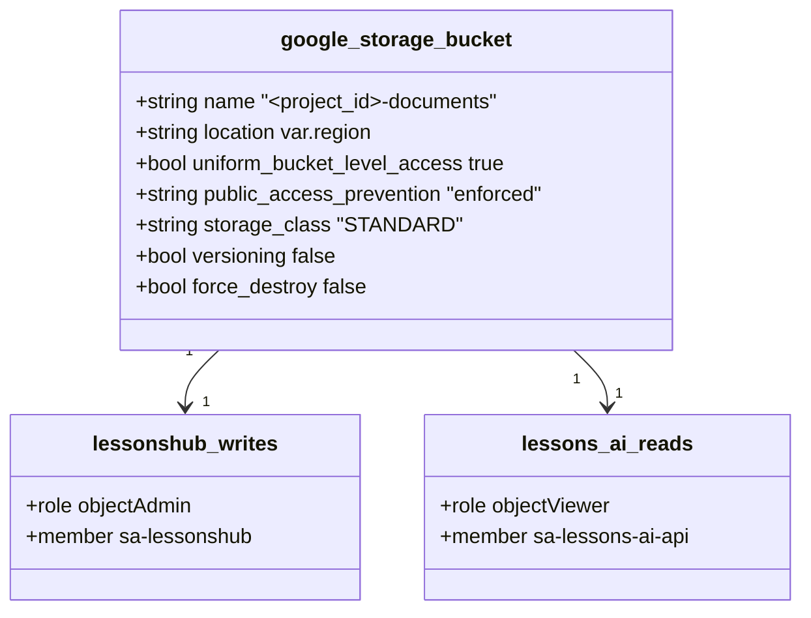
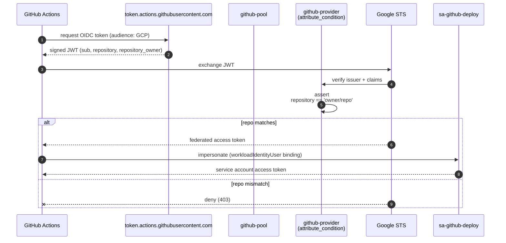

# 02 — Infrastructure (Terraform)

Per-resource inventory of [terraform/](../terraform/). All GCP resources for LessonsHub are defined here; nothing is created by-hand in the GCP console (except the initial GCP project).

> **Source files**: [terraform/apis.tf](../terraform/apis.tf), [terraform/cloud_sql.tf](../terraform/cloud_sql.tf), [terraform/secrets.tf](../terraform/secrets.tf), [terraform/service_accounts.tf](../terraform/service_accounts.tf), [terraform/wif.tf](../terraform/wif.tf), [terraform/document_storage.tf](../terraform/document_storage.tf), [terraform/artifact_registry.tf](../terraform/artifact_registry.tf), [terraform/main.tf](../terraform/main.tf), [terraform/variables.tf](../terraform/variables.tf), [terraform/outputs.tf](../terraform/outputs.tf).

## Resource graph

## Enabled APIs

[terraform/apis.tf](../terraform/apis.tf) toggles eight APIs:

| API | Why |
|---|---|
| `run.googleapis.com` | Cloud Run hosts the three services |
| `sqladmin.googleapis.com` | Cloud SQL provisioning |
| `artifactregistry.googleapis.com` | Docker image storage |
| `secretmanager.googleapis.com` | Per-service secret injection |
| `iamcredentials.googleapis.com` | SA impersonation (used by the .NET → AI invoker call) |
| `iam.googleapis.com` | Workload Identity Federation needs IAM admin |
| `sts.googleapis.com` | Federated token exchange (the OIDC step) |
| `cloudbuild.googleapis.com` | Triggered indirectly by `gcloud run deploy --source` if used |

`disable_on_destroy = false` so a `terraform destroy` doesn't yank APIs another project might share.

## Cloud SQL

Two databases on one instance:

- **`LessonsHub`** — the .NET app's data (entities, plans, lessons, exercises, shares, etc.). Schema migrated by EF Core on app startup.
- **`LessonsAi`** — the Python AI service's data: `DocumentationCache` (search-result cache), `DocumentChunks` (pgvector embeddings for RAG). Schema bootstrapped by `init_schema()` in [tools/doc_cache.py](../lessons-ai-api/tools/doc_cache.py) and [tools/rag_store.py](../lessons-ai-api/tools/rag_store.py).

Both databases share the *same* `app` user with a random 64-character password generated at apply time. Connection strings are composed in [terraform/secrets.tf](../terraform/secrets.tf) and stored in Secret Manager.

> **Why `ipv4_enabled = true` if there's no public access?** Cloud SQL refuses to provision without at least one connectivity option enabled. With no `authorized_networks` block, the public IP exists but accepts zero connections. Cloud Run reaches the instance via the Cloud SQL Auth Proxy (`/cloudsql/<instance>` Unix socket); local access uses `cloud-sql-proxy` with `gcloud` credentials.

## Service accounts and IAM

[terraform/service_accounts.tf](../terraform/service_accounts.tf) creates 4 SAs:

The `.NET → AI` `roles/run.invoker` binding is *not* in Terraform: the AI Cloud Run service is created by the deploy workflow (post-Terraform), so the deploy workflow adds that binding idempotently.

## GCS bucket for uploaded documents

[terraform/document_storage.tf](../terraform/document_storage.tf) — one regional bucket per project, used by the document-upload feature.

Asymmetric access by design: only the .NET service writes (uploads + deletes); the Python service only reads (chunk + embed at ingest).

## Secret Manager

[terraform/secrets.tf](../terraform/secrets.tf) creates five secret containers and writes initial versions:

| Secret | Source | Consumer |
|---|---|---|
| `db-url-lessonshub` | composed from Cloud SQL instance + db + user | `lessonshub` (.NET, Npgsql format) |
| `db-url-lessonsai` | composed from Cloud SQL instance + db + user | `lessons-ai-api` (asyncpg format) |
| `jwt-secret` | `random_password` (64 chars) | `lessonshub` (signs JWTs issued after Google login) |
| `google-oauth-client-id` | `var.google_oauth_client_id` (you provide via tfvars) | `lessonshub-ui` (One Tap) + `lessonshub` (token validation) |
| `context7-api-key` | `var.context7_api_key` | (legacy, unused after the framework-analyzer refactor; keep for now) |

Cloud Run services inject these via `--set-secrets` flags in the deploy workflow, so the running container only sees env vars — no SDK calls to fetch secrets at runtime.

## Workload Identity Federation (GitHub Actions)

[terraform/wif.tf](../terraform/wif.tf) — replaces long-lived JSON keys for CI/CD.

The `attribute_condition` (`assertion.repository == '${var.github_repo}'`) is what stops *any other GitHub repo* from minting tokens for this project, even if the audience and subject pattern match.

## Artifact Registry

[terraform/artifact_registry.tf](../terraform/artifact_registry.tf) — one Docker repository per project, in the same region as Cloud Run for fastest pulls. Repo ID `lessonshub`. The deploy workflow tags images as:

- `<region>-docker.pkg.dev/<project>/lessonshub/lessonshub:<sha>`
- `<region>-docker.pkg.dev/<project>/lessonshub/lessonshub-ui:<sha>`
- `<region>-docker.pkg.dev/<project>/lessonshub/lessons-ai-api:<sha>`

## State management

`main.tf` uses **local state** (`terraform.tfstate` + backup files committed to `.gitignore`). For multi-developer workflows, swap to a `gcs` backend block — the comment in [terraform/main.tf](../terraform/main.tf) outlines this.

## What Terraform does NOT manage

- The Cloud Run **services themselves** — created/updated by the deploy workflow ([.github/workflows/deploy.yml](../.github/workflows/deploy.yml)). Terraform only sets up the SAs and IAM bindings they need.
- The `.NET → AI` `run.invoker` binding — same reason (the AI service doesn't exist until the workflow runs).
- DNS / custom domains — not currently configured. Cloud Run ships `*.run.app` URLs.
- VPC / Cloud NAT — not used. All Cloud Run traffic is public-internet-routed via Cloud Run's managed networking.

## Variables ([variables.tf](../terraform/variables.tf))

| Variable | Default | Purpose |
|---|---|---|
| `project_id` | (required) | GCP project ID |
| `region` | (required) | GCP region for all resources |
| `sql_tier` | (required) | Cloud SQL machine tier (e.g. `db-f1-micro`) |
| `github_repo` | (required) | `owner/repo` for WIF binding |
| `google_oauth_client_id` | (required) | Stored as a secret |
| `context7_api_key` | "" | Legacy — unused post-refactor |

[terraform.tfvars.example](../terraform/terraform.tfvars.example) shows the expected shape; copy to `terraform.tfvars` (gitignored) and fill in.

## Outputs ([outputs.tf](../terraform/outputs.tf))

The deploy workflow consumes these to know what to deploy *into*:

- Cloud SQL instance connection name (for `--add-cloudsql-instances` flag).
- Service account emails (for `--service-account` flag per Cloud Run service).
- Artifact Registry repo URL (for `docker push`).
- Workload Identity provider full resource path (for `google-github-actions/auth`).
