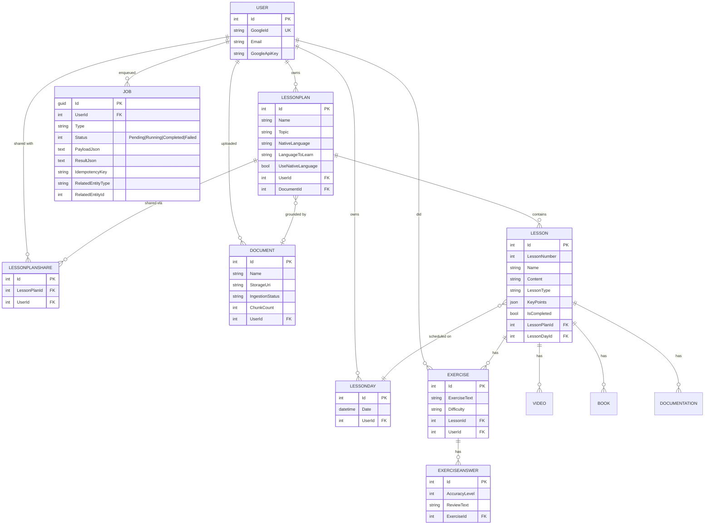
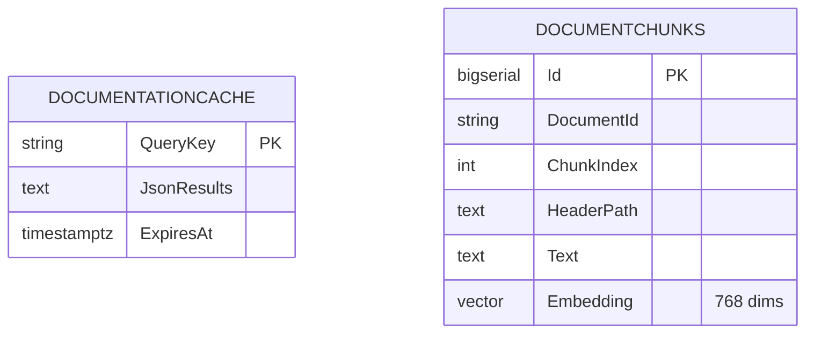

# 03 — Database

Two Postgres databases on the same Cloud SQL instance.

> **Source files**: [LessonsHub.Domain/Entities/](../LessonsHub.Domain/Entities/), [LessonsHub.Infrastructure/Migrations/](../LessonsHub.Infrastructure/Migrations/), [lessons-ai-api/tools/doc_cache.py](../lessons-ai-api/tools/doc_cache.py), [lessons-ai-api/tools/rag_store.py](../lessons-ai-api/tools/rag_store.py).

| Database | Owner | Schema source | Tables |
| --- | --- | --- | --- |
| `LessonsHub` | .NET API | EF Core migrations | 14 entity tables + `__EFMigrationsHistory` |
| `LessonsAi` | Python AI | `CREATE TABLE IF NOT EXISTS` at startup | 2 tables + pgvector extension |

The two services intentionally do not share a database — separation at the storage layer mirrors the deployment-tier separation.

## `LessonsHub` (.NET app)

### Notable schema decisions

- **Per-user `Exercise` and `ExerciseAnswer`**: a borrower's exercises belong to them, not the plan owner. `Exercise.UserId` is required.
- **Per-user `LessonDay`**: the calendar entry is the user's, not the plan's. Two users scheduling the same lesson on the same date end up with two `LessonDay` rows.
- **`Document.StorageUri`** is opaque (`gs://bucket/path` in prod). Only the storage service interprets it.
- **Cascade deletes**: `LessonPlan` → `Lessons` → `Exercises`/`Videos`/`Books`/`Documentation`. `LessonDay` rows that become empty after a plan delete are cleaned up explicitly by `LessonPlanService`.
- **`Job` table**: persists the SignalR background-work pipeline. Filtered unique index on `(UserId, Type, IdempotencyKey)` for idempotency dedupe (excludes NULL keys). Indexed on `(UserId, Status)` for the in-flight UI banner.
- **`KeyPoints` on `Lesson`** is `jsonb` — EF Core handles serialization, no side-table.

EF auto-applies migrations on app startup ([Program.cs](../LessonsHub/Program.cs)).

## `LessonsAi` (Python AI service)

The AI service treats the .NET `Document.Id` as opaque text — no foreign key, no cross-DB referential integrity. Each service evolves its storage independently.

- **`DocumentationCache`** is a flat KV cache for DDG framework-grounding results. `QueryKey` is `q|<lowercased query>`. TTL = 30 days; reads past `ExpiresAt` force a re-fetch. Bypassed per-request via `bypassDocCache: true`.
- **`DocumentChunks`** (pgvector) holds embedded chunks of user-uploaded documents. Embeddings are 768-dim because the embedder uses Gemini `text-embedding-004`. Indexes: B-tree on `DocumentId`, HNSW with `vector_cosine_ops` on the embedding column. Re-ingest is `DELETE`+`INSERT` (replace, not upsert).

The `lifespan` hook calls `init_schema()` on FastAPI startup — idempotent `CREATE TABLE IF NOT EXISTS` for both tables. No migration history; backwards-incompatible changes are applied manually then reflected in the `CREATE TABLE`.
