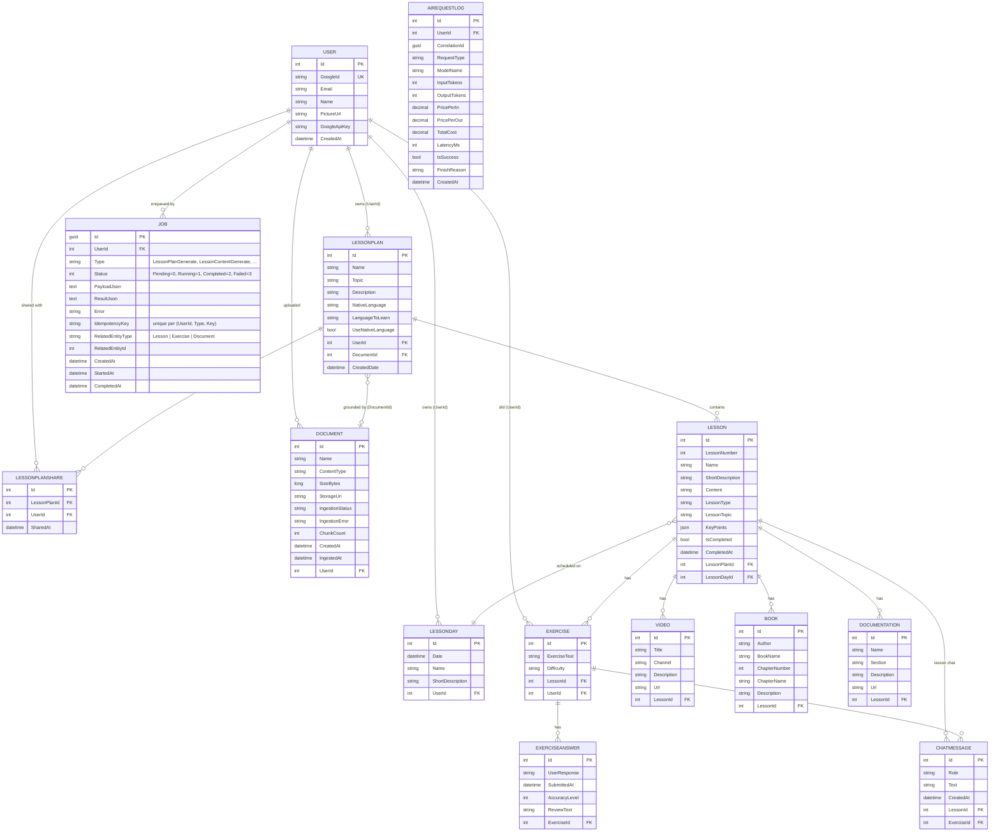
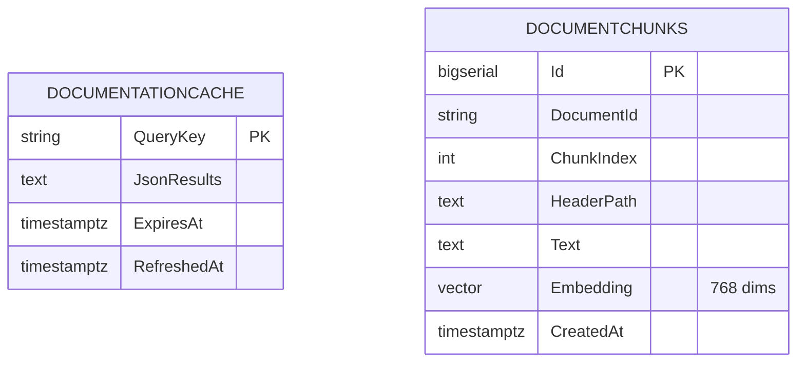
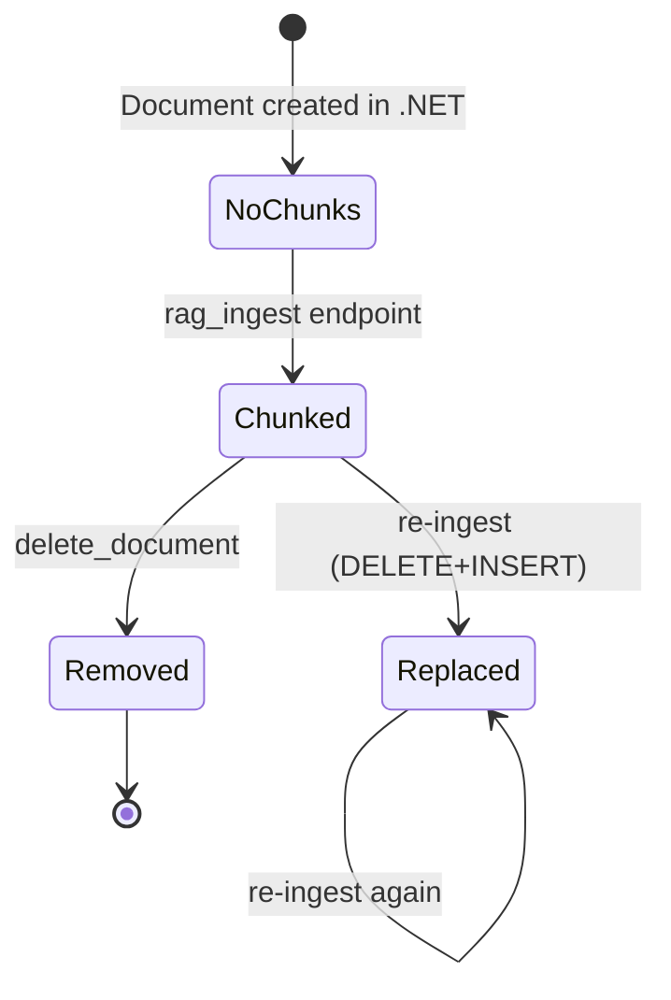

# 03 — Database

Two Postgres databases, both on the same Cloud SQL instance.

> **Source files**: [LessonsHub.Domain/Entities/](../LessonsHub.Domain/Entities/), [LessonsHub.Infrastructure/Migrations/](../LessonsHub.Infrastructure/Migrations/), [lessons-ai-api/tools/doc_cache.py](../lessons-ai-api/tools/doc_cache.py), [lessons-ai-api/tools/rag_store.py](../lessons-ai-api/tools/rag_store.py).

| Database | Owned by | Schema source | Tables |
|---|---|---|---|
| **`LessonsHub`** | `.NET` API | EF Core migrations | 14 entity tables (User, LessonPlan, Lesson, …, Job) + 1 history table (`__EFMigrationsHistory`) |
| **`LessonsAi`** | Python AI service | Raw asyncpg `CREATE TABLE IF NOT EXISTS` at startup | 2 tables: `DocumentationCache`, `DocumentChunks` (+ pgvector extension) |

The two services intentionally do *not* share a database — separation of concerns at the storage layer mirrors the deployment-tier separation.

---

## Database 1: `LessonsHub` (.NET app)

### ER diagram



### Notable schema decisions

- **`KeyPoints` on `Lesson`** is stored as JSON (Postgres `jsonb`) — EF Core handles serialization. Avoids a side-table for what's effectively a tag list.
- **Per-user exercises**: `Exercise.UserId` is required. When a borrower (someone the plan was shared with) generates an exercise, the new row is *theirs*, not the owner's. Same applies to `ExerciseAnswer` (cascaded via `Exercise`).
- **Per-user `LessonDay`**: a "day" is the user's calendar entry, not the plan's. Two users scheduling the same lesson on the same date end up with two `LessonDay` rows. See [LessonDay.cs](../LessonsHub.Domain/Entities/LessonDay.cs).
- **`Lesson.LessonDayId`** is *shared* across users despite `LessonDay` being per-user. Practical effect: only the plan owner can assign/unassign a lesson today, so this is consistent. A future per-user-assignment redesign would split this.
- **`Document.StorageUri`** is opaque: `gs://bucket/path` in GCS prod, `file:///abs/path` in local-dev. Only the storage layer ([LocalDocumentStorage.cs](../LessonsHub.Infrastructure/Services/LocalDocumentStorage.cs), [GcsDocumentStorage.cs](../LessonsHub.Infrastructure/Services/GcsDocumentStorage.cs)) and the Python RAG service interpret it.
- **Cascade behaviour**: deleting a `LessonPlan` cascades to its `Lessons`, which cascades to their `Exercises`/`Videos`/`Books`/`Documentation` (configured in `LessonsHubDbContext.OnModelCreating`). `LessonDay` rows that become empty after a plan delete are *not* auto-deleted by the DB — `LessonPlanService.DeleteAsync` cleans them up explicitly.
- **`Job` table**: persists the SignalR-driven background work pipeline. Filtered unique index on `(UserId, Type, IdempotencyKey)` lets the same client click coalesce to one job (the index excludes NULL keys so a missing header doesn't conflict with anything). Indexed on `(UserId, Status)` for the in-flight UI banner. See [backend/04-infrastructure.md](backend/04-infrastructure.md) for the executor/queue pipeline.

### Migration history

EF migrations recording the schema's evolution (most recent on top):

| Migration | What |
|---|---|
| `20260428161435_AddJobs` | `Jobs` table for the SignalR background-work pipeline (status, payload/result JSON, idempotency key) |
| `20260427193026_AddLanguageToLearnAndUseNativeLanguage` | New columns on `LessonPlan` for Language-lesson translation toggle |
| `20260427150037_MigrateDocumentLessonTypeToDefault` | Old "Document" lesson type → "Default" (orthogonalized doc grounding) |
| `20260427125723_AddLessonPlanDocumentId` | `LessonPlan.DocumentId` FK to `Document` |
| `20260427065237_AddDocuments` | New `Documents` table |
| `20260426163243_RemoveDocumentationCache` | Moved doc-cache to the AI service's database |
| `20260419214655_AddDocumentationCache` | (since reverted) initial doc-cache table on .NET side |
| `20260419205035_AddLessonPlanShareAndExerciseUserId` | Sharing + per-user exercises |
| `20260419204257_AddUserIdToLessonDay` | Per-user calendar |
| `20260419202145_AddGoogleApiKeyToUser` | Per-user Gemini key field |
| (earlier) | Initial entity model + indexes |

EF auto-applies migrations at startup ([Program.cs:174-194](../LessonsHub/Program.cs)).

---

## Database 2: `LessonsAi` (Python AI service)

### ER diagram



### Why no foreign keys

The AI service treats the .NET `Document.Id` as **opaque text**. It never validates it; it doesn't try to enforce referential integrity across databases (both the schema and the connection are scoped per-service). This is intentional — it lets the Python service evolve its storage independently.

### `DocumentationCache`

A flat key-value cache for web-search results (DDG queries from the framework analyzer + their fetched page content).

- **`QueryKey`** is a string like `q|<lowercased trimmed analyzer-produced query>`. See `_query_cache_key` in [tools/documentation_search.py](../lessons-ai-api/tools/documentation_search.py).
- **`JsonResults`** is a JSON-serialized list of `{url, title, content_excerpt}`.
- **TTL** = 30 days (`doc_cache_ttl_days` in [config.py](../lessons-ai-api/config.py)). Reads after `ExpiresAt` return `None` → forces a re-fetch. The user can also force-bypass per request via `bypassDocCache: true` on the lesson request body.

### `DocumentChunks` (pgvector)

Chunked + embedded text from user-uploaded documents.

- **`DocumentId`** is the `Document.Id` from the .NET DB, treated as a string.
- **`Embedding vector(768)`** — 768 dims because the embedder uses Gemini `text-embedding-004` (see [tools/rag_embedder.py](../lessons-ai-api/tools/rag_embedder.py)). Changing the embedding model means a new `EMBEDDING_DIM` and a re-ingest of all documents.
- **Indexes**:
  - `IX_DocumentChunks_DocumentId` (B-tree) — most queries scope to one document.
  - `IX_DocumentChunks_Embedding_HNSW` (HNSW with `vector_cosine_ops`) — fast cosine similarity.
- **Replace, not upsert**: re-ingesting a document `DELETE`s all its existing chunks and `INSERT`s the new ones. See `upsert_chunks` in [tools/rag_store.py](../lessons-ai-api/tools/rag_store.py).

### Schema bootstrap

The Python service bootstraps both tables on FastAPI startup via the `lifespan` hook:

```python
async def lifespan(app: FastAPI):
    await init_doc_cache_schema()   # CREATE TABLE IF NOT EXISTS DocumentationCache
    await init_rag_schema()         # CREATE EXTENSION vector + CREATE TABLE IF NOT EXISTS DocumentChunks
    yield
```

Idempotent — safe to call repeatedly. No EF-style migration history; if a schema change ever needs to be backwards-incompatible, do it manually then update the `CREATE TABLE` statement.

### Lifecycle


