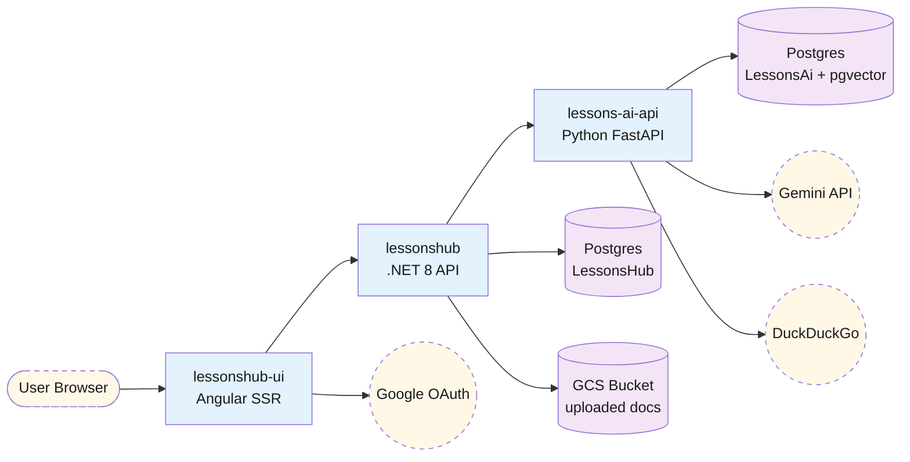
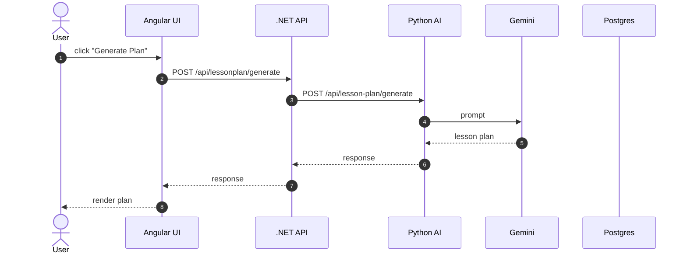
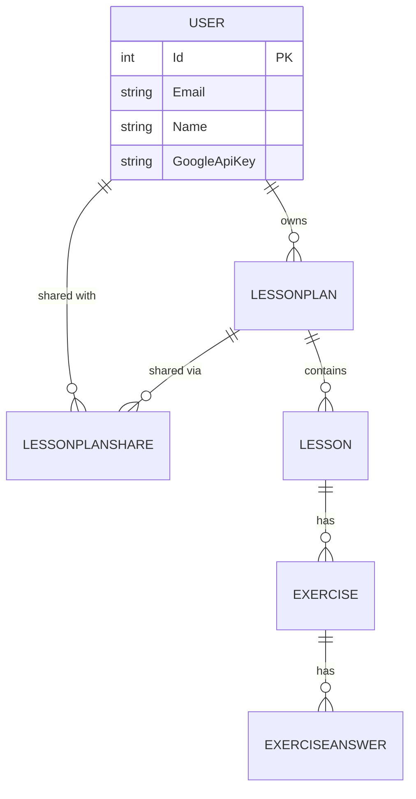
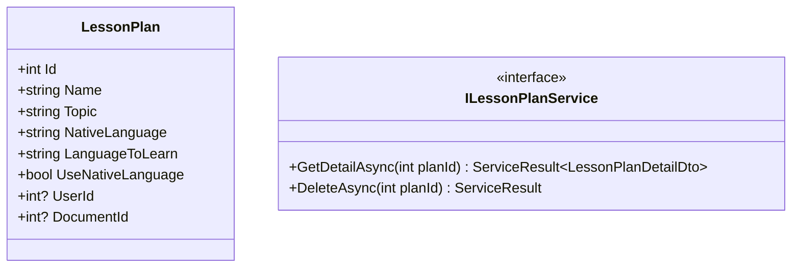
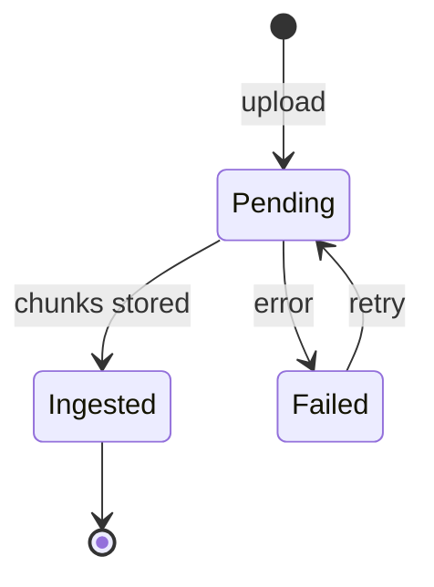

# Documentation Generation Prompt

This file is the spec for regenerating the `diagrams/` folder. Hand it to a coding agent (or feed it to a future Claude session) when the codebase has drifted enough that the docs are misleading. The agent should:

1. Read this prompt end-to-end before writing anything.
2. Delete the existing `diagrams/` folder (`rm -rf diagrams/`). Do not edit in place — stale docs hide drift.
3. Produce the file tree below using **only Mermaid for diagrams**. No images, no PlantUML, no SVG export.
4. Run the self-check at the bottom before declaring done.

---

## Goal

Produce a complete, **mermaid-only**, navigable architecture documentation for LessonsHub — a multi-tier educational app:

- **Backend** (`LessonsHub*.csproj`) — .NET 8 + EF Core + PostgreSQL. Repo + facade architecture (`ServiceResult<T>` returns, `ICurrentUser`, no UnitOfWork).
- **AI service** (`lessons-ai-api/`) — Python FastAPI + CrewAI agents + Pydantic + pgvector RAG.
- **Frontend** (`lessonshub-ui/`) — Angular 21 + standalone components + signals + SSR.
- **Infra** — Terraform → GCP (Cloud Run × 3, Cloud SQL Postgres 17, GCS, Secret Manager, Artifact Registry, Workload Identity Federation for GitHub Actions).

The docs must let a new contributor understand **how a lesson is generated** without reading code first.

---

## Folder layout

```
diagrams/
├── README.md                           # Index + how-to-render + style guide (classDef conventions)
├── PROMPT.md                           # This file — keeps regeneration repeatable
├── 01-cloud-architecture.md            # Cloud Run × 3, Caddy local proxy, Cloud SQL, GCS, external integrations
├── 02-infrastructure-terraform.md      # Per-resource inventory of terraform/*.tf
├── 03-database.md                      # ER diagrams for both Postgres DBs (LessonsHub + LessonsAi)
├── frontend/
│   ├── README.md                       # Tier index
│   ├── 01-architecture.md              # Standalone components, signals, SSR config, Material, interceptors/guards
│   ├── 02-routing.md                   # Route table + authGuard + lazy chunks
│   ├── 03-components.md                # Component graph: 8 pages + 5 dialogs (graph + per-component class diagram)
│   ├── 04-services.md                  # 8 services + LessonDataStore + endpoint mapping
│   ├── 05-models.md                    # Class diagram of TypeScript interfaces
│   └── 06-flows.md                     # Login, generate plan, edit lesson, share, schedule, upload doc
├── backend/
│   ├── README.md                       # Tier index
│   ├── 01-architecture.md              # 4-project DI graph (Domain/Application/Infrastructure/API), startup
│   ├── 02-domain-model.md              # Entities + relationships
│   ├── 03-application-layer.md         # I*Service interfaces, ServiceResult<T>, ICurrentUser, mappers
│   ├── 04-infrastructure.md            # DbContext, RepositoryBase + I*Repository, GoogleTokenValidator, AI clients
│   ├── 05-api-controllers.md           # 7 controllers, endpoints, ToActionResult mapping
│   └── 06-flows.md                     # Auth, plan CRUD, lesson edit, sharing, document upload
├── ai/
│   ├── README.md                       # Tier index
│   ├── 01-architecture.md              # FastAPI layering: routes → services → crews → agents/tasks → tools
│   ├── 02-endpoints.md                 # 8 endpoints + Pydantic request/response models
│   ├── 03-services-and-crews.md        # 4 services + 6 crews + framework_analysis_crew + quality retry loop
│   ├── 04-agents.md                    # 8 agent personas + role/goal/backstory pattern
│   └── 05-tools.md                     # documentation_search, rag_*, doc_cache, doc_storage, document_context, youtube_search_tool
├── flows/
│   ├── README.md
│   ├── lesson-plan-default.md          # Default plan generation (no grounding)
│   ├── lesson-plan-technical.md        # Technical: + framework analyzer + DDG search + quality loop
│   ├── lesson-plan-language.md         # Language: + native vs target language toggle
│   ├── lesson-content-default.md
│   ├── lesson-content-technical.md
│   ├── lesson-content-language.md
│   ├── exercise-generate.md
│   ├── exercise-retry.md
│   ├── exercise-review.md
│   └── resources.md
└── rag/
    ├── README.md
    ├── ingest.md                       # Upload → chunk → embed → pgvector upsert
    └── search.md                       # Lesson topic → query embed → cosine search → format chunks
```

---

## Source-of-truth file map

For each output doc, these are the input files an agent must read first:

| Output doc | Source files (read these before writing) |
|---|---|
| `01-cloud-architecture.md` | `docker-compose.example.yml`, `terraform/`, `.github/workflows/deploy.yml`, `Caddyfile` |
| `02-infrastructure-terraform.md` | `terraform/*.tf` (apis, cloud_sql, secrets, service_accounts, wif, document_storage, artifact_registry) |
| `03-database.md` | `LessonsHub.Domain/Entities/*.cs`, `LessonsHub.Infrastructure/Migrations/*.cs`, `lessons-ai-api/tools/doc_cache.py`, `lessons-ai-api/tools/rag_store.py` |
| `backend/01-architecture.md` | `LessonsHub.sln`, `LessonsHub/Program.cs`, `LessonsHub/Extensions/DependencyInjection.cs` |
| `backend/02-domain-model.md` | `LessonsHub.Domain/Entities/*.cs` |
| `backend/03-application-layer.md` | `LessonsHub.Application/Abstractions/*.cs`, `LessonsHub.Application/Services/*.cs`, `LessonsHub.Application/Models/*.cs`, `LessonsHub.Application/Mappers/*.cs` |
| `backend/04-infrastructure.md` | `LessonsHub.Infrastructure/Data/*.cs`, `LessonsHub.Infrastructure/Repositories/*.cs`, `LessonsHub.Infrastructure/Services/*.cs`, `LessonsHub.Infrastructure/Auth/*.cs`, `LessonsHub.Infrastructure/Realtime/*.cs` (SignalR hub, channel queue, background worker, executor registry), `LessonsHub.Application/Services/Executors/*.cs`, `LessonsHub/Program.cs` (HTTP pipeline + resilience + SignalR + JWT-via-querystring for hub handshake) |
| `backend/05-api-controllers.md` | `LessonsHub/Controllers/*.cs`, `LessonsHub/Extensions/ServiceResultExtensions.cs` |
| `backend/06-flows.md` | All controllers + their service implementations |
| `ai/01-architecture.md` | `lessons-ai-api/main.py`, `routes/__init__.py` |
| `ai/02-endpoints.md` | `lessons-ai-api/routes/lessons.py`, `routes/rag.py`, `models/requests.py`, `models/responses.py` |
| `ai/03-services-and-crews.md` | `lessons-ai-api/services/*.py`, `crews/*.py` |
| `ai/04-agents.md` | `lessons-ai-api/agents/*.py`, `agents/utils.py`, `templates/agents/*.jinja2` |
| `ai/05-tools.md` | `lessons-ai-api/tools/*.py` |
| `frontend/01-architecture.md` | `lessonshub-ui/src/app/app.config.ts`, `app.config.server.ts` |
| `frontend/02-routing.md` | `lessonshub-ui/src/app/app.routes.ts`, `guards/auth.guard.ts`, `interceptors/*.ts` |
| `frontend/03-components.md` | `lessonshub-ui/src/app/*/` (each page folder) |
| `frontend/04-services.md` | `lessonshub-ui/src/app/services/*.ts` |
| `frontend/05-models.md` | `lessonshub-ui/src/app/models/*.ts` |
| `frontend/06-flows.md` | Synthesized from components + services |
| `flows/lesson-plan-*.md` | `routes/lessons.py:generate_lesson_plan`, `services/curriculum_service.py`, `crews/curriculum_crew.py`, `crews/framework_analysis_crew.py`, `templates/tasks/lesson_plan_*.jinja2`, plus the C# side: `LessonPlanService.GenerateAsync`, `LessonsAiApiClient.GenerateLessonPlanAsync` |
| `flows/lesson-content-*.md` | Same shape, but `run_content_crew` and `lesson_content_*.jinja2` plus `LessonService.GetDetailAsync` (lazy generation) and `LessonService.RegenerateContentAsync` |
| `flows/exercise-*.md` | `crews/exercise_crew.py`, `crews/review_crew.py`, `templates/tasks/exercise_*.jinja2`, `ExerciseService.cs` |
| `flows/resources.md` | `crews/research_crew.py`, `templates/tasks/resource_research_*.jinja2` |
| `rag/ingest.md` | `routes/rag.py:rag_ingest`, `tools/rag_chunker.py`, `tools/rag_embedder.py`, `tools/rag_store.py:upsert_chunks`, plus C# `DocumentsController` + `DocumentService` (the upload trigger) |
| `rag/search.md` | `routes/rag.py:rag_search_endpoint`, `tools/rag_store.py:search`, `tools/document_context.py`, plus `crews/content_crew.py:_fetch_document_context` for the consumer side |

---

## Mermaid recipes (copy-pasteable)

### Architecture overview (flowchart)

````

````

### Sequence diagram (flow)

````

````

### ER diagram

````

````

### Class diagram (entities or services)

````

````

### State diagram (lifecycle)

````

````

---

## Style guide

**ClassDef colors** (define once per file, reuse). All architecture diagrams should pull from the same palette so a reader builds intuition:

- `external` — third-party services. Dashed border, light yellow fill (`stroke-dasharray: 5 5, fill:#fff8e7`).
- `internal` — our Cloud Run services / our processes. Solid blue fill (`fill:#e3f2fd`).
- `data` — Postgres, GCS, pgvector tables. Light purple (`fill:#f3e5f5`). Use cylinder shape `[(Label)]`.
- `service` — internal modules / libraries (controllers, services, crews). Light green (`fill:#e8f5e9`).
- `agent` — CrewAI agents. Light pink (`fill:#fce4ec`). Wrap multiple agents in `subgraph` when relevant.

**File-path links**: every file referenced in prose or diagrams should be a markdown link in the form `[Filename.cs](relative/path/Filename.cs)`. Path is relative to the repo root, NOT to `diagrams/`.

**Stable headings**: every diagram has a heading like `### Cloud Run Services` so cross-doc anchor links (`[link](other-file.md#cloud-run-services)`) work.

**Avoid emojis in headings** — they break GitHub anchor generation. Use them in prose if you must.

**One mermaid block per concept**. If a diagram is getting too dense (>15 nodes / >10 actors), split into two.

**Mermaid syntax pitfalls** (run a render test in [mermaid.live](https://mermaid.live/) when in doubt):

- **Braces in labels**: `{...}` is a rhombus-shape delimiter in flowcharts. If your label needs braces (e.g. `{project_id}-documents`), wrap the whole label in double quotes — `node[("My label with {x} braces")]:::class` — or replace with `&lt;...&gt;` HTML entities.
- **Parens in labels**: `(...)` is a stadium/round-shape delimiter. `node[Label (parenthetical)]` will fail to parse. Quote: `node["Label (parenthetical)"]` — or just drop the parens if the `<br/>` line break is enough separation. Same rule applies to `node[function_call(arg)]` — quote it.
- **Pipes in labels**: `|` is reserved for edge labels (`A -- |label| --> B`). Quote labels containing pipes.
- **Parens with no space**: `node[(label)]` is a cylinder; `node[label]` is a rectangle. Make sure the inner-paren shapes match — typos like `node[(label]` silently fail.
- **Reserved words as IDs**: avoid `end`, `direction`, `subgraph` etc. as node IDs.
- **Multi-line labels**: use `<br/>` (HTML), not `\n`.

---

## Self-check (run before declaring done)

Verify each is true. If any are false, fix before stopping:

### Coverage

- [ ] Every entity in `LessonsHub.Domain/Entities/` appears in either `03-database.md` (ER) or `backend/02-domain-model.md` (class).
- [ ] Every controller in `LessonsHub/Controllers/` appears in `backend/05-api-controllers.md` with all endpoints listed.
- [ ] Every service in `LessonsHub.Application/Services/` and every repository in `LessonsHub.Infrastructure/Repositories/` is documented.
- [ ] Every endpoint in `lessons-ai-api/routes/` is in `ai/02-endpoints.md` with its Pydantic request/response model.
- [ ] Every crew in `lessons-ai-api/crews/` has at least one sequence diagram in `flows/`.
- [ ] Every agent in `lessons-ai-api/agents/` is described in `ai/04-agents.md`.
- [ ] Every component in `lessonshub-ui/src/app/*/` (excluding `*.spec.ts`) is documented in `frontend/03-components.md`.
- [ ] Every Angular service in `services/` is in `frontend/04-services.md`.
- [ ] All three lesson types (Default / Technical / Language) have their own plan + content generation flow files.

### Mermaid quality

- [ ] No `\`\`\`` fences left unclosed.
- [ ] Every file has at least one mermaid block.
- [ ] No diagram exceeds 15 nodes / 10 actors (if so, split it).
- [ ] All five `classDef` color classes are used consistently.

### Links

- [ ] Every relative link (`[…](path)`) resolves to a file that exists on disk.
- [ ] Every cross-doc link uses the path *relative to the repo root* (not relative to `diagrams/`).
- [ ] Every `frontend/`, `backend/`, `ai/`, `flows/`, `rag/` subfolder has a `README.md` linking to its siblings.

### Drift detection

- [ ] No mention of removed concepts: `Context7Backend`, `KNOWN_FRAMEWORK_DOC_SITES`, `detect_primary_framework`, `extract_technologies`, `IUnitOfWork`, `MemPalace`, the `EchoTestExecutor` Phase-0 sanity-test endpoint.
- [ ] Mentions the **current** state: `framework_analyzer_agent`, `analyze_for_search_queries`, `LanguageToLearn`, `UseNativeLanguage`, `_resolve_language`, `RepositoryBase`, `ServiceResult<T>`, `Microsoft.Extensions.Http.Resilience` / `AddStandardResilienceHandler` (Polly v8 retry + circuit-breaker pipeline on `LessonsAiApiClient` / `RagApiClient`).
- [ ] Mentions the **SignalR job pipeline**: `Job` entity, `JobBackgroundService`, `IJobExecutor` strategy + `JobExecutorRegistry`, `ChannelJobQueue`, `GenerationHub` at `/hubs/generation`, the `UserContext` scoped holder that bridges HTTP and BG worker scopes (so executors see `_currentUser.Id == Job.UserId`), `IJobService.EnqueueAsync` with idempotency keys via `X-Idempotency-Key` header, `RealtimeService` on the Angular side multiplexing `JobEvent`s by `jobId`. All AI generation endpoints (lesson plan / content / regenerate / exercise / retry / review / document ingest) return `202 Accepted { jobId }`; the executor calls the existing service method which still does the AI work and persistence. The Cloud Run `.NET` service runs `--min-instances=1 --no-cpu-throttling` and `--max-instances=1` (no Redis backplane in v1).
- [ ] Mentions the **in-flight recovery + DRY layer**: `JobsService.postAndStream<TBody>(url, body, opts?)` is the single helper every TS service uses for `202 + stream`. `findInFlight(type, entityType?, entityId?)` and `listInFlightForEntity(entityType, entityId)` are the two recovery probes — `JobsController` exposes them at `GET /api/jobs/in-flight` and `GET /api/jobs/in-flight-for-entity`. `LessonPlan.ngOnInit` and `LessonDetail.loadLesson` use them to repaint banners after navigation. Lesson-plan generation results are also persisted to `localStorage['lessonshub:pendingPlan']` (24h TTL) so a Completed-but-unsaved plan survives revisits. Every job-completion path emits a `notify.success`/`notify.error` so the bell-icon history (in `NotificationService`) reflects every long-running operation; the bell shows a small `matBadge` for unread count. Profile lives in a dropdown under the gear icon (top header), no longer in the sidebar.
- [ ] Mentions reverse-proxy / dev-server requirements: Caddy's [Caddyfile](../Caddyfile) and Angular's [proxy.conf.json](../lessonshub-ui/proxy.conf.json) both route `/hubs/*` to the `.NET` service alongside `/api/*` (with `ws: true` on the dev proxy). Without those routes, SignalR's `negotiate` POST 404s against the Angular SSR server.
- [ ] Mentions the **JSON casing rule**: `JobBackgroundService` serializes the executor result with `JsonSerializerOptions { PropertyNamingPolicy = JsonNamingPolicy.CamelCase }` so it matches the rest of the API (Newtonsoft camelCase) and what Angular models expect. Default `System.Text.Json` would emit PascalCase and the UI would parse it into all-undefined fields.
- [ ] Mentions that **`UserApiKeyProvider` and `AiCostLogger` resolve user identity via `ICurrentUser`, not `IHttpContextAccessor` directly** — required for executors that run outside any HTTP request scope. New rule: never inject `IHttpContextAccessor` for user identity; always go through `ICurrentUser`.

---

## Update protocol

When the code drifts enough that the docs feel stale:

1. `rm -rf diagrams/`
2. Read this prompt end-to-end.
3. Re-execute the source-of-truth file map.
4. Run the self-check.

Don't edit `diagrams/` in place. Partial regeneration produces a Frankenstein doc tree where some files reflect the new code and others lie about it. Full regeneration is the only honest mode.
