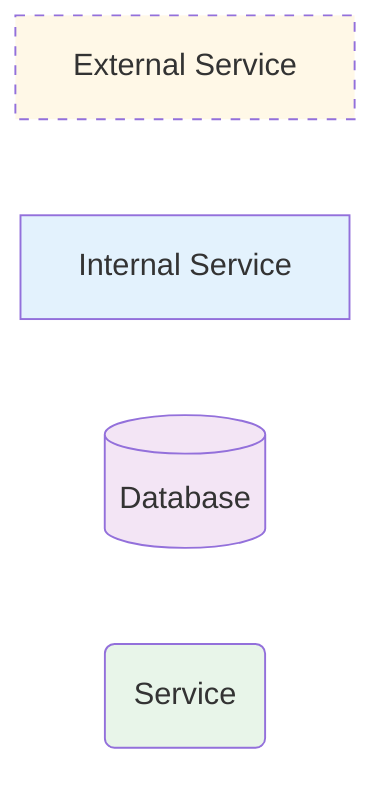

# LessonsHub — Architecture Diagrams

Mermaid-only architecture documentation for the LessonsHub project. Every diagram in this folder is a fenced ` ```mermaid ` block — no images, no PlantUML, no SVG export. Diagrams render inline in GitHub, GitLab, VS Code (with the Mermaid Preview extension), and most other markdown viewers.

> **How was this generated?** See [PROMPT.md](PROMPT.md). To regenerate after code changes: `rm -rf diagrams/` and feed the prompt to a coding agent. Editing in place leads to drift; full regeneration keeps it honest.

---

## Index

### Cross-tier (start here)

- [01-cloud-architecture.md](01-cloud-architecture.md) — Cloud Run × 3 + Cloud SQL + GCS + external integrations + the local Caddy reverse-proxy.
- [02-infrastructure-terraform.md](02-infrastructure-terraform.md) — Every GCP resource Terraform provisions, plus the GitHub Actions Workload Identity Federation flow.
- [03-database.md](03-database.md) — ER diagrams for both Postgres databases (`LessonsHub` for the .NET app, `LessonsAi` for the Python service's RAG cache + chunks).

### Per-tier deep dives

- [backend/](backend/) — .NET 8 solution: Domain / Application / Infrastructure / API. Repo + facade architecture.
- [ai/](ai/) — Python FastAPI + CrewAI. Routes → services → crews → agents/tasks → tools.
- [frontend/](frontend/) — Angular 21 (standalone components + signals + SSR).

### End-to-end flows

- [flows/](flows/) — Lesson-plan generation (Default / Technical / Language), lesson content generation, exercise lifecycle, resources research.
- [rag/](rag/) — Document upload → chunk → embed → pgvector. Per-lesson chunk retrieval at generation time.

---

## Mermaid styling conventions

The five diagram types used:

| Type | When |
|---|---|
| `flowchart LR/TD` / `graph` | Architecture overviews, infrastructure topology, component trees |
| `sequenceDiagram` | All flows that cross service boundaries |
| `erDiagram` | Database schemas |
| `classDiagram` | Domain entities, service interfaces, dataclasses, TypeScript models |
| `stateDiagram-v2` | Quality retry loops, document ingestion lifecycle |

Standard `classDef` blocks every architecture diagram should pull from:



- **`external`** — third-party APIs / services we don't run (Google OAuth, Gemini, DDG, YouTube Data API, Context7-was-here)
- **`internal`** — our Cloud Run services
- **`data`** — Postgres, GCS buckets, pgvector tables (cylinder shape)
- **`service`** — internal modules / libraries (controllers, services, crews)
- **`agent`** — CrewAI agents (subgraph wrap)

## Render previews

Paste any mermaid block into [mermaid.live](https://mermaid.live) to verify a diagram renders. Shipping a broken block silently degrades documentation, so a 5-second sanity check after any edit is cheap insurance.

## Coverage at a glance

| Area | File |
|---|---|
| GCP topology | [01-cloud-architecture.md](01-cloud-architecture.md) |
| Terraform resource inventory | [02-infrastructure-terraform.md](02-infrastructure-terraform.md) |
| Postgres schemas (both DBs) | [03-database.md](03-database.md) |
| .NET solution layout | [backend/01-architecture.md](backend/01-architecture.md) |
| Domain entities | [backend/02-domain-model.md](backend/02-domain-model.md) |
| Application services + DTOs | [backend/03-application-layer.md](backend/03-application-layer.md) |
| Repositories + DbContext + external clients | [backend/04-infrastructure.md](backend/04-infrastructure.md) |
| Controllers + endpoints | [backend/05-api-controllers.md](backend/05-api-controllers.md) |
| Backend flows | [backend/06-flows.md](backend/06-flows.md) |
| FastAPI layering | [ai/01-architecture.md](ai/01-architecture.md) |
| AI endpoints | [ai/02-endpoints.md](ai/02-endpoints.md) |
| Services + crews + quality loop | [ai/03-services-and-crews.md](ai/03-services-and-crews.md) |
| Agent personas | [ai/04-agents.md](ai/04-agents.md) |
| Python tools (RAG, doc-search) | [ai/05-tools.md](ai/05-tools.md) |
| Angular architecture | [frontend/01-architecture.md](frontend/01-architecture.md) |
| Angular routing | [frontend/02-routing.md](frontend/02-routing.md) |
| Angular components | [frontend/03-components.md](frontend/03-components.md) |
| Angular services | [frontend/04-services.md](frontend/04-services.md) |
| Angular models | [frontend/05-models.md](frontend/05-models.md) |
| Frontend flows | [frontend/06-flows.md](frontend/06-flows.md) |
| Plan generation × 3 lesson types | [flows/lesson-plan-default.md](flows/lesson-plan-default.md), [flows/lesson-plan-technical.md](flows/lesson-plan-technical.md), [flows/lesson-plan-language.md](flows/lesson-plan-language.md) |
| Content generation × 3 lesson types | [flows/lesson-content-default.md](flows/lesson-content-default.md), [flows/lesson-content-technical.md](flows/lesson-content-technical.md), [flows/lesson-content-language.md](flows/lesson-content-language.md) |
| Exercise lifecycle | [flows/exercise-generate.md](flows/exercise-generate.md), [flows/exercise-retry.md](flows/exercise-retry.md), [flows/exercise-review.md](flows/exercise-review.md) |
| Resources research | [flows/resources.md](flows/resources.md) |
| RAG pipeline | [rag/ingest.md](rag/ingest.md), [rag/search.md](rag/search.md) |
