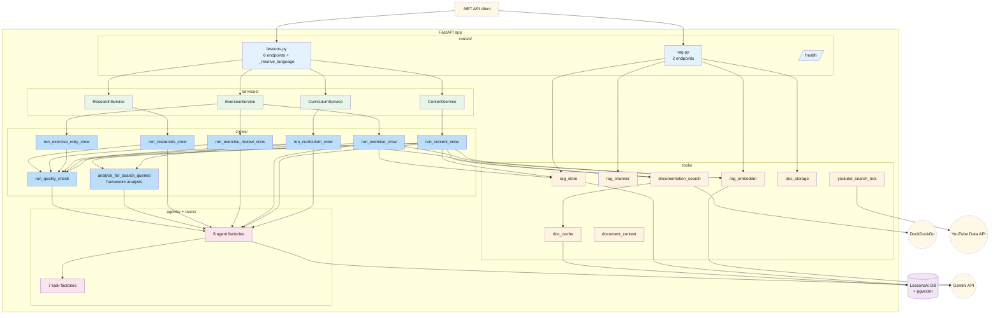
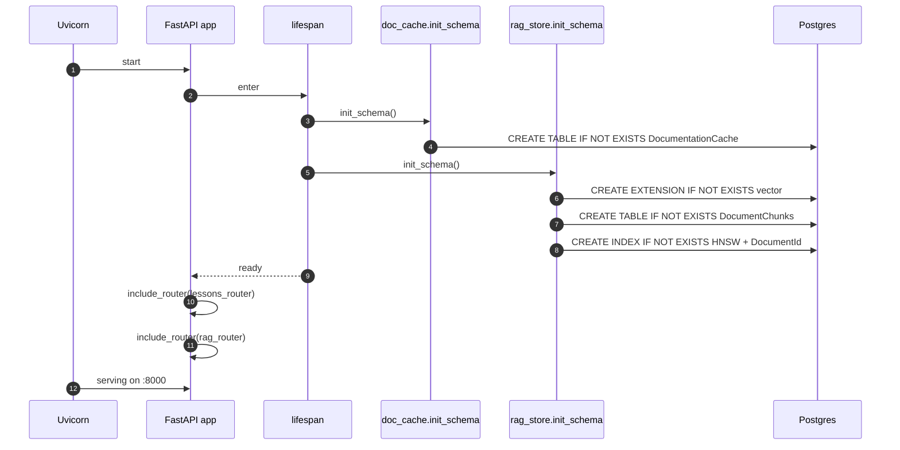

# AI — 01 Architecture

A FastAPI process that exposes 8 HTTP endpoints. Each endpoint adapts the HTTP request → an internal service call → orchestrates one or more CrewAI crews → returns a Pydantic response.

> **Source files**: [main.py](../../lessons-ai-api/main.py), [routes/](../../lessons-ai-api/routes/), [services/](../../lessons-ai-api/services/), [crews/](../../lessons-ai-api/crews/), [agents/](../../lessons-ai-api/agents/), [tasks/](../../lessons-ai-api/tasks/), [tools/](../../lessons-ai-api/tools/), [models/](../../lessons-ai-api/models/), [templates/](../../lessons-ai-api/templates/), [factories/](../../lessons-ai-api/factories/), [config.py](../../lessons-ai-api/config.py).

## Layered diagram

**Reading order**: HTTP request lands at a route → route adapts to service-call shape (Pydantic → dataclass `PlanContext`/`LessonContext`/`ExerciseSpec`) → service constructs an LLM and calls a crew → crew (often) calls the framework analyzer first, then runs the writer agent inside a quality retry loop → returns response.

## Module responsibilities

| Module | Role | Notable files |
|---|---|---|
| `routes/` | FastAPI `APIRouter`s. Per-endpoint Pydantic→context conversion. | [routes/lessons.py](../../lessons-ai-api/routes/lessons.py), [routes/rag.py](../../lessons-ai-api/routes/rag.py) |
| `services/` | Thin static facades — pick an LLM (per-task model from `config.py`), forward to a crew. | [services/curriculum_service.py](../../lessons-ai-api/services/curriculum_service.py), [services/content_service.py](../../lessons-ai-api/services/content_service.py), [services/exercise_service.py](../../lessons-ai-api/services/exercise_service.py), [services/research_service.py](../../lessons-ai-api/services/research_service.py) |
| `crews/` | The actual orchestration. Build agent + task, run via CrewAI, wrap with quality retry. | [crews/](../../lessons-ai-api/crews/) (6 user-facing + `quality_crew` + `framework_analysis_crew`) |
| `agents/` | Agent factory functions. Most templates-based; quality-checker + framework-analyzer + youtube-researcher are Python-inline. | [agents/](../../lessons-ai-api/agents/), [agents/utils.py](../../lessons-ai-api/agents/utils.py) (template resolver) |
| `tasks/` | Task factory functions — build the `Task.description` from Jinja templates. | [tasks/](../../lessons-ai-api/tasks/) |
| `templates/` | Jinja2 prompt templates, one per (task, agent_type). Include the shared `_document_context.jinja2` partial for RAG-grounded chunks. | [templates/agents/](../../lessons-ai-api/templates/agents/), [templates/tasks/](../../lessons-ai-api/templates/tasks/) |
| `factories/` | `TemplateManager` (Jinja env + per-(role, type) template path resolution). | [factories/template_manager.py](../../lessons-ai-api/factories/template_manager.py) |
| `tools/` | Cross-cutting helpers: web search, doc cache, RAG chunk/embed/store, document storage abstraction, YouTube tool. | [tools/](../../lessons-ai-api/tools/) |
| `models/` | Pydantic request/response DTOs ([requests.py](../../lessons-ai-api/models/requests.py), [responses.py](../../lessons-ai-api/models/responses.py)) + internal dataclass contexts ([contexts.py](../../lessons-ai-api/models/contexts.py)). |
| `config.py` | Pydantic-Settings: model names + temperatures per task, doc-cache TTL, max-quality-retries, default language. |

## Startup (lifespan)

Both schema bootstraps are idempotent (`IF NOT EXISTS`). If `DATABASE_URL` is unset, both log a warning and continue without the cache/RAG features (graceful degradation; the lesson endpoints still work, just without grounding).

## Per-task model selection

[config.py](../../lessons-ai-api/config.py) defines five `(model, temperature)` tuples — one per task type:

| Task | Default model | Default temp |
|---|---|---|
| Plan generation | `gemini/gemini-3.1-pro-preview` | 0.5 |
| Content generation | `gemini/gemini-3-flash-preview` | 0.5 |
| Exercise generation | `gemini/gemini-3-flash-preview` | 0.5 |
| Exercise review | `gemini/gemini-3-flash-preview` | 0.5 |
| Resource research | `gemini/gemini-3-flash-preview` | 0.5 |
| Quality checker | `gemini/gemini-3.1-flash-lite-preview` | 0.3 |

Plan generation uses Pro (better reasoning for course design); everything else uses Flash (cheaper, faster). Override per-deployment via env vars: `PLAN_MODEL`, `CONTENT_MODEL`, etc.

## Authentication (server-to-server)

The AI service is protected at the Cloud Run layer — only callers with `roles/run.invoker` on the AI service can reach it. The .NET service holds that role (bound by the deploy workflow); other GCP identities don't.

There's no per-user auth inside the AI service. The user's identity flows through the request body (`google_api_key` field for billing the right user; `correlation_id` for log correlation), not via JWTs. This is intentional — the AI service is an internal service.
