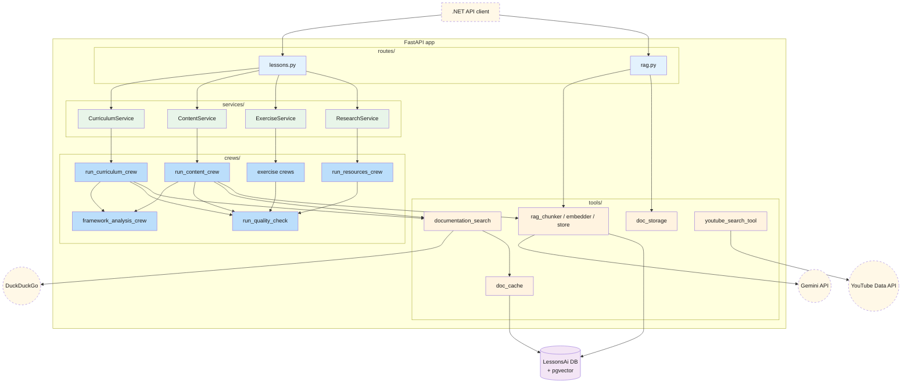

# AI — 01 Architecture

A FastAPI process that exposes 8 HTTP endpoints. Each adapts the HTTP request → an internal service call → orchestrates one or more CrewAI crews → returns a Pydantic response.

> **Source files**: [main.py](../../lessons-ai-api/main.py), [routes/](../../lessons-ai-api/routes/), [services/](../../lessons-ai-api/services/), [crews/](../../lessons-ai-api/crews/), [agents/](../../lessons-ai-api/agents/), [tasks/](../../lessons-ai-api/tasks/), [tools/](../../lessons-ai-api/tools/), [models/](../../lessons-ai-api/models/), [templates/](../../lessons-ai-api/templates/), [config.py](../../lessons-ai-api/config.py).

## Layered diagram

**Reading order**: HTTP request → route adapts to context dataclass (`PlanContext`/`LessonContext`/`ExerciseSpec`) → service constructs an LLM and calls a crew → crew (often) calls the framework analyzer first, then runs the writer agent inside a quality retry loop → returns response.

## Module responsibilities

| Module | Role |
|---|---|
| `routes/` | FastAPI `APIRouter`s; per-endpoint Pydantic→context conversion |
| `services/` | Thin static facades — pick an LLM (per-task model from `config.py`), forward to a crew |
| `crews/` | The actual orchestration. Build agent + task, run via CrewAI, wrap with quality retry |
| `agents/` | Agent factory functions; most templates-based, a few Python-inline (quality, framework analyzer, youtube researcher) |
| `tasks/` | Task factory functions — build the `Task.description` from Jinja templates |
| `templates/` | Jinja2 prompt templates, one per (task, agent_type). Includes the shared `_document_context.jinja2` partial for RAG-grounded chunks |
| `tools/` | Cross-cutting helpers: web search, doc cache, RAG chunk/embed/store, document storage, YouTube tool |
| `models/` | Pydantic request/response DTOs + internal dataclass contexts |
| `config.py` | Pydantic-Settings: model names + temperatures per task, doc-cache TTL, max-quality-retries |

## Per-task model selection

`config.py` defines `(model, temperature)` per task type. Plan generation uses Gemini Pro (better reasoning for course design); content / exercise / review / resources use Flash (cheaper, faster); the quality checker uses Flash-Lite. Override per-deployment via env vars (`PLAN_MODEL`, `CONTENT_MODEL`, …).

## Authentication

The AI service is protected at the Cloud Run layer — only callers with `roles/run.invoker` on the AI service can reach it. The .NET service holds that role; other GCP identities don't. There's no per-user auth inside the AI service. The user's identity flows through the request body (`google_api_key` for billing the right user, `correlation_id` for log correlation), not via JWTs. This is intentional — the AI service is internal.

## Startup

The `lifespan` hook calls `init_schema()` for both `DocumentationCache` and `DocumentChunks` (idempotent `IF NOT EXISTS`). If `DATABASE_URL` is unset, both log a warning and continue without the cache/RAG features (graceful degradation; lesson endpoints still work, just without grounding).
