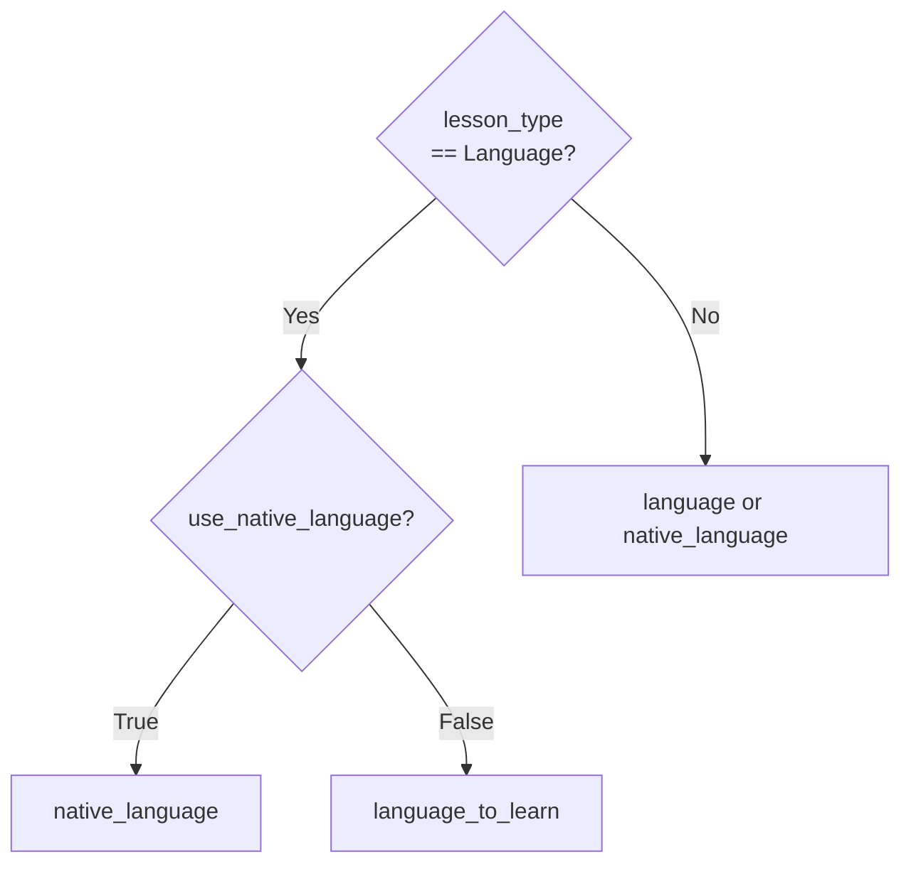
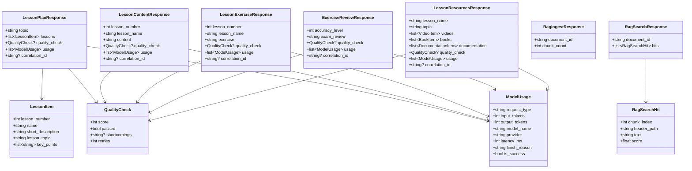
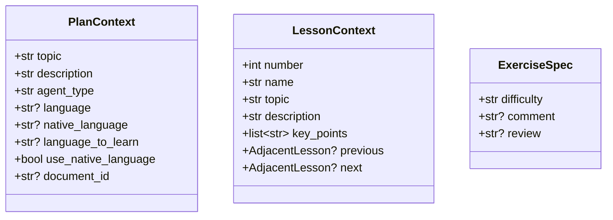

# AI — 02 Endpoints

Eight HTTP endpoints across two routers + one health probe.

> **Source files**: [routes/lessons.py](../../lessons-ai-api/routes/lessons.py), [routes/rag.py](../../lessons-ai-api/routes/rag.py), [main.py](../../lessons-ai-api/main.py), [models/requests.py](../../lessons-ai-api/models/requests.py), [models/responses.py](../../lessons-ai-api/models/responses.py), [models/contexts.py](../../lessons-ai-api/models/contexts.py).

## Endpoint inventory

| Method | Path | Request | Response | Service hit |
|---|---|---|---|---|
| POST | `/api/lesson-plan/generate` | `LessonPlanRequest` | `LessonPlanResponse` | `CurriculumService.generate_plan` |
| POST | `/api/lesson-content/generate` | `LessonContentRequest` | `LessonContentResponse` | `ContentService.generate_content` |
| POST | `/api/lesson-exercise/generate` | `LessonExerciseRequest` | `LessonExerciseResponse` | `ExerciseService.generate_exercise` |
| POST | `/api/lesson-exercise/retry` | `ExerciseRetryRequest` | `LessonExerciseResponse` | `ExerciseService.retry_exercise` |
| POST | `/api/exercise-review/check` | `ExerciseReviewRequest` | `ExerciseReviewResponse` | `ExerciseService.review_exercise` |
| POST | `/api/lesson-resources/generate` | `LessonResourcesRequest` | `LessonResourcesResponse` | `ResearchService.generate_resources` |
| POST | `/api/rag/ingest` | `RagIngestRequest` | `RagIngestResponse` | (inline — uses `rag_chunker`, `rag_embedder`, `rag_store`) |
| POST | `/api/rag/search` | `RagSearchRequest` | `RagSearchResponse` | (inline) |
| GET | `/health` | — | `{ status: "healthy" }` | — |

## The `_resolve_language` boundary helper

[routes/lessons.py:_resolve_language](../../lessons-ai-api/routes/lessons.py) computes the *rendering* language from the per-type fields on the request:



Default/Technical lessons just need one language string. Language lessons need a deliberate *render* choice based on the `useNativeLanguage` toggle. This helper is the single place that branching lives; the rest of the AI service treats `PlanContext.language` as the answer.

## Request models — class diagram

```mermaid
classDiagram
  class AdjacentLesson {
    +string name
    +string description
  }

  class LessonPlanRequest {
    +string lesson_type
    +string topic
    +int? number_of_lessons
    +string? description
    +string? language
    +string? native_language
    +string? language_to_learn
    +bool use_native_language
    +string? correlation_id
    +string? google_api_key
    +bool bypass_doc_cache
    +string? document_id
  }

  class LessonContentRequest {
    +string topic
    +string lesson_type
    +string lesson_topic
    +list~string~ key_points
    +string plan_description
    +int lesson_number
    +string lesson_name
    +string lesson_description
    +string? language
    +string? native_language
    +string? language_to_learn
    +bool use_native_language
    +AdjacentLesson? previous_lesson
    +AdjacentLesson? next_lesson
    +string? correlation_id
    +string? google_api_key
    +bool bypass_doc_cache
    +string? document_id
  }

  class LessonExerciseRequest {
    +string lesson_type
    +string lesson_topic
    +int lesson_number
    +string lesson_name
    +string lesson_description
    +list~string~ key_points
    +string difficulty
    +string? comment
    +string? native_language
    +string? language_to_learn
    +bool use_native_language
    +AdjacentLesson? previous_lesson
    +AdjacentLesson? next_lesson
    +string? correlation_id
    +string? google_api_key
    +bool bypass_doc_cache
    +string? document_id
  }

  class ExerciseRetryRequest {
    +(same as LessonExerciseRequest, plus)
    +string review
  }

  class ExerciseReviewRequest {
    +string lesson_type
    +string lesson_content
    +string exercise_content
    +string difficulty
    +string answer
    +string? language
    +string? native_language
    +string? language_to_learn
    +bool use_native_language
    +string? correlation_id
    +string? google_api_key
  }

  class LessonResourcesRequest {
    +string lesson_type
    +string topic
    +string lesson_name
    +string lesson_topic
    +string lesson_description
    +string? language
    +string? correlation_id
    +string? google_api_key
  }

  class RagIngestRequest {
    +string document_id
    +string document_uri
    +bool is_markdown
    +string google_api_key
  }

  class RagSearchRequest {
    +string document_id
    +string query
    +int top_k
    +string google_api_key
  }

  LessonContentRequest --> AdjacentLesson
  LessonExerciseRequest --> AdjacentLesson
  ExerciseRetryRequest --> AdjacentLesson
```



All Pydantic models use `populate_by_name = True` and field aliases like `lessonType`, `nativeLanguage`, `languageToLearn`, `useNativeLanguage`, `googleApiKey` — that's the camelCase JSON the .NET service sends.

## Response models



`ModelUsage` and `QualityCheck` are reused across every generation response — the .NET side uses `usage` to write `AiRequestLog` rows for billing.

## Internal context dataclasses

[models/contexts.py](../../lessons-ai-api/models/contexts.py) holds three plain dataclasses passed through the task → crew → service stack. They're **not** HTTP DTOs — `routes/lessons.py` constructs them from the validated Pydantic requests, then lower layers stay framework-agnostic.



`PlanContext.language` is the *rendering* language — set by `_resolve_language` based on lesson type. The other language fields are kept verbatim so Language templates can branch on `use_native_language` and reference both languages explicitly.

## Error handling

[main.py](../../lessons-ai-api/main.py) registers two exception handlers:

```mermaid
flowchart LR
  classDef ok fill:#e8f5e9,color:#1a1a1a
  classDef bad fill:#ffe0e0,color:#1a1a1a

  req[HTTP request]
  ok[200 with response_model]:::ok
  v_err[ValueError]:::bad
  e_err[other Exception]:::bad

  req --> ok
  req --> v_err --> r400[400 { detail }]
  req --> e_err --> r500[500 { detail: "An unexpected technical error occurred." }]
```

The crews swallow most errors internally (e.g. quality-check failures return a passing result so generated content isn't lost), so the broad `Exception` handler is rarely hit in practice.
