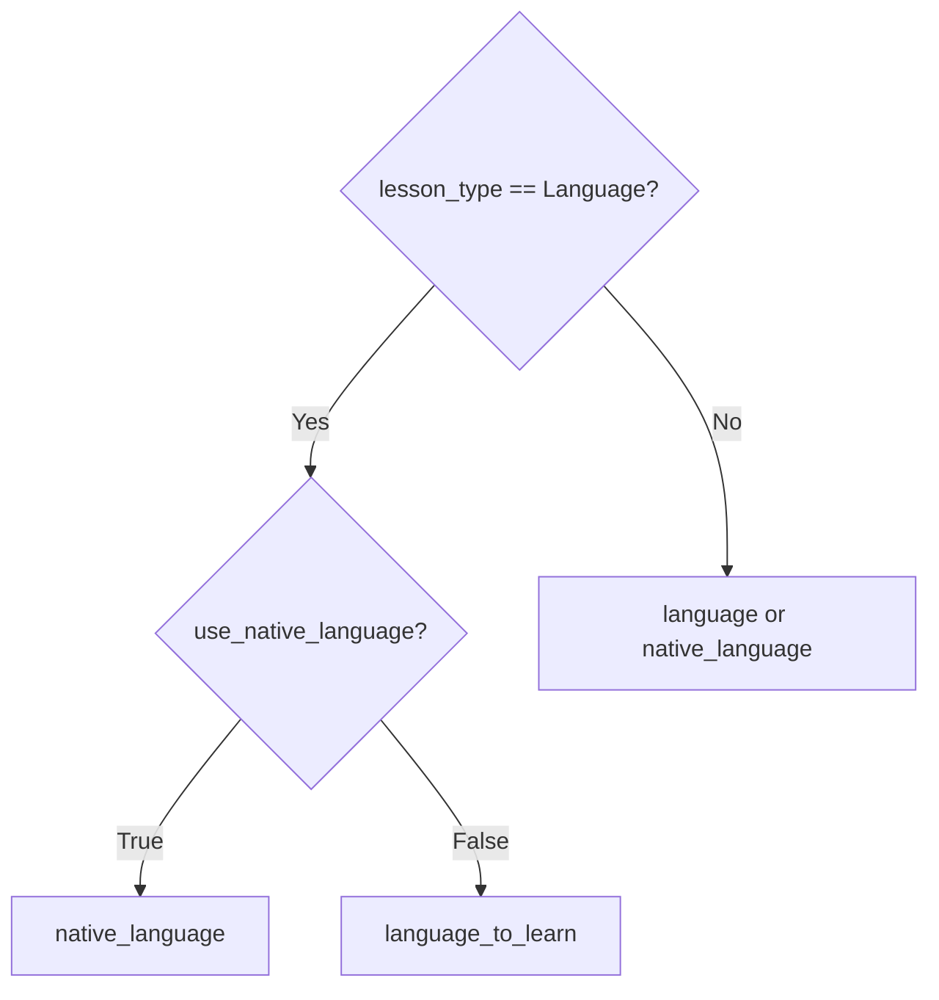
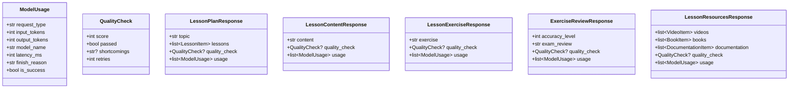

# AI — 02 Endpoints

Eight HTTP endpoints across two routers + one health probe.

> **Source files**: [routes/lessons.py](../../lessons-ai-api/routes/lessons.py), [routes/rag.py](../../lessons-ai-api/routes/rag.py), [main.py](../../lessons-ai-api/main.py), [models/requests.py](../../lessons-ai-api/models/requests.py), [models/responses.py](../../lessons-ai-api/models/responses.py), [models/contexts.py](../../lessons-ai-api/models/contexts.py).

## Endpoint inventory

| Method | Path | Request | Response | Service |
| --- | --- | --- | --- | --- |
| POST | `/api/lesson-plan/generate` | `LessonPlanRequest` | `LessonPlanResponse` | `CurriculumService.generate_plan` |
| POST | `/api/lesson-content/generate` | `LessonContentRequest` | `LessonContentResponse` | `ContentService.generate_content` |
| POST | `/api/lesson-exercise/generate` | `LessonExerciseRequest` | `LessonExerciseResponse` | `ExerciseService.generate_exercise` |
| POST | `/api/lesson-exercise/retry` | `ExerciseRetryRequest` | `LessonExerciseResponse` | `ExerciseService.retry_exercise` |
| POST | `/api/exercise-review/check` | `ExerciseReviewRequest` | `ExerciseReviewResponse` | `ExerciseService.review_exercise` |
| POST | `/api/lesson-resources/generate` | `LessonResourcesRequest` | `LessonResourcesResponse` | `ResearchService.generate_resources` |
| POST | `/api/rag/ingest` | `RagIngestRequest` | `RagIngestResponse` | inline (rag_chunker + embedder + store) |
| POST | `/api/rag/search` | `RagSearchRequest` | `RagSearchResponse` | inline |
| GET | `/health` | — | `{ status: "healthy" }` | — |

All Pydantic models use `populate_by_name = True` and camelCase aliases (`lessonType`, `nativeLanguage`, `googleApiKey`, …) to match the .NET service's JSON.

## `_resolve_language` boundary

[routes/lessons.py:_resolve_language](../../lessons-ai-api/routes/lessons.py) computes the *rendering* language from the per-type fields:

The rest of the AI service treats `PlanContext.language` as the answer. `native_language` and `language_to_learn` are passed through separately so Language templates can branch on `use_native_language` and reference both explicitly.

## Common response shapes

Every generation response carries `quality_check: QualityCheck?` (score, passed, shortcomings, retries) and `usage: list[ModelUsage]` (per-call: request_type, input_tokens, output_tokens, model_name, latency_ms, …). The .NET side persists `usage` as `AiRequestLog` rows for billing.

`RagIngestResponse` returns `{ document_id, chunk_count }`. `RagSearchResponse` returns hits with `{ chunk_index, header_path, text, score }`.

## Internal context dataclasses

[models/contexts.py](../../lessons-ai-api/models/contexts.py) holds three plain dataclasses passed through the task → crew → service stack. `routes/lessons.py` constructs them from the validated Pydantic requests, then lower layers stay framework-agnostic:

- **`PlanContext`** — topic, description, agent_type, language fields, document_id.
- **`LessonContext`** — number, name, topic, description, key_points, previous/next.
- **`ExerciseSpec`** — difficulty, comment, review (the latter set only on retry).

## Error handling

[main.py](../../lessons-ai-api/main.py) registers two exception handlers: `ValueError → 400 { detail }` and any other `Exception → 500 { detail: "An unexpected technical error occurred." }`. Crews swallow most errors internally (e.g. quality-check failures return a passing result so generated content isn't lost), so the broad `Exception` handler is rarely hit.
