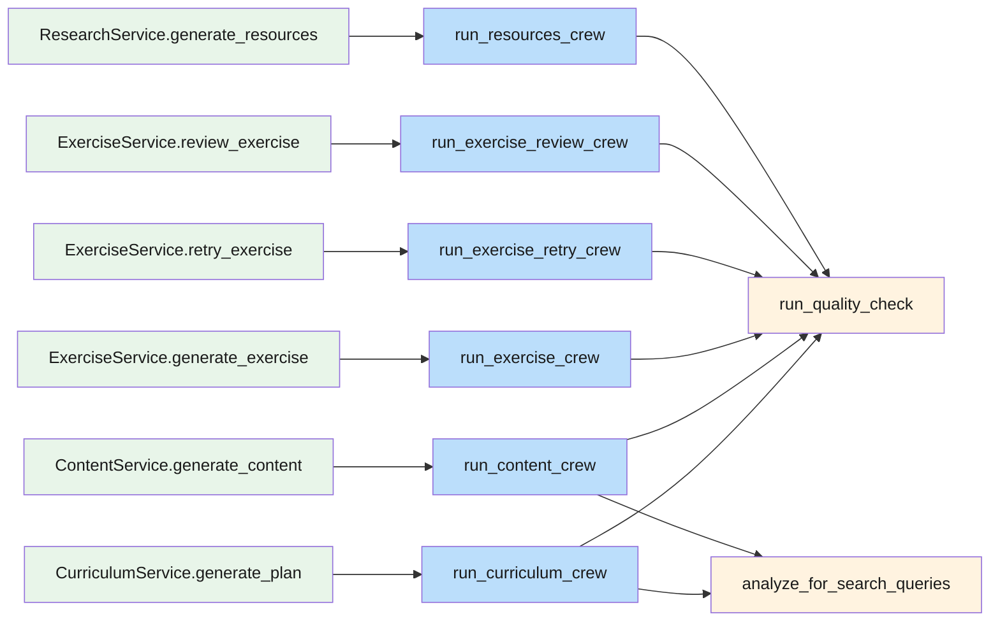
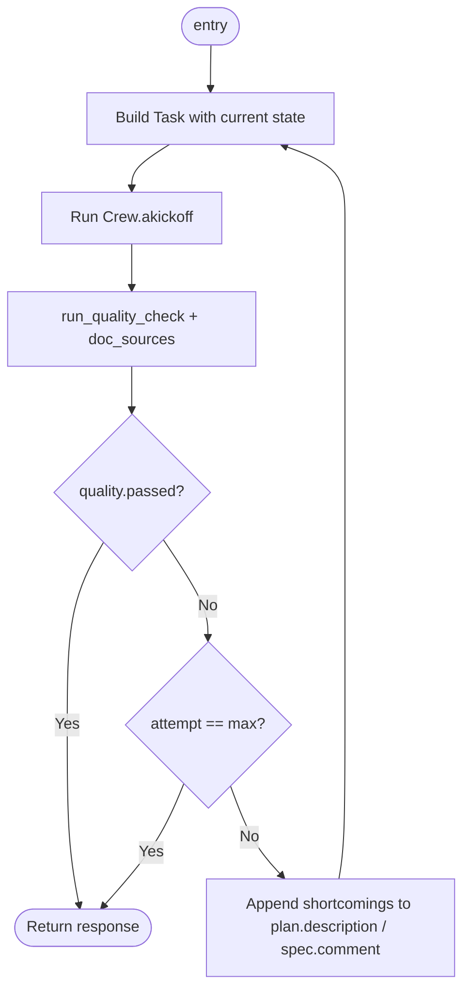
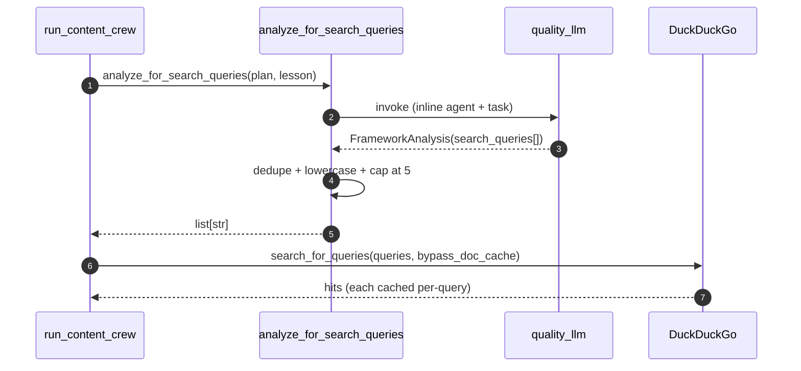

# AI — 03 Services and Crews

The "service" classes in [services/](../../lessons-ai-api/services/) are thin static facades. The real orchestration lives in [crews/](../../lessons-ai-api/crews/). Each crew is one async function that builds an agent + a task, runs them inside a CrewAI `Crew`, and (usually) wraps the call in a quality retry loop.

## Service → crew mapping

Each service method does one thing: pick the right LLM (`create_plan_llm`, `create_content_llm`, …) using the user's `google_api_key`, then forward to its crew. Zero business logic above the crew layer — the dataclass contexts (`PlanContext` / `LessonContext` / `ExerciseSpec`) carry everything down.

## Crew layer

| Crew | Purpose |
| --- | --- |
| `run_curriculum_crew` | Calls framework analyzer for Technical, fetches RAG outline for Document-grounded plans. |
| `run_content_crew` | Per-lesson framework analyzer + DDG search; per-lesson RAG chunk fetch. Appends a Sources section to final markdown. |
| `run_exercise_crew` | RAG-grounded if `document_id` is set. |
| `run_exercise_retry_crew` | Same shape as `exercise_crew` but `spec.review` is non-null and the prompt branches on it. |
| `run_exercise_review_crew` | No grounding — student's answer is the input. |
| `run_resources_crew` | Two agents in sequence: YouTube researcher + book/docs researcher. |
| `run_quality_check` | Helper that wraps a validator agent. Re-receives doc sources for "verify-against-same-sources" grounding. |
| `analyze_for_search_queries` | Tiny one-shot crew. Returns `list[str]` of analyzer-produced queries; fails soft to `[]`. |

## Quality retry loop

Most generation crews wrap their task call in a loop with `settings.max_quality_retries + 1` iterations (default 2 retries → 3 total attempts):

Two important behaviours:

- **Never lose generated content**: when `attempt == max_retries`, the crew returns the *last* attempt's content even if it failed quality.
- **Validator is fault-tolerant**: any exception inside `run_quality_check` returns `QualityCheck(score=0, passed=True, …)` so a flaky validator can't poison the user's output.

## Framework analyzer

For Technical lessons, this runs *before* the writer:

The analyzer returns concrete queries like `"angular standalone components site:angular.dev"`. If it returns `[]` (off-topic, parse failure, exception) the crew skips grounding and the writer runs ungrounded — failing soft.
