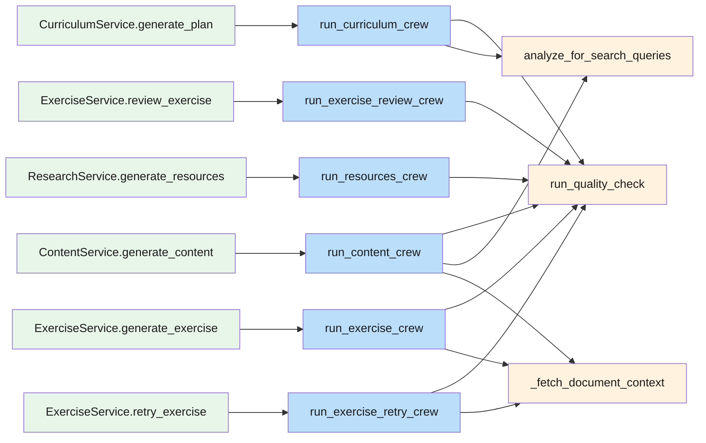
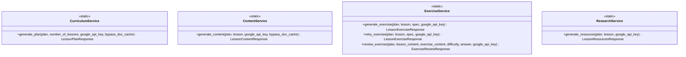
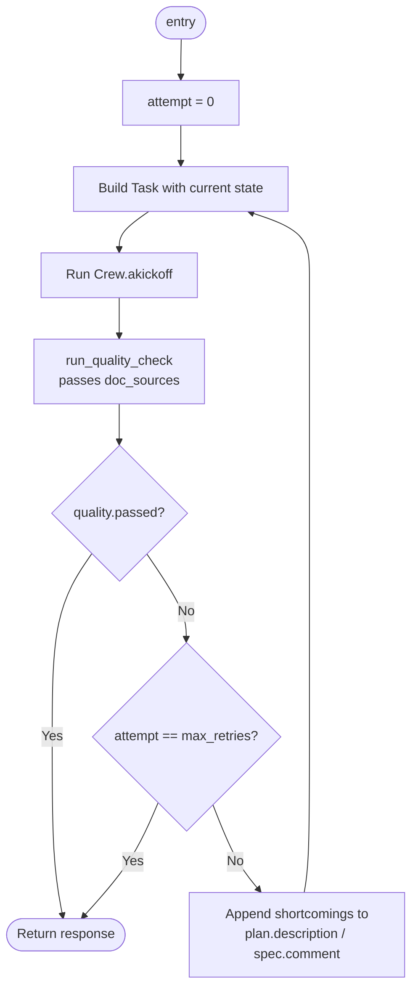
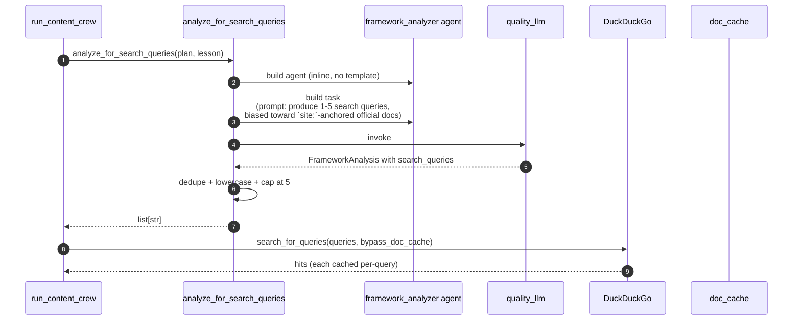

# AI — 03 Services and Crews

The "service" classes in [services/](../../lessons-ai-api/services/) are thin static facades. The real orchestration lives in [crews/](../../lessons-ai-api/crews/). Each crew is one async function that builds an agent + a task, runs them inside a CrewAI `Crew`, and (usually) wraps the call in a quality retry loop.

## Service → crew mapping



## Service layer (4 classes)



Each service method does one thing: pick the right LLM (e.g. `create_plan_llm`, `create_content_llm`) using the user's `google_api_key`, then forward to its crew. Zero business logic above the crew layer — the dataclass contexts (`PlanContext`/`LessonContext`/`ExerciseSpec`) carry everything down.

## Crew layer

| Crew | File | Quality loop? | Notes |
|---|---|---|---|
| `run_curriculum_crew` | [crews/curriculum_crew.py](../../lessons-ai-api/crews/curriculum_crew.py) | Yes | Calls framework analyzer for Technical, fetches doc outline for Document-grounded plans. Two task variants: with-count vs auto-count. |
| `run_content_crew` | [crews/content_crew.py](../../lessons-ai-api/crews/content_crew.py) | Yes | Per-lesson framework analyzer + DDG search; per-lesson RAG chunk fetch via `_fetch_document_context`. Appends a Sources section to final markdown. |
| `run_exercise_crew` | [crews/exercise_crew.py](../../lessons-ai-api/crews/exercise_crew.py) | Yes | RAG-grounded if `document_id` is set. |
| `run_exercise_retry_crew` | [crews/exercise_crew.py](../../lessons-ai-api/crews/exercise_crew.py) | Yes | Same shape as exercise_crew but `spec.review` is non-null and the prompt branches on it. |
| `run_exercise_review_crew` | [crews/review_crew.py](../../lessons-ai-api/crews/review_crew.py) | Yes | No grounding — student's answer is the input. |
| `run_resources_crew` | [crews/research_crew.py](../../lessons-ai-api/crews/research_crew.py) | Yes | Two agents run in sequence (YouTube researcher + book/docs researcher). |
| `run_quality_check` | [crews/quality_crew.py](../../lessons-ai-api/crews/quality_crew.py) | (it *is* the loop) | Returns `(QualityCheck, ModelUsage)`. Re-receives doc sources for "verify-against-same-sources" grounding. |
| `analyze_for_search_queries` | [crews/framework_analysis_crew.py](../../lessons-ai-api/crews/framework_analysis_crew.py) | No | Tiny one-shot crew. Returns `list[str]` of analyzer-produced search queries; fails soft to `[]`. |

## Quality retry loop

Most generation crews wrap their task call in a loop with `settings.max_quality_retries + 1` iterations (default 2 retries → 3 total attempts):



The `feedback` step mutates the plan description (curriculum/content) or the exercise spec's comment (exercises) so the next prompt sees the previous attempt's shortcomings. Notable: when `attempt == max_retries`, the crew returns the *last* attempt's content even if it failed quality — never lose generated content.

`run_quality_check` itself is fault-tolerant: any exception inside it returns `QualityCheck(score=0, passed=True, …)` so a flaky validator can't poison the user's output.

## The framework analyzer (`analyze_for_search_queries`)

For Technical lessons, this runs *before* the writer:



The analyzer returns concrete queries like `"angular standalone components site:angular.dev"`. If it returns `[]` (off-topic, parse failure, exception) the crew skips grounding and the writer runs ungrounded — failing soft.

## Service signatures (verbatim from current source)

[services/curriculum_service.py](../../lessons-ai-api/services/curriculum_service.py):

```python
class CurriculumService:
    @staticmethod
    async def generate_plan(
        plan: PlanContext,
        number_of_lessons: int | None,
        google_api_key: str | None = None,
        bypass_doc_cache: bool = False,
    ) -> LessonPlanResponse:
        llm = create_plan_llm(api_key=google_api_key)
        return await run_curriculum_crew(...)
```

[services/content_service.py](../../lessons-ai-api/services/content_service.py):

```python
class ContentService:
    @staticmethod
    async def generate_content(
        plan: PlanContext,
        lesson: LessonContext,
        google_api_key: str | None = None,
        bypass_doc_cache: bool = False,
    ) -> LessonContentResponse: ...
```

[services/exercise_service.py](../../lessons-ai-api/services/exercise_service.py):

```python
class ExerciseService:
    @staticmethod
    async def generate_exercise(plan, lesson, spec, google_api_key=None) -> LessonExerciseResponse: ...
    @staticmethod
    async def retry_exercise(plan, lesson, spec, google_api_key=None) -> LessonExerciseResponse: ...
    @staticmethod
    async def review_exercise(plan, lesson_content, exercise_content, difficulty, answer, google_api_key=None) -> ExerciseReviewResponse: ...
```

[services/research_service.py](../../lessons-ai-api/services/research_service.py):

```python
class ResearchService:
    @staticmethod
    async def generate_resources(plan, lesson, google_api_key=None) -> LessonResourcesResponse: ...
```

All four post the recent dataclass-grouping refactor — services + crews used to take 13–15 individual parameters before being grouped into `PlanContext`/`LessonContext`/`ExerciseSpec`.
