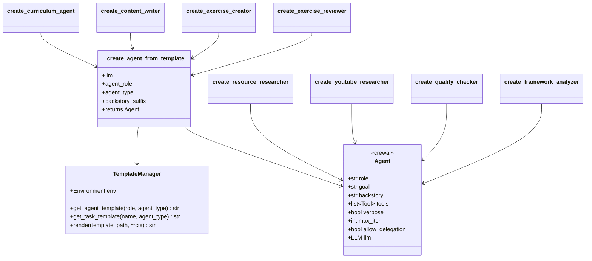
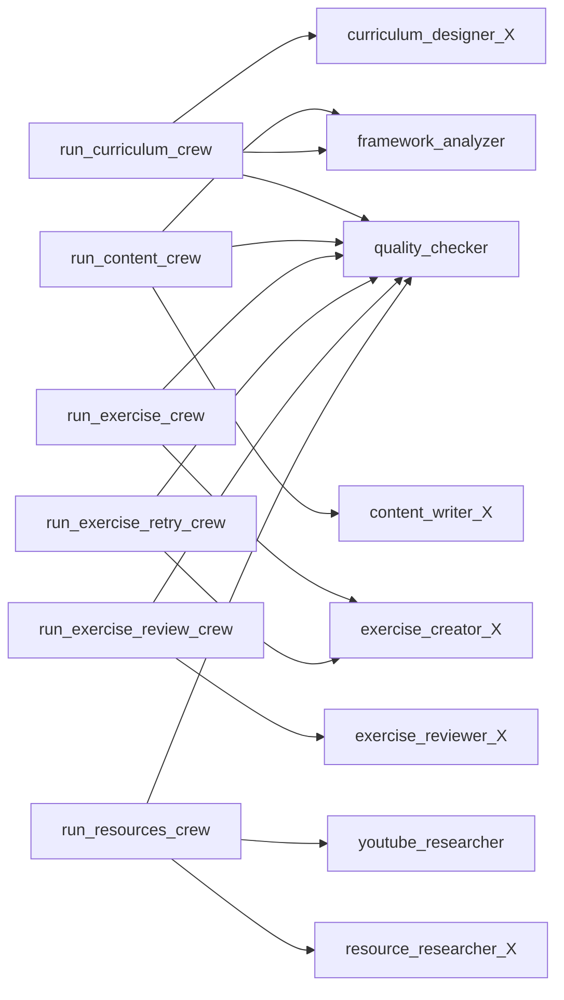

# AI — 04 Agents

Eight agent factories under [lessons-ai-api/agents/](../../lessons-ai-api/agents/). All return CrewAI `Agent` instances; the difference is how they construct the persona.

## Agent inventory

| Agent factory | File | Has per-type variants? | Persona source |
|---|---|---|---|
| `create_curriculum_agent(llm, agent_type)` | [agents/lesson_planner_agent.py](../../lessons-ai-api/agents/lesson_planner_agent.py) | Yes — Default / Technical / Language | Jinja template per type |
| `create_content_writer(llm, agent_type)` | [agents/content_writer_agent.py](../../lessons-ai-api/agents/content_writer_agent.py) | Yes | Jinja template per type |
| `create_exercise_creator(llm, agent_type)` | [agents/exercise_creator_agent.py](../../lessons-ai-api/agents/exercise_creator_agent.py) | Yes | Jinja template per type |
| `create_exercise_reviewer(llm, agent_type)` | [agents/exercise_reviewer_agent.py](../../lessons-ai-api/agents/exercise_reviewer_agent.py) | Yes | Jinja template per type |
| `create_resource_researcher(llm, agent_type)` | [agents/resource_researcher_agent.py](../../lessons-ai-api/agents/resource_researcher_agent.py) | Yes | Inline Python dict (Default / Technical / Language) |
| `create_youtube_researcher(llm)` | [agents/youtube_researcher_agent.py](../../lessons-ai-api/agents/youtube_researcher_agent.py) | No | Inline Python (uses `search_youtube_videos` tool) |
| `create_quality_checker(llm)` | [agents/quality_checker_agent.py](../../lessons-ai-api/agents/quality_checker_agent.py) | No | Inline Python |
| `create_framework_analyzer(llm)` | [agents/framework_analyzer_agent.py](../../lessons-ai-api/agents/framework_analyzer_agent.py) | No | Inline Python |

The split between template-based and inline isn't accidental: agents whose voice differs by *lesson type* (a Language curriculum designer vs a Technical one needs a different teaching philosophy) use templates. Agents that are pure infrastructure (quality checker, framework analyzer, YouTube researcher) use inline Python — they're identity-stable across lesson types.

## Template-based agent flow

```mermaid
flowchart LR
  classDef tm fill:#fff3e0
  classDef agent fill:#fce4ec

  call[create_X_agent<br/>llm, agent_type]
  util[_create_agent_from_template]:::tm
  resolve[_resolve_template<br/>agent_role + agent_type]:::tm
  tm[TemplateManager.render]:::tm
  yaml[yaml.safe_load<br/>role + goal + backstory]:::tm
  agent[crewai.Agent<br/>role, goal, backstory + suffix]:::agent

  call --> util
  util --> resolve
  resolve --> tm
  tm --> yaml
  yaml --> agent
```

[agents/utils.py](../../lessons-ai-api/agents/utils.py) holds two helpers:

- **`_resolve_template(role, agent_type)`** — picks `templates/agents/{role}_{agent_type}.jinja2` if it exists, falls back to `templates/agents/{role}_Default.jinja2`. Lets us add Technical/Language variants only where they earn their keep (resource_research is a single template; content_writer has all three).
- **`_create_agent_from_template(llm, role, agent_type, backstory_suffix="")`** — renders the template (which produces YAML), parses it, and constructs the `Agent` with `verbose=True, max_iter=3, allow_delegation=False`.

The `backstory_suffix` parameter lets each factory append a one-liner to the backstory without duplicating the template per agent — for example, `create_content_writer` appends `" You focus on clarity and cognitive load management."`.

## Template files

[lessons-ai-api/templates/agents/](../../lessons-ai-api/templates/agents/) holds:

- `base_agent.jinja2` — defines the YAML key shape (`role`, `goal`, `backstory`).
- `content_writer_{Default,Technical,Language}.jinja2`
- `curriculum_designer_{Default,Technical,Language}.jinja2`
- `exercise_creator_{Default,Technical,Language}.jinja2`
- `exercise_reviewer_{Default,Technical,Language}.jinja2`

Each variant produces YAML with three string keys. Example shape:

```yaml
role: "Senior Technical Curriculum Architect"
goal: "Design lesson plans that build engineering intuition through ..."
backstory: "You have decades of experience teaching software engineering ..."
```

## Inline agents

These four agents skip the template machinery — their role is type-agnostic so a single Python definition is clearer than a single-variant template.

### `create_quality_checker(llm)` ([agents/quality_checker_agent.py](../../lessons-ai-api/agents/quality_checker_agent.py))

```python
return Agent(
    role="Senior Quality Assurance Reviewer",
    goal="Evaluate generated educational content for accuracy, completeness, ...",
    backstory="...A score of 80+ means the content is good enough to use. ...",
    verbose=True, max_iter=3, allow_delegation=False, llm=llm,
)
```

Critical instruction in the backstory: never echo the content being reviewed (saves tokens, reduces drift).

### `create_framework_analyzer(llm)` ([agents/framework_analyzer_agent.py](../../lessons-ai-api/agents/framework_analyzer_agent.py))

```python
return Agent(
    role="Technical Documentation Researcher",
    goal="Read a lesson topic + description and produce a short list of concrete web search queries ...",
    backstory="You are a senior developer who, before writing about a topic, looks up the official documentation. ...",
    verbose=True, max_iter=2, allow_delegation=False, llm=llm,
)
```

Backstory specifically calls out anchoring queries with `site:` filters — the resulting search hits land on official docs rather than blog posts.

### `create_youtube_researcher(llm)` ([agents/youtube_researcher_agent.py](../../lessons-ai-api/agents/youtube_researcher_agent.py))

The only template-less agent that takes a **tool** (`search_youtube_videos`). CrewAI gives the agent the tool definition; the agent calls it iteratively up to `max_iter=3` times.

### `create_resource_researcher(llm, agent_type)` ([agents/resource_researcher_agent.py](../../lessons-ai-api/agents/resource_researcher_agent.py))

Despite having three variants, this one stays inline because the per-type `(role, goal, backstory)` triplets are short enough that an inline `dict` is clearer than three template files. Adding a fourth lesson type would tip the balance toward templates.

## Class diagram



## Where agents get used

Each crew picks its agents based on lesson type:



The `_X` suffix means the agent's variant is selected per `plan.agent_type` (Default / Technical / Language). The `quality_checker`, `framework_analyzer`, and `youtube_researcher` are always the same instance regardless of lesson type.
