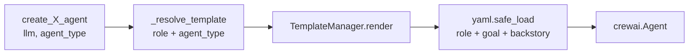
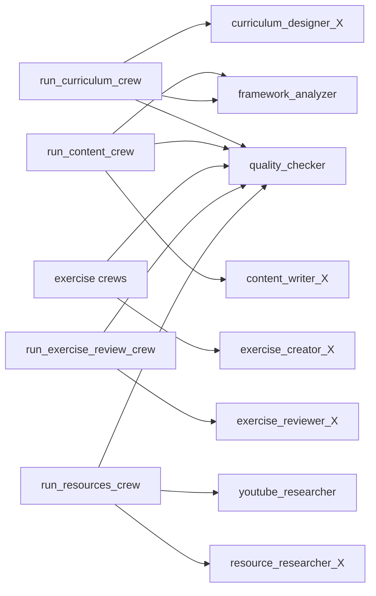

# AI — 04 Agents

Eight agent factories under [lessons-ai-api/agents/](../../lessons-ai-api/agents/). All return CrewAI `Agent` instances; the difference is how they construct the persona.

## Agent inventory

| Agent factory | Per-type variants? | Persona source |
| --- | --- | --- |
| `create_curriculum_agent` | Default / Technical / Language | Jinja template per type |
| `create_content_writer` | Default / Technical / Language | Jinja template per type |
| `create_exercise_creator` | Default / Technical / Language | Jinja template per type |
| `create_exercise_reviewer` | Default / Technical / Language | Jinja template per type |
| `create_resource_researcher` | Default / Technical / Language | Inline Python dict |
| `create_youtube_researcher` | No | Inline Python (uses `search_youtube_videos` tool) |
| `create_quality_checker` | No | Inline Python |
| `create_framework_analyzer` | No | Inline Python |

The split between template-based and inline isn't accidental: agents whose voice differs by *lesson type* use templates. Agents that are pure infrastructure (quality, framework analyzer, YouTube researcher) use inline Python — they're identity-stable across lesson types.

## Template-based agent flow

[agents/utils.py](../../lessons-ai-api/agents/utils.py) holds two helpers:

- `_resolve_template(role, agent_type)` — picks `templates/agents/{role}_{agent_type}.jinja2` if it exists, falls back to `templates/agents/{role}_Default.jinja2`. Lets us add Technical/Language variants only where they earn their keep.
- `_create_agent_from_template(llm, role, agent_type, backstory_suffix="")` — renders the template (which produces YAML), parses it, and constructs the `Agent` with `verbose=True, max_iter=3, allow_delegation=False`. The `backstory_suffix` lets each factory append a one-liner without duplicating the template.

Each variant produces YAML with three string keys — `role`, `goal`, `backstory`.

## Inline agents

These four skip the template machinery — their role is type-agnostic so a single Python definition is clearer.

- **`create_quality_checker`** — `Senior Quality Assurance Reviewer`. Backstory specifies a 0–100 score with 80+ = good enough, and forbids echoing the reviewed content (saves tokens, reduces drift).
- **`create_framework_analyzer`** — `Technical Documentation Researcher`. Backstory anchors queries with `site:` filters so search hits land on official docs.
- **`create_youtube_researcher`** — the only template-less agent that takes a *tool* (`search_youtube_videos`). CrewAI gives the tool definition; the agent calls it iteratively up to `max_iter=3`.
- **`create_resource_researcher`** — has 3 variants but the `(role, goal, backstory)` triplets are short enough that an inline `dict` is clearer than three template files.

## Where agents get used

The `_X` suffix means the agent's variant is selected per `plan.agent_type`. The `quality_checker`, `framework_analyzer`, and `youtube_researcher` are always the same instance regardless of lesson type.
