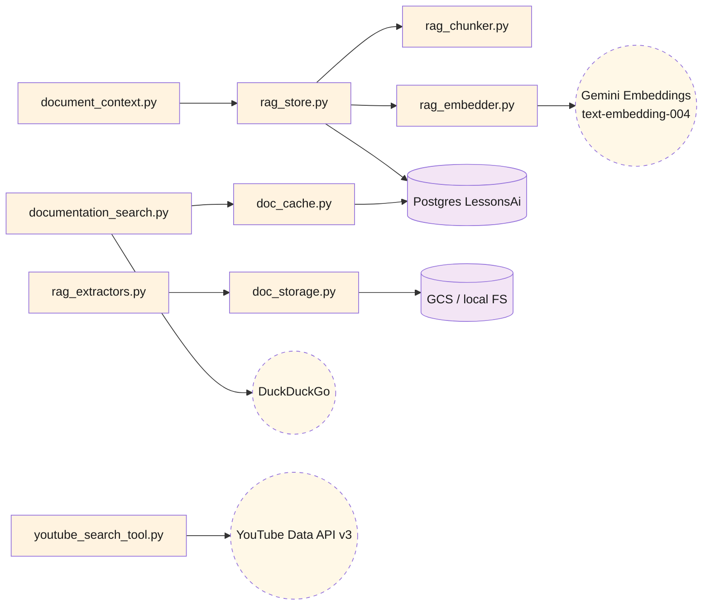
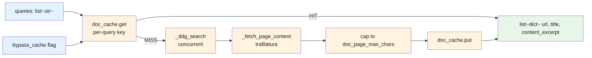
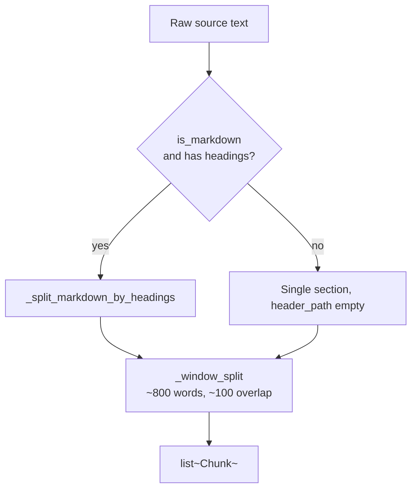
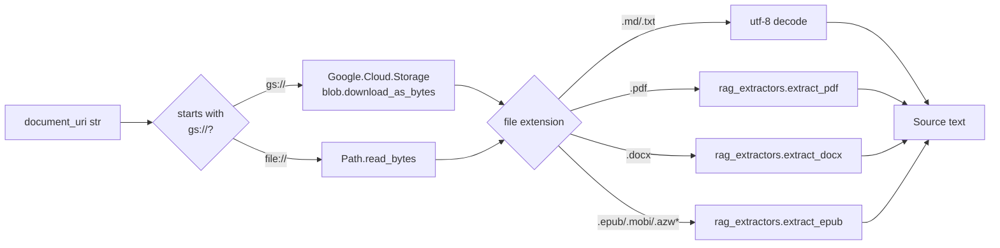

# AI — 05 Tools

Cross-cutting helpers under [lessons-ai-api/tools/](../../lessons-ai-api/tools/). Some are CrewAI `tools` (LLM-callable), most are plain Python helpers used by crews/services directly.

## Module map

## `documentation_search` ([tools/documentation_search.py](../../lessons-ai-api/tools/documentation_search.py))

Web search + page fetch for grounding Technical lessons. The framework-analyzer agent decides *what* to search for; this module just runs the queries it produces.

| Function | Purpose |
|---|---|
| `search_for_queries(queries, bypass_cache)` | Public entry. Strips blanks, runs each query concurrently, flattens results. |
| `_run_one_query(query, bypass_cache)` | Per-query: cache lookup → DDG → page-fetch → cache write. Failures yield `[]`, never raise. |
| `_ddg_search(query)` | Wraps the sync `ddgs.text()` library in a thread. One retry with 2s backoff on rate-limit / `202` / timeout. |
| `_fetch_page_content(url)` | `httpx` GET (8s timeout, follow redirects) → `trafilatura.extract` (favors recall) → cap to `doc_page_max_chars`. |
| `format_docs_for_prompt(results)` | Renders the `## Reference Documentation (use these, not your training data)` block injected into the writer's prompt and the validator's prompt. |
| `format_sources_section(results)` | Renders the trailing `## Sources` markdown list appended to lesson content. Dedupes by URL. |

## RAG pipeline tools

### `rag_chunker.py` ([tools/rag_chunker.py](../../lessons-ai-api/tools/rag_chunker.py))

`chunk_text(source_text, *, is_markdown, chunk_words, overlap_words) -> list[Chunk]`. Splits raw text into ~800-word chunks with ~100-word overlap. When `is_markdown=True`, splits on headings first so each chunk gets a `header_path` like `"Chapter 1 > Section 2"`.

### `rag_embedder.py` ([tools/rag_embedder.py](../../lessons-ai-api/tools/rag_embedder.py))

Wraps Gemini `text-embedding-004`. Two task-typed entrypoints:

- `embed_documents(texts, api_key)` — `task_type="RETRIEVAL_DOCUMENT"`. Used at ingest.
- `embed_query(text, api_key)` — `task_type="RETRIEVAL_QUERY"`. Returns one vector. Used at search time.

Internally uses `_embed_batch(texts, api_key, task_type)` with `MAX_BATCH_SIZE=100` per Gemini call. `EMBEDDING_DIM=768`.

### `rag_store.py` ([tools/rag_store.py](../../lessons-ai-api/tools/rag_store.py))

Postgres + pgvector storage.

| Function | Purpose |
|---|---|
| `init_schema()` | `CREATE EXTENSION vector` + `CREATE TABLE DocumentChunks` + HNSW + B-tree indexes. Idempotent. |
| `upsert_chunks(document_id, chunks, embeddings)` | Replace strategy: `DELETE ... WHERE DocumentId=$1` + `INSERT` new rows. Re-ingestion cleanly removes stale chunks. |
| `search(document_id, query_embedding, top_k=5)` | Cosine-similarity top-k, scoped to a single document. Returns `[{chunk_index, header_path, text, score}]`. |
| `list_chunks(document_id, limit=200)` | Full chunk list ordered by index. Used by curriculum crew when generating Document-grounded plans (it gets the *outline*, not embeddings). |
| `delete_document(document_id)` | Removes all chunks for a document. Returns deleted row count. |

The `vector_cosine_ops` HNSW index is what makes per-document top-k search fast even with hundreds of thousands of chunks.

### `rag_extractors.py` ([tools/rag_extractors.py](../../lessons-ai-api/tools/rag_extractors.py))

Format-aware text extractors used at ingest. Picks the right extractor based on file extension:

- `.md`, `.markdown`, `.txt` — pass-through
- `.pdf` — `pypdf` extractor
- `.docx` — `python-docx` (preserves Heading 1/2/3 → `#`, `##`, `###`)
- `.epub`, `.mobi`, `.azw`, `.azw3` — `ebooklib` (one synthesized `# Title` heading per chapter)

The extracted text becomes the `source_text` input to `chunk_text`. `is_markdown` is `True` for the formats that produce heading-structured output (so the chunker respects them).

### `document_context.py` ([tools/document_context.py](../../lessons-ai-api/tools/document_context.py))

Two formatters that render RAG-fetched chunks into prompt-ready blocks:

- `format_chunks_for_lesson(hits)` — used by content/exercise crews. Wraps each chunk in `### {header_path}` headings + the chunk text. Capped per `settings.rag_top_k_per_lesson` (default 5).
- `format_outline_for_plan(chunks)` — used by curriculum crew when a `document_id` is set. Renders just the unique `header_path`s as a tree, plus a one-line preview per top-level heading. Gives the LLM the *structure* of the source book without flooding the context.

Both are called from inside the Jinja2 `_document_context.jinja2` partial that every lesson template includes.

## `doc_cache.py` ([tools/doc_cache.py](../../lessons-ai-api/tools/doc_cache.py))

Generic key-value cache backed by the `LessonsAi.DocumentationCache` table. JSON-serialized values, TTL'd via `ExpiresAt`.

| Function | Purpose |
|---|---|
| `init_schema()` | `CREATE TABLE IF NOT EXISTS DocumentationCache`. Idempotent. |
| `get(query_key)` | Returns the cached value if present and not expired; `None` otherwise. |
| `put(query_key, value)` | Insert-or-update with `ExpiresAt = now + doc_cache_ttl_days`. |
| `invalidate(query_key)` | Manually nuke a row. |

Failure mode: any DB error logs a warning and returns `None` (read) or silently drops (write). Lesson generation continues without the cache benefit; we never want a missing/down DB to break lessons.

## `doc_storage.py` ([tools/doc_storage.py](../../lessons-ai-api/tools/doc_storage.py))

Storage-URI abstraction — given a `gs://bucket/path` or `file:///path` URI, returns the file's text.

`read_document(uri)` is the single public entry. It hides the `gs://` vs `file://` choice from the caller — same code path works in Cloud Run and docker-compose.

## `youtube_search_tool.py` ([tools/youtube_search_tool.py](../../lessons-ai-api/tools/youtube_search_tool.py))

A CrewAI-tagged `@tool` that the youtube_researcher agent can invoke. Wraps the YouTube Data API v3 `search.list` endpoint, returns a list of `{title, channel, description, url}` for the LLM to choose from.

The agent decides *which* videos to recommend; this tool just gives it the search hits.
