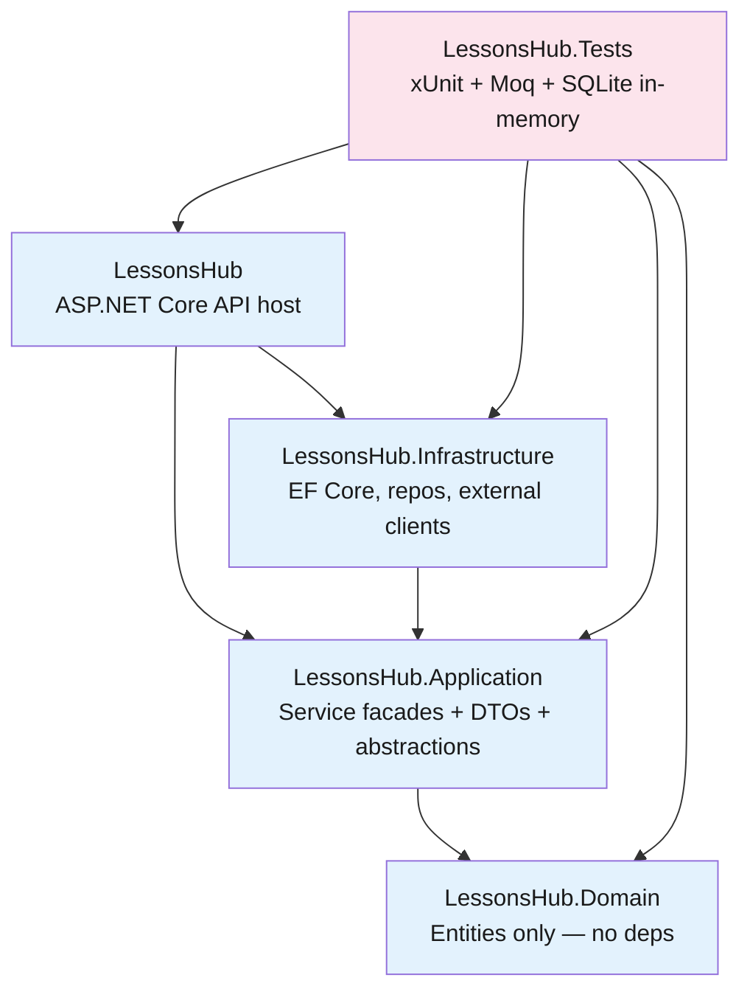
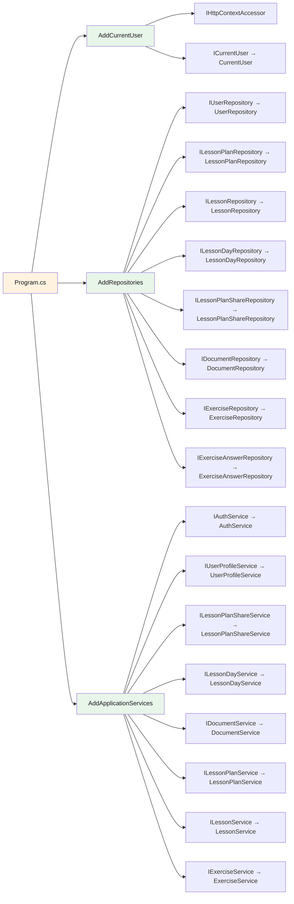
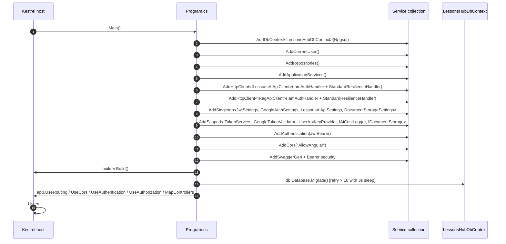
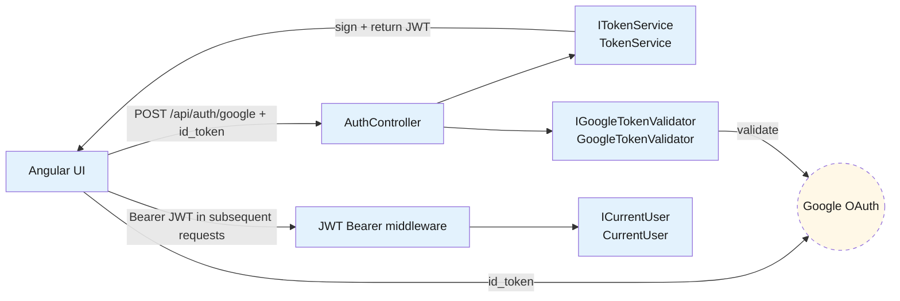

# Backend — 01 Architecture

The .NET 8 solution is split into four projects following Clean Architecture conventions.

> **Source files**: [LessonsHub.sln](../../LessonsHub.sln), [LessonsHub/Program.cs](../../LessonsHub/Program.cs), [LessonsHub/Extensions/DependencyInjection.cs](../../LessonsHub/Extensions/DependencyInjection.cs).

## Solution layout

**The dependency rule**: Domain has zero project deps. Application depends only on Domain. Infrastructure depends on Application (so it can implement its interfaces). API (the host) depends on both Application and Infrastructure, wiring them together at startup.

## Per-project responsibilities

| Project | Purpose | Notable files |
|---|---|---|
| `LessonsHub.Domain` | Pure entity classes — no behaviour, no external deps. EF treats them as POCOs. | All under [Entities/](../../LessonsHub.Domain/Entities/) |
| `LessonsHub.Application` | Abstractions (`IRepository`, `I*Service`, `ICurrentUser`), service implementations (the facades), DTOs, mappers, `ServiceResult<T>`. The framework-agnostic core of the app. | [Abstractions/](../../LessonsHub.Application/Abstractions/), [Services/](../../LessonsHub.Application/Services/), [Models/](../../LessonsHub.Application/Models/) |
| `LessonsHub.Infrastructure` | EF Core `DbContext`, repository implementations, external clients (Google ID-token validator, AI HTTP client, document storage), JWT issuer, EF migrations. | [Data/](../../LessonsHub.Infrastructure/Data/), [Repositories/](../../LessonsHub.Infrastructure/Repositories/), [Services/](../../LessonsHub.Infrastructure/Services/), [Auth/](../../LessonsHub.Infrastructure/Auth/), [Migrations/](../../LessonsHub.Infrastructure/Migrations/) |
| `LessonsHub` | ASP.NET host — controllers, DI registration, JWT bearer auth, CORS, Swagger. Composition root. | [Controllers/](../../LessonsHub/Controllers/), [Program.cs](../../LessonsHub/Program.cs), [Extensions/](../../LessonsHub/Extensions/) |
| `LessonsHub.Tests` | Integration tests against SQLite-in-memory DbContext. Tests construct the full controller→service→repo stack via [TestStack.cs](../../LessonsHub.Tests/TestSupport/TestStack.cs). | [Controllers/](../../LessonsHub.Tests/Controllers/), [TestSupport/](../../LessonsHub.Tests/TestSupport/) |

## DI registration

Composition happens in [Program.cs](../../LessonsHub/Program.cs) via three extension methods on `IServiceCollection` defined in [Extensions/DependencyInjection.cs](../../LessonsHub/Extensions/DependencyInjection.cs):

All registrations are `Scoped` — same lifetime as `LessonsHubDbContext`, which means all repos within a request share one `DbContext` (and therefore one EF Core change-tracker / unit of work).

## Startup sequence

The `db.Database.Migrate()` retry loop handles the case where Cloud SQL is briefly unreachable on cold start.

## Authentication wiring

- `JwtBearerDefaults.AuthenticationScheme` is the default scheme.
- `JwtSettings` (issuer, audience, secret, expiration) is a singleton bound from `JwtSettings:*` config.
- `ICurrentUser` reads the `NameIdentifier` claim from `IHttpContextAccessor.HttpContext.User`, throws `InvalidOperationException` if absent (every facade method assumes auth is required; `[Authorize]` on the controller enforces it before the facade runs).
