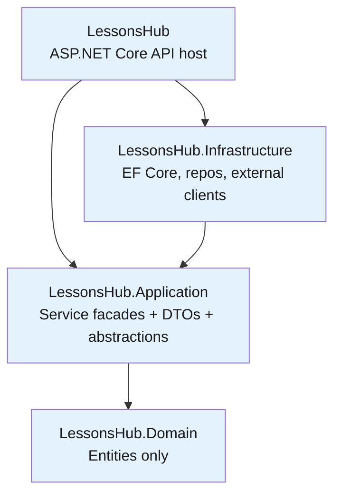
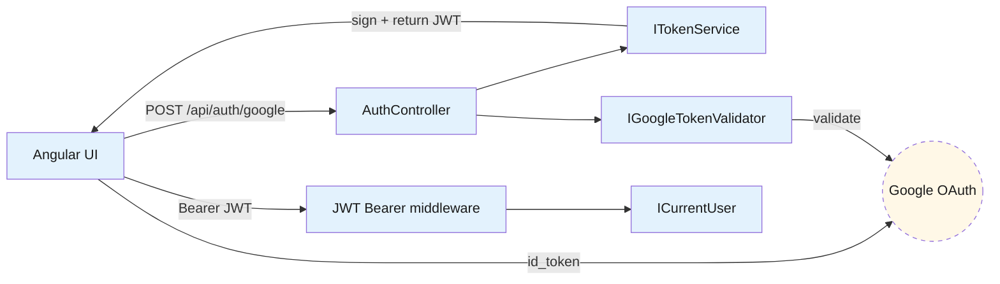

# Backend — 01 Architecture

The .NET 8 solution follows Clean Architecture conventions across four projects.

> **Source files**: [LessonsHub.sln](../../LessonsHub.sln), [LessonsHub/Program.cs](../../LessonsHub/Program.cs), [LessonsHub/Extensions/DependencyInjection.cs](../../LessonsHub/Extensions/DependencyInjection.cs).

## Solution layout

The dependency rule: Domain has zero project deps. Application depends only on Domain. Infrastructure depends on Application (so it can implement its interfaces). API (the host) depends on both, wiring them at startup.

| Project | Purpose |
| --- | --- |
| `LessonsHub.Domain` | Pure entity classes — POCOs, no behaviour |
| `LessonsHub.Application` | `I*Service` / `IRepository` abstractions, service facades, DTOs, mappers, `ServiceResult<T>`, `ICurrentUser` |
| `LessonsHub.Infrastructure` | `LessonsHubDbContext`, repository implementations, external clients (Google validator, AI HTTP clients, doc storage), JWT issuer, EF migrations |
| `LessonsHub` | Composition root — controllers, DI registration, JWT bearer, CORS, SignalR hub |

## DI registration

[Extensions/DependencyInjection.cs](../../LessonsHub/Extensions/DependencyInjection.cs) exposes three extension methods called from `Program.cs`: `AddCurrentUser()`, `AddRepositories()`, `AddApplicationServices()`. All registrations are `Scoped` — same lifetime as `LessonsHubDbContext`, so all repos within a request share one DbContext (and one EF change-tracker / unit of work).

## Authentication wiring

The default scheme is `JwtBearerDefaults.AuthenticationScheme`. `JwtSettings` (issuer, audience, secret, expiration) is bound from config as a singleton. `ICurrentUser` reads `NameIdentifier` from `IHttpContextAccessor.HttpContext.User` and throws if absent — every facade method assumes auth is required and `[Authorize]` on the controller enforces it before the facade runs.

## SignalR + background worker

For AI generation the API enqueues `Job` rows and a `BackgroundService` pumps them through `IJobExecutor` strategies. Results stream to the browser via SignalR groups (`user-{userId}`). See [04-infrastructure.md](04-infrastructure.md) for the executor + queue + hub plumbing.

## Startup highlights

`db.Database.Migrate()` runs in a 10-attempt × 3-second retry loop to handle Cloud SQL cold-start unavailability. CORS is configured with `AllowCredentials()` (required for SignalR WebSocket negotiate). Polly `AddStandardResilienceHandler()` is applied to both AI HTTP clients with `SamplingDuration = 5min` (must be ≥ 2× `AttemptTimeout`).
