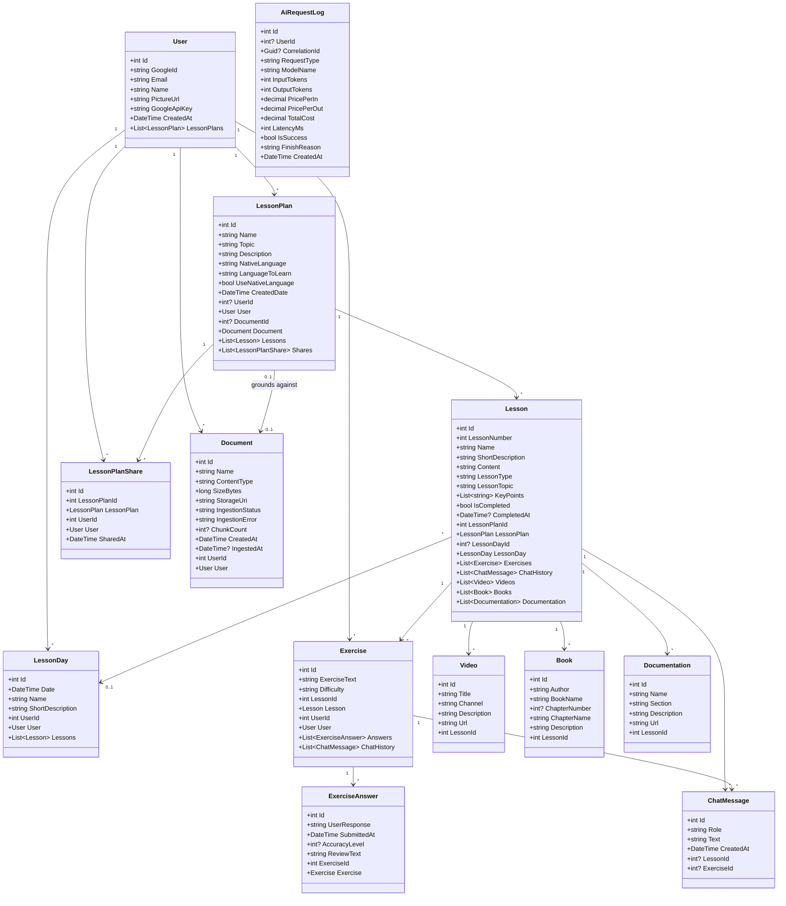
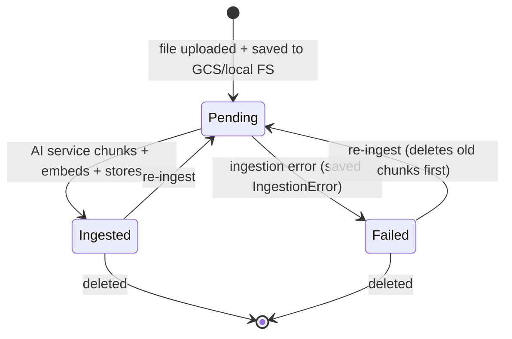

# Backend — 02 Domain Model

Entities live in [LessonsHub.Domain/Entities/](../../LessonsHub.Domain/Entities/). All POCOs, no behaviour, no external dependencies. EF Core relationships are configured in [LessonsHubDbContext.OnModelCreating](../../LessonsHub.Infrastructure/Data/LessonsHubDbContext.cs).

> The cross-tier ER view is in [03-database.md](../03-database.md). This file zooms in on the C# class shape.

## Class diagram (full)

## Per-entity notes

### `User` ([User.cs](../../LessonsHub.Domain/Entities/User.cs))

The Google-authenticated user. `GoogleId` is the OAuth `sub` claim and is the natural key (unique per user). `GoogleApiKey` is the user's *personal* Gemini API key — every AI call routes through it via [IUserApiKeyProvider](../../LessonsHub.Application/Interfaces/IUserApiKeyProvider.cs), so users pay for their own generation. Stored plaintext in `GoogleApiKey` (acceptable threat model: the column is per-user, the user controls when to rotate it via the profile page).

### `LessonPlan` ([LessonPlan.cs](../../LessonsHub.Domain/Entities/LessonPlan.cs))

The course container. Owned by exactly one user; can be shared (read-only) with others via `LessonPlanShare`. Three language fields:

- **`NativeLanguage`** — for non-Language lessons, this is the *only* language field used. For Language lessons, it's the user's mother tongue.
- **`LanguageToLearn`** — Language lessons only. The target language.
- **`UseNativeLanguage`** — Language lessons only. When `true`, lessons render in `NativeLanguage` (with target-language examples). When `false`, immersive mode — entire lesson in `LanguageToLearn`.

`DocumentId` (nullable FK to `Document`) means "this plan was generated from this uploaded book/article". The Python service uses it for RAG grounding orthogonal to lesson type.

### `Lesson` ([Lesson.cs](../../LessonsHub.Domain/Entities/Lesson.cs))

A single lesson within a plan. `LessonNumber` is sequential within the plan (1, 2, 3, …). `Content` is the AI-generated markdown body, lazily populated on first read (see `LessonService.GetDetailAsync`). `KeyPoints` is a JSON-serialized `List<string>` — the bullets the AI was told to cover.

`LessonDayId` (nullable) is the **shared** "scheduled on this day" pointer. See [03-database.md](../03-database.md) for the consistency note about per-user `LessonDay` rows vs. shared `Lesson.LessonDayId`.

### `LessonDay` ([LessonDay.cs](../../LessonsHub.Domain/Entities/LessonDay.cs))

A user's calendar day. Per-user — two users scheduling the same lesson on the same date have two `LessonDay` rows.

### `LessonPlanShare` ([LessonPlanShare.cs](../../LessonsHub.Domain/Entities/LessonPlanShare.cs))

Many-to-many junction between `User` and `LessonPlan`. Sharing is read-only by convention (the sharing target can read content + generate their own exercises, but cannot edit the plan or its lessons; see [LessonService.UpdateAsync](../../LessonsHub.Application/Services/LessonService.cs) which is owner-only).

### `Exercise` ([Exercise.cs](../../LessonsHub.Domain/Entities/Exercise.cs))

Per-user — `Exercise.UserId` is required. When a borrower (someone with whom a plan was shared) generates an exercise on a shared lesson, the new row is theirs. `Difficulty` is a free-text string; the UI restricts it to `easy | medium | hard | very-hard`.

### `ExerciseAnswer` ([ExerciseAnswer.cs](../../LessonsHub.Domain/Entities/ExerciseAnswer.cs))

The user's submitted answer + the AI's review. `AccuracyLevel` (0–100) is the AI's score; `ReviewText` is the markdown explanation.

### Resource entities (`Video`, `Book`, `Documentation`)

Researcher-agent output, attached per-lesson. Generated on demand via the resources flow (see [../flows/resources.md](../flows/resources.md)). All three are per-lesson (not per-user) — visible to anyone who can read the lesson.

### `ChatMessage` ([ChatMessage.cs](../../LessonsHub.Domain/Entities/ChatMessage.cs))

Generic chat history attached to *either* a Lesson or an Exercise (one of `LessonId`/`ExerciseId` is set, the other is null). Currently no controller writes to this table — it's a forward-looking placeholder for an in-lesson chat feature.

### `Document` ([Document.cs](../../LessonsHub.Domain/Entities/Document.cs))

A user-uploaded file (PDF, EPUB, MD, etc.) used as RAG ground-truth. State machine:

`StorageUri` is opaque — see [03-database.md](../03-database.md).

### `AiRequestLog` ([AiRequestLog.cs](../../LessonsHub.Domain/Entities/AiRequestLog.cs))

Per-call cost tracking. Written by [AiCostLogger.cs](../../LessonsHub.Infrastructure/Services/AiCostLogger.cs) after every AI generation. Used for observability + per-user cost reports (no current UI surface). Pricing per `(ModelName, RequestType)` is resolved by [ModelPricingResolver.cs](../../LessonsHub.Infrastructure/Services/ModelPricingResolver.cs).

## Relationships at a glance

| From | To | Rel | Cascade on delete? |
|---|---|---|---|
| `User` | `LessonPlan` | 1 → * | Restrict (orphans the plan if user goes — but users aren't deleted in practice) |
| `LessonPlan` | `Lesson` | 1 → * | **Cascade** |
| `LessonPlan` | `LessonPlanShare` | 1 → * | **Cascade** |
| `LessonPlan` | `Document` | 0..1 → 0..1 | SetNull (delete the doc, plan keeps existing) |
| `Lesson` | `Exercise` | 1 → * | **Cascade** |
| `Lesson` | `Video`/`Book`/`Documentation` | 1 → * | **Cascade** |
| `Lesson` | `LessonDay` | * → 0..1 | SetNull |
| `Exercise` | `ExerciseAnswer` | 1 → * | **Cascade** |
| `User` | `LessonDay` | 1 → * | Restrict |
| `User` | `Exercise` | 1 → * | Restrict |
| `User` | `Document` | 1 → * | Restrict |

The cascading set is centred on `LessonPlan` — deleting a plan tears down everything underneath it. `LessonDay` rows that become empty after the delete are cleaned up explicitly by [LessonPlanService.DeleteAsync](../../LessonsHub.Application/Services/LessonPlanService.cs) (the FK cascade rule is `SetNull`, not delete-day, because two users may share a day).
