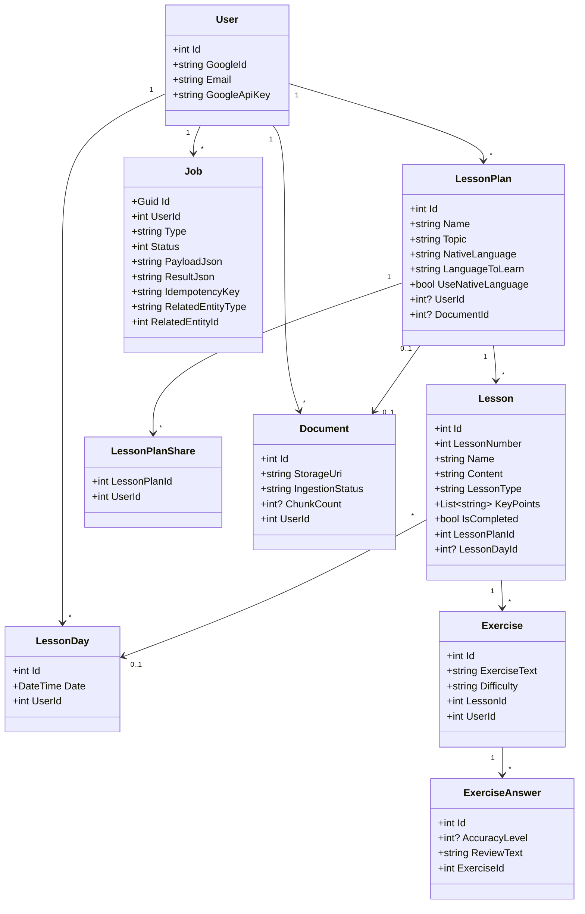
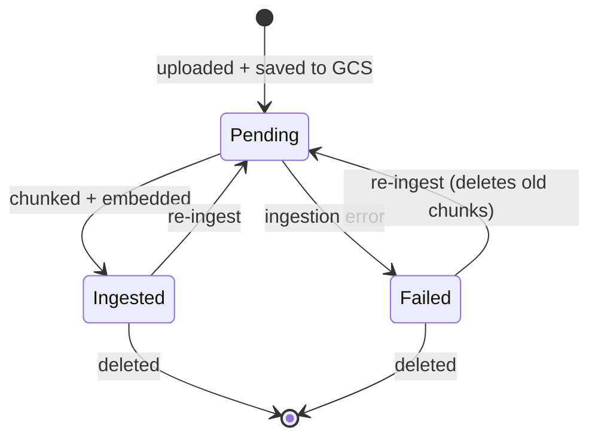

# Backend — 02 Domain Model

Entities under [LessonsHub.Domain/Entities/](../../LessonsHub.Domain/Entities/) — POCOs only, no behaviour, no external deps. EF relationships are configured in [LessonsHubDbContext.OnModelCreating](../../LessonsHub.Infrastructure/Data/LessonsHubDbContext.cs).

> Cross-tier ER view is in [03-database.md](../03-database.md). This file zooms in on the C# class shape.

## Class diagram

Per-lesson resource entities (`Video`, `Book`, `Documentation`) and `ChatMessage` are omitted from the diagram for clarity — they're plain `LessonId`-keyed children. `AiRequestLog` is per-call cost-tracking, written by [AiCostLogger.cs](../../LessonsHub.Infrastructure/Services/AiCostLogger.cs).

## Key invariants

- **Per-user `Exercise` and `ExerciseAnswer`**. When a borrower (a user the plan was shared with) generates an exercise on a shared lesson, the new row is theirs, not the owner's. `Exercise.UserId` is required.
- **Per-user `LessonDay`**. The calendar entry is the user's, not the plan's. `Lesson.LessonDayId` is shared across users — practically only the plan owner can assign/unassign, so this is consistent today; a future per-user-assignment redesign would split it.
- **`GoogleApiKey` is per-user**. Every AI call routes through it via `IUserApiKeyProvider`, so users pay for their own generation.
- **Sharing is read-only by convention**. `LessonService.UpdateAsync` and `RegenerateContentAsync` are owner-only; borrowers can read content and generate their own exercises.
- **Three language fields on `LessonPlan`**. `NativeLanguage` is used universally; `LanguageToLearn` and `UseNativeLanguage` apply only when `LessonType == "Language"`. Native mode = explanations in mother tongue with target-language examples; immersive = entire lesson in target language.
- **`Document.StorageUri` is opaque** (`gs://bucket/path` in prod). Only the storage layer interprets it.

## Document lifecycle

## Cascade behaviour

The cascading set is centred on `LessonPlan` — deleting a plan tears down `Lessons` → `Exercises`/`Videos`/`Books`/`Documentation` and the `LessonPlanShare` rows. `Lesson.LessonDayId` cascade is `SetNull` (two users may share a day), so empty `LessonDay` rows are cleaned up explicitly by `LessonPlanService.DeleteAsync`. `Document` deletion uses `SetNull` on `LessonPlan.DocumentId` — losing the source doc doesn't take the plan down with it.
