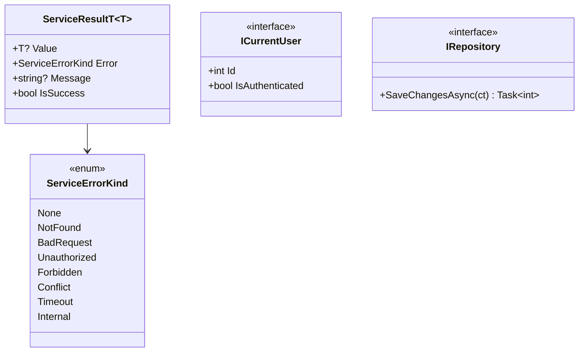

# Backend — 03 Application Layer

The framework-agnostic core. Eight service facades, each implementing an `I*Service` interface from [Abstractions/Services/](../../LessonsHub.Application/Abstractions/Services/) and returning `ServiceResult<T>`.

> **Source files**: [Abstractions/](../../LessonsHub.Application/Abstractions/), [Services/](../../LessonsHub.Application/Services/), [Models/](../../LessonsHub.Application/Models/), [Mappers/](../../LessonsHub.Application/Mappers/), [Interfaces/](../../LessonsHub.Application/Interfaces/).

## Cross-cutting types

- **`ServiceResult<T>`** — every facade returns this. Controllers translate via the `ToActionResult()` extension (see [05-api-controllers.md](05-api-controllers.md)).
- **`ICurrentUser`** — facades inject this rather than reading `HttpContext`. Implementation: [CurrentUser.cs](../../LessonsHub.Infrastructure/Auth/CurrentUser.cs). It first checks the scoped `UserContext.UserId` (used by background-job executors) before falling back to the JWT claim.
- **`IRepository`** — base interface; every concrete repo has `SaveChangesAsync` so facades commit work without a separate `IUnitOfWork`. All repos share one `LessonsHubDbContext` per request scope.

## Service-to-controller mapping

| Service | Controller | Endpoints |
|---|---|---|
| `AuthService` | `AuthController` | Google login |
| `UserProfileService` | `UserProfileController` | Profile read/update |
| `LessonPlanService` | `LessonPlanController` | Plan CRUD + generate + save |
| `LessonPlanShareService` | `LessonPlanShareController` | Sharing CRUD |
| `LessonDayService` | `LessonDayController` | Calendar + assign/unassign |
| `LessonService` | `LessonController` | Lesson detail/update/regen/complete |
| `ExerciseService` | `LessonController` | Exercise generate/retry/check |
| `DocumentService` | `DocumentsController` | Doc upload/list/get/delete |
| `JobService` | `JobsController` | Job lookup + in-flight recovery |

Authorization (the "owner-only" / "has read access" checks) lives in the facades, which call repo predicates like `IsOwnerAsync` / `HasReadAccessAsync`. Repos take primitive parameters (`int userId`, `int planId`) and don't depend on `ICurrentUser`.

## Mappers

[LessonMapper.cs](../../LessonsHub.Application/Mappers/LessonMapper.cs) is the central entity → DTO converter (hand-coded, not AutoMapper). `ToDetailDto(this Lesson, int userId)` filters `Exercises` to only those belonging to `userId` — keeps borrowers from seeing the owner's exercises on a shared lesson.

DTOs are organized by direction:

- **Requests** ([Models/Requests/](../../LessonsHub.Application/Models/Requests/)) — incoming HTTP bodies and outgoing AI HTTP bodies.
- **Responses** ([Models/Responses/](../../LessonsHub.Application/Models/Responses/)) — outgoing HTTP bodies and DTOs returned from facades.

## Application/Interfaces

Abstractions for things implemented in Infrastructure, so Application can depend on the contract without importing Infrastructure types ([Interfaces/](../../LessonsHub.Application/Interfaces/)):

| Interface | Purpose |
|---|---|
| `ITokenService` | JWT issuance |
| `IGoogleTokenValidator` | Validate the One-Tap id_token |
| `IUserApiKeyProvider` | Returns the current user's `User.GoogleApiKey` for AI calls |
| `IAiCostLogger` | Writes `AiRequestLog` rows |
| `ILessonsAiApiClient` | Calls the Python AI service |
| `IRagApiClient` | Calls the Python RAG endpoints |
| `IDocumentStorage` | File save/load (GCS in prod) |

The split keeps the Application project free of `Google.Apis.Auth`, `Google.Cloud.Storage`, `Microsoft.IdentityModel.Tokens`, and HTTP client concerns.
