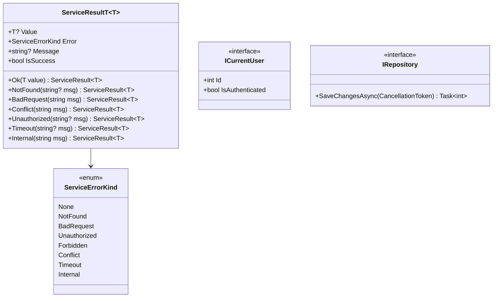
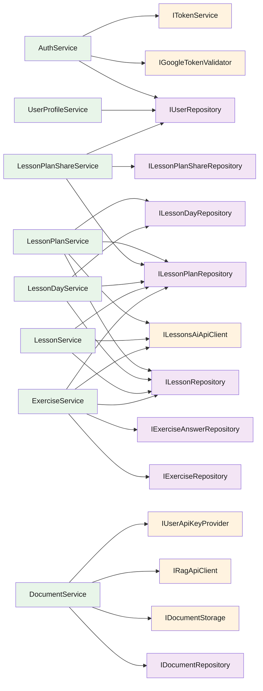

# Backend — 03 Application Layer

The framework-agnostic core. Eight service facades, each implementing an `I*Service` interface from [Abstractions/Services/](../../LessonsHub.Application/Abstractions/Services/) and returning `ServiceResult<T>`.

> **Source files**: [LessonsHub.Application/Abstractions/](../../LessonsHub.Application/Abstractions/), [LessonsHub.Application/Services/](../../LessonsHub.Application/Services/), [LessonsHub.Application/Models/](../../LessonsHub.Application/Models/), [LessonsHub.Application/Mappers/](../../LessonsHub.Application/Mappers/), [LessonsHub.Application/Interfaces/](../../LessonsHub.Application/Interfaces/).

## Cross-cutting types

- **`ServiceResult<T>`** ([ServiceResult.cs](../../LessonsHub.Application/Abstractions/ServiceResult.cs)) — all facades return this. Controllers translate via the `ToActionResult()` extension (see [05-api-controllers.md](05-api-controllers.md)).
- **`ICurrentUser`** ([ICurrentUser.cs](../../LessonsHub.Application/Abstractions/ICurrentUser.cs)) — facades inject this instead of digging into `HttpContext`. Implementation in [Infrastructure/Auth/CurrentUser.cs](../../LessonsHub.Infrastructure/Auth/CurrentUser.cs).
- **`IRepository`** ([IRepository.cs](../../LessonsHub.Application/Abstractions/Repositories/IRepository.cs)) — base interface. Every concrete repo has `SaveChangesAsync` so services can commit work-in-progress without a separate UoW abstraction.

## Service interfaces

```mermaid
classDiagram
  class IAuthService {
    <<interface>>
    +LoginWithGoogleAsync(GoogleLoginRequest, ct) ServiceResult~LoginResponseDto~
  }

  class IUserProfileService {
    <<interface>>
    +GetProfileAsync(ct) ServiceResult~UserProfileDto~
    +UpdateProfileAsync(UpdateUserProfileRequest, ct) ServiceResult~UserProfileDto~
  }

  class ILessonPlanService {
    <<interface>>
    +GetDetailAsync(int planId, ct) ServiceResult~LessonPlanDetailDto~
    +GetSharedWithMeAsync(ct) ServiceResult~List~LessonPlanSummaryDto~~
    +DeleteAsync(int planId, ct) ServiceResult
    +UpdateAsync(int planId, UpdateLessonPlanRequestDto, ct) ServiceResult~LessonPlanDetailDto~
    +GenerateAsync(LessonPlanRequestDto, ct) ServiceResult~LessonPlanResponseDto~
    +SaveAsync(SaveLessonPlanRequestDto, ct) ServiceResult~SaveLessonPlanResponseDto~
  }

  class ILessonPlanShareService {
    <<interface>>
    +GetSharesAsync(int planId, ct) ServiceResult~List~LessonPlanShareDto~~
    +AddShareAsync(int planId, string? email, ct) ServiceResult~LessonPlanShareDto~
    +RemoveShareAsync(int planId, int shareUserId, ct) ServiceResult
  }

  class ILessonDayService {
    <<interface>>
    +GetUserPlansAsync(ct) ServiceResult~List~LessonPlanSummaryDto~~
    +GetAvailableLessonsAsync(int planId, ct) ServiceResult~List~AvailableLessonDto~~
    +GetLessonDaysByMonthAsync(int year, int month, ct) ServiceResult~List~LessonDayDto~~
    +GetLessonDayByDateAsync(DateTime date, ct) ServiceResult~LessonDayDto?~
    +AssignLessonAsync(AssignLessonRequestDto, ct) ServiceResult
    +UnassignLessonAsync(int lessonId, ct) ServiceResult
  }

  class ILessonService {
    <<interface>>
    +GetDetailAsync(int lessonId, ct) ServiceResult~LessonDetailDto~
    +UpdateAsync(int lessonId, UpdateLessonInfoDto, ct) ServiceResult~LessonDetailDto~
    +RegenerateContentAsync(int lessonId, bool bypassDocCache, ct) ServiceResult~LessonDetailDto~
    +ToggleCompleteAsync(int lessonId, ct) ServiceResult~LessonDetailDto~
    +GetSiblingLessonIdsAsync(int lessonId, ct) ServiceResult~SiblingLessonsDto~
  }

  class IExerciseService {
    <<interface>>
    +GenerateAsync(int lessonId, string difficulty, string? comment, ct) ServiceResult~ExerciseDto~
    +RetryAsync(int lessonId, string difficulty, string? comment, string review, ct) ServiceResult~ExerciseDto~
    +CheckAnswerAsync(int exerciseId, string? answer, ct) ServiceResult~ExerciseAnswerDto~
  }

  class IDocumentService {
    <<interface>>
    +ListAsync(ct) ServiceResult~List~DocumentDto~~
    +GetAsync(int id, ct) ServiceResult~DocumentDto~
    +UploadAsync(UploadDocumentInput, ct) ServiceResult~DocumentDto~
    +DeleteAsync(int id, ct) ServiceResult
  }
```

## Service-to-controller mapping

| Service | Controller | Endpoints owned |
|---|---|---|
| `AuthService` | [AuthController](../../LessonsHub/Controllers/AuthController.cs) | `POST /api/auth/google` |
| `UserProfileService` | [UserProfileController](../../LessonsHub/Controllers/UserProfileController.cs) | `GET/PUT /api/user/profile` |
| `LessonPlanService` | [LessonPlanController](../../LessonsHub/Controllers/LessonPlanController.cs) | Plan CRUD + generate + save |
| `LessonPlanShareService` | [LessonPlanShareController](../../LessonsHub/Controllers/LessonPlanShareController.cs) | Sharing CRUD |
| `LessonDayService` | [LessonDayController](../../LessonsHub/Controllers/LessonDayController.cs) | Calendar + assign/unassign + plan list |
| `LessonService` | [LessonController](../../LessonsHub/Controllers/LessonController.cs) | Lesson detail/update/regen/complete/siblings |
| `ExerciseService` | [LessonController](../../LessonsHub/Controllers/LessonController.cs) (same controller) | Exercise generate/retry/check |
| `DocumentService` | [DocumentsController](../../LessonsHub/Controllers/DocumentsController.cs) | Doc upload/list/get/delete |

## Service dependency map

## Mappers

[LessonsHub.Application/Mappers/LessonMapper.cs](../../LessonsHub.Application/Mappers/LessonMapper.cs) is the central entity → DTO converter. Hand-coded extension methods, not AutoMapper. Notable: `ToDetailDto(this Lesson, int userId)` filters `Exercises` to only those belonging to `userId` — keeps borrowers from seeing the owner's exercises on a shared lesson.

DTOs are organized by direction:

- **Requests** ([Models/Requests/](../../LessonsHub.Application/Models/Requests/)) — incoming HTTP bodies and outgoing AI HTTP bodies. Examples: `LessonPlanRequestDto`, `SaveLessonPlanRequestDto`, `AiLessonContentRequest`, `AiLessonExerciseRequest`.
- **Responses** ([Models/Responses/](../../LessonsHub.Application/Models/Responses/)) — outgoing HTTP bodies and DTOs returned from facades. Examples: `LessonDetailDto`, `LessonPlanDetailDto`, `LessonPlanSummaryDto`, `ExerciseDto`, `ExerciseAnswerDto`, `LoginResponseDto`, `SiblingLessonsDto`, `DocumentDto`.

## Application/Interfaces

[Abstractions for things implemented in Infrastructure](../../LessonsHub.Application/Interfaces/), so Application can depend on the contract without importing Infrastructure types:

| Interface | Implementation | Purpose |
|---|---|---|
| `ITokenService` | `Infrastructure/Services/TokenService.cs` | JWT issuance |
| `IGoogleTokenValidator` | `Infrastructure/Services/GoogleTokenValidator.cs` | Validate the One-Tap id_token |
| `IUserApiKeyProvider` | `Infrastructure/Services/UserApiKeyProvider.cs` | Returns the current user's `User.GoogleApiKey` for AI calls |
| `IAiCostLogger` | `Infrastructure/Services/AiCostLogger.cs` | Writes `AiRequestLog` rows |
| `ILessonsAiApiClient` | `Infrastructure/Services/LessonsAiApiClient.cs` | Calls the Python AI service |
| `IRagApiClient` | `Infrastructure/Services/RagApiClient.cs` | Calls the Python RAG endpoints |
| `IDocumentStorage` | `Infrastructure/Services/{Local,Gcs}DocumentStorage.cs` | File save/load (local FS or GCS) |

The split keeps the Application project free of `Google.Apis.Auth`, `Google.Cloud.Storage`, `Microsoft.IdentityModel.Tokens`, and HTTP client concerns.
