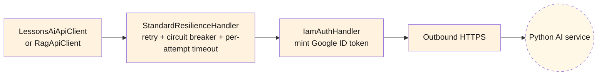
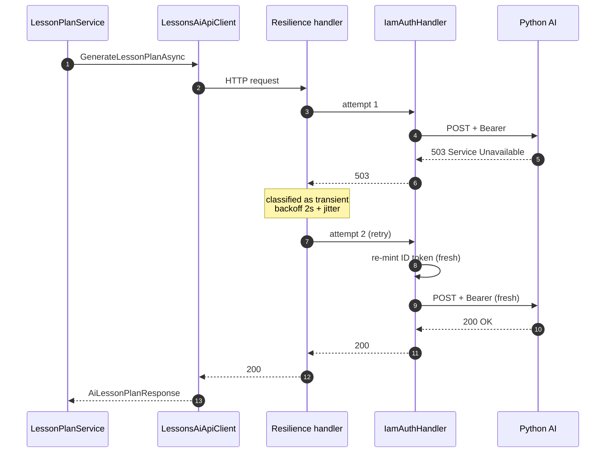
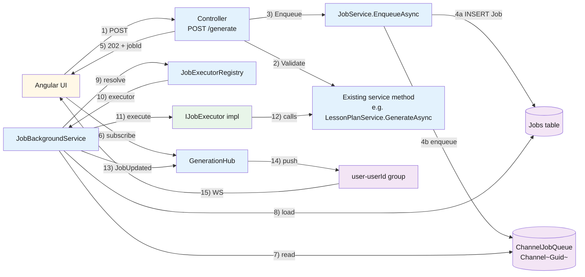

# Backend — 04 Infrastructure

[LessonsHub.Infrastructure/](../../LessonsHub.Infrastructure/) — the bridge between Application abstractions and the outside world (Postgres, Google OAuth, the AI service, GCS).

> **Source files**: [Data/](../../LessonsHub.Infrastructure/Data/), [Repositories/](../../LessonsHub.Infrastructure/Repositories/), [Services/](../../LessonsHub.Infrastructure/Services/), [Auth/](../../LessonsHub.Infrastructure/Auth/), [Migrations/](../../LessonsHub.Infrastructure/Migrations/), [Configuration/](../../LessonsHub.Infrastructure/Configuration/).

## DbContext

[LessonsHubDbContext](../../LessonsHub.Infrastructure/Data/LessonsHubDbContext.cs) is the single EF Core DbContext for the .NET app. It holds 13 `DbSet<>` declarations — one per entity (the same set listed in [02-domain-model.md](02-domain-model.md)).

`OnModelCreating` configures:

- Index on `User.GoogleId` (unique).
- Cascade rules — `LessonPlan → Lesson → Exercise → ExerciseAnswer` cascade-on-delete; `Lesson → LessonDay` is `SetNull` so deleting a plan doesn't yank a day used by another plan.
- JSON value-converter for `Lesson.KeyPoints` (`List<string>` ↔ jsonb).

## Repositories

[RepositoryBase.cs](../../LessonsHub.Infrastructure/Repositories/RepositoryBase.cs) holds the `_db` field and the `SaveChangesAsync` implementation; concretes inherit it and just expose query methods.

### Per-repo method inventory

| Repo | Methods (key ones) |
|---|---|
| `IUserRepository` | `GetByIdAsync`, `GetByEmailAsync`, `GetByGoogleIdAsync`, `Add` |
| `ILessonPlanRepository` | `IsOwnerAsync`, `HasReadAccessAsync`, `GetOwnedAsync`, `GetOwnedWithLessonsAsync`, `GetForReadAsync`, `GetForReadWithLessonsAsync`, `GetSharedWithUserAsync`, `GetOwnedWithLessonCountAsync`, `Add`, `Remove` |
| `ILessonRepository` | `GetByIdAsync`, `GetWithPlanAsync`, `GetWithDetailsAsync`, `GetWithLessonAndPlanForExerciseAsync`, `GetByPlanAsync`, `GetAdjacentAsync`, `Add`, `RemoveRange` |
| `ILessonDayRepository` | `GetByMonthAsync`, `GetByDateAsync`, `GetByDateWithLessonsAsync`, `GetByIdWithLessonsAsync`, `GetEmptyAmongAsync`, `Add`, `Remove`, `RemoveRange` |
| `ILessonPlanShareRepository` | `GetByPlanAsync`, `ExistsAsync`, `GetAsync`, `Add`, `Remove` |
| `IDocumentRepository` | `GetForUserAsync`, `ListForUserAsync`, `Add`, `Remove` |
| `IExerciseRepository` | `GetForUserWithLessonAsync`, `Add` |
| `IExerciseAnswerRepository` | `Add` |

Repos take primitive parameters (`int userId`, `int planId`) — they don't depend on `ICurrentUser`. Authorization (the "owner-only" / "has read access" checks) lives in the *facades*, which call repo predicates like `IsOwnerAsync` / `HasReadAccessAsync`.

### Why no separate `IUnitOfWork`?

Originally there was one. It was removed because:

- All repos are scoped, all share the same `LessonsHubDbContext`. There's already exactly one unit of work per request (the `DbContext` itself).
- Services were artificially injecting `IUnitOfWork` alongside their primary repo, calling `_uow.SaveChangesAsync()` but really meaning "commit this repo's changes."

After the simplification, `IRepository.SaveChangesAsync` lives on every repo (inherited from `RepositoryBase`). Services call it on their primary repo (e.g. `_plans.SaveChangesAsync(ct)` in `LessonPlanService`). Same atomicity guarantees, less indirection.

## External services

### `IamAuthHandler`

Cross-cutting `DelegatingHandler` attached to both `LessonsAiApiClient` and `RagApiClient`. In Cloud Run prod, it mints a Google ID token on every outbound request (target audience = the AI service URL) and adds `Authorization: Bearer <token>`. Cloud Run rejects unauthenticated invocations to the AI service. In local-dev, the handler is a no-op (no ADC available; the local container has no IAM check).

### Resilience pipeline (`Microsoft.Extensions.Http.Resilience` / Polly v8)

Both AI HTTP clients chain `.AddStandardResilienceHandler(...)` after `.AddHttpMessageHandler<IamAuthHandler>()` in [Program.cs](../../LessonsHub/Program.cs). Pipeline order, outer → inner:

Resilience runs *outside* `IamAuthHandler`, so a retry re-mints a fresh ID token if the original expired mid-request.

**Configured policies** (see `ConfigureAiResilience` in [Program.cs](../../LessonsHub/Program.cs)):

| Policy | Setting | Why |
|---|---|---|
| Retry | 1 attempt, 2s base, exponential backoff w/ jitter | Cover network blips + cold start; conservative because the Python side already has its own internal quality-retry loop (3 attempts) — stacking amplifies tail latency + Gemini cost. |
| Circuit breaker | open after 50% failures over 5-min window, 30s break | Stop hammering a broken AI service while users keep clicking "Generate". Polly requires the sampling window be ≥ 2× per-attempt timeout, so 5 min covers two worst-case 2-min attempts plus headroom. |
| Per-attempt timeout | 2 minutes | Inner cap. Without this a hung request burns the whole `HttpClient.Timeout` and leaves no budget for retry. |
| Total request timeout | `LessonsAiApiSettings.TimeoutMinutes` | Outer cap, drives the user-facing 504. Same value as `client.Timeout`. |

**Retry triggers**: transient HTTP errors as defined by the standard handler — 5xx, 408 Request Timeout, 429 Too Many Requests, plus network-level failures (`HttpRequestException`, `TaskCanceledException` from timeout, etc.). 4xx other than the above are *not* retried — programming bugs shouldn't loop.

**Failure modes from the .NET service's perspective**:

If the circuit is open when a new request arrives, Polly throws `BrokenCircuitException` immediately — no HTTP call is even attempted. `LessonsAiApiClient`'s catch blocks treat that as a normal exception (logged, response is null), which surfaces as `ServiceErrorKind.Internal` to the user. The 30-second break gives the AI service room to recover.

### Realtime / job pipeline (SignalR + background worker)

All AI-generation endpoints are now **fire-and-forget**: the controller validates the request synchronously, persists a `Job` row, enqueues its id, and returns `202 Accepted { jobId }`. A `BackgroundService` pumps the queue and pushes lifecycle events to the SignalR hub. Browsers subscribe to a per-user group and update UI as `Status` transitions.

**Components**:

| Class | Responsibility |
|---|---|
| `GenerationHub` ([Realtime/GenerationHub.cs](../../LessonsHub.Infrastructure/Realtime/GenerationHub.cs)) | `[Authorize]` SignalR hub. On connect joins `user-{userId}` group from JWT claim. Server-only — no client-callable methods. Mounted at `/hubs/generation`. |
| `IJobQueue` / `ChannelJobQueue` ([Realtime/ChannelJobQueue.cs](../../LessonsHub.Infrastructure/Realtime/ChannelJobQueue.cs)) | Unbounded `Channel<Guid>`, single-reader. Singleton. |
| `JobBackgroundService` ([Realtime/JobBackgroundService.cs](../../LessonsHub.Infrastructure/Realtime/JobBackgroundService.cs)) | `BackgroundService`: at startup re-enqueues `Pending` jobs from a previous instance and marks orphaned `Running` rows `Failed`. Main loop reads channel → opens DI scope → loads `Job` → sets `UserContext.UserId` (so executors see the right `_currentUser.Id` despite no HttpContext) → resolves executor → runs → writes result/error → `IHubContext<GenerationHub>.Clients.Group("user-{id}").SendAsync("JobUpdated", JobEvent)`. |
| `IJobExecutor` / `JobExecutorRegistry` | Strategy pattern keyed on `Job.Type`. One executor class per `JobType` constant ([Models/Jobs/JobType.cs](../../LessonsHub.Application/Models/Jobs/JobType.cs)). Each executor deserializes its payload and calls the existing service method (`_plans.GenerateAsync` etc.) — the service does the real work, the executor is a thin wrapper. |
| `IJobService` / `JobService` ([Application/Services/JobService.cs](../../LessonsHub.Application/Services/JobService.cs)) | Controller-facing API: `EnqueueAsync` (with idempotency probe + DB insert + queue enqueue), `GetForCurrentUserAsync`, `ListForCurrentUserAsync`. |
| `UserContext` ([Application/Abstractions/UserContext.cs](../../LessonsHub.Application/Abstractions/UserContext.cs)) | Mutable scoped holder. The BG worker writes `Job.UserId` here before resolving the executor; `CurrentUser` checks it first and falls back to `IHttpContextAccessor` for normal HTTP scopes. Without this, executors would throw "No authenticated user" because they run outside any HTTP request. |

**JWT on the WebSocket handshake**: the JS SignalR client can't set headers on the WS upgrade. Instead it sends `?access_token=<jwt>` on the URL. [Program.cs:JwtBearerEvents.OnMessageReceived](../../LessonsHub/Program.cs) extracts this token only when the request path starts with `/hubs/`, so the query-string-token escape hatch isn't accidentally exposed on regular API endpoints.

**Idempotency**: every controller endpoint accepts `X-Idempotency-Key`. `JobService.EnqueueAsync` looks up `(UserId, Type, Key)` first and returns the existing job's id if one exists. Backed by a unique filtered index — see [03-database.md](../03-database.md).

**In-flight recovery**: jobs survive UI navigation because the BG worker doesn't care about subscribers. Two lookup endpoints exist so the UI can repaint banners on revisit:

| Endpoint | Returns | Used for |
| --- | --- | --- |
| `GET /api/jobs/in-flight?type=X&relatedEntityType=Y&relatedEntityId=Z` | One in-flight `JobDto` or `null` | Single-job pages (e.g. lesson-plan generate). Page-load probe to re-attach banner. |
| `GET /api/jobs/in-flight-for-entity?relatedEntityType=Lesson&relatedEntityId=42` | Array of all in-flight `JobDto`s tied to that entity | Detail pages with multiple possible job types (e.g. lesson detail covers content gen / regen / exercise gen / retry). One query repaints every active banner. |

The Angular client wraps these in `JobsService.findInFlight()` / `listInFlightForEntity()`. On page load, components dispatch each returned job to the matching banner state and call `JobsService.subscribeToExistingJob(jobId)` to receive the rest of the lifecycle. That helper polls the job once before opening the WS to handle the race where the executor finished between page load and the SignalR connect.

**`JobsService.postAndStream<TBody>(url, body, opts?)`**: the per-service POST + subscribe + filter-on-terminal + throw-on-failed boilerplate is collapsed into one helper. Auto-injects `X-Idempotency-Key` and reuses `subscribeToExistingJob` for the streaming half. Each TS service method (`generateLessonPlan`, `generateContent`, etc.) becomes ~3 lines.

**Cloud Run constraint**: the queue is in-process, so the .NET service runs `--max-instances=1` until we add a Redis backplane. Combined with `--min-instances=1 --no-cpu-throttling` (so WebSockets stay alive between requests) — see the deploy YAML.

**Reverse proxy**: Caddy in docker-compose routes `/api/*` AND `/hubs/*` to the `.NET` container. Without the second route, the SignalR JS client's `POST /hubs/generation/negotiate` hits the Angular SSR Express server and gets a 404 with HTML body. See [Caddyfile](../../Caddyfile).

### Document storage strategy

Two implementations of `IDocumentStorage`, picked at startup:

- **`LocalDocumentStorage`** — writes to `./uploads/<userId>/<docId>/<fileName>`. Used in docker-compose dev.
- **`GcsDocumentStorage`** — uses `Google.Cloud.Storage.V1` client, writes to `gs://<project>-documents/<userId>/<docId>/<fileName>`. Used in Cloud Run prod.

Selection is via [DocumentStorageSettings.Strategy](../../LessonsHub.Infrastructure/Configuration/DocumentStorageSettings.cs) read from config (`DocumentStorage:Strategy = "Local"` or `"Gcs"`).

### Pricing resolver

[ModelPricingResolver](../../LessonsHub.Infrastructure/Services/ModelPricingResolver.cs) resolves a per-token price for a given `(ModelName, RequestType)`. Hardcoded table in source — when Gemini changes its prices, update this file. Used by `AiCostLogger` to compute `TotalCost = (in_tokens × price_in) + (out_tokens × price_out)`.

## Configuration objects

[LessonsHub.Infrastructure/Configuration/](../../LessonsHub.Infrastructure/Configuration/) holds plain settings classes bound to config sections in `Program.cs`:

| Class | Bound from | Used by |
|---|---|---|
| `JwtSettings` | `JwtSettings:*` | `TokenService` (signing), JWT bearer middleware (validation) |
| `GoogleAuthSettings` | `GoogleAuth:*` | `GoogleTokenValidator` |
| `LessonsAiApiSettings` | `LessonsAiApi:*` | `LessonsAiApiClient` (BaseUrl, Timeout) |
| `DocumentStorageSettings` | `DocumentStorage:*` | DI selection between Local/Gcs storage; bucket name |

All registered as `Singleton` (config is read once at startup; no per-request rebinding).

## Migrations

[LessonsHub.Infrastructure/Migrations/](../../LessonsHub.Infrastructure/Migrations/) — EF Core code-first migrations. Auto-applied at startup by `db.Database.Migrate()` in [Program.cs](../../LessonsHub/Program.cs). The migration history is in [03-database.md](../03-database.md).

Adding a new migration: `dotnet ef migrations add <Name> --project LessonsHub.Infrastructure --startup-project LessonsHub`.
