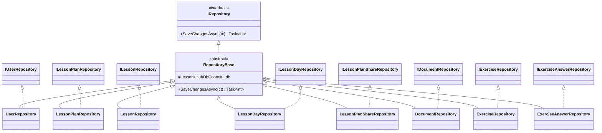
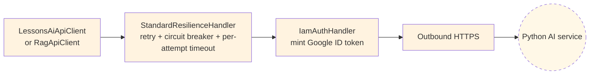
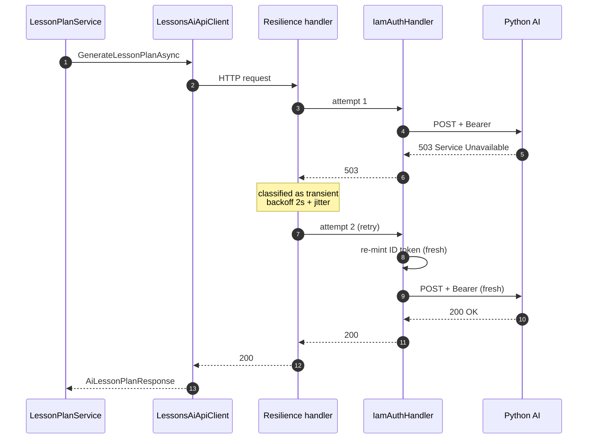

# Backend — 04 Infrastructure

[LessonsHub.Infrastructure/](../../LessonsHub.Infrastructure/) — the bridge between Application abstractions and the outside world (Postgres, Google OAuth, the AI service, GCS).

> **Source files**: [Data/](../../LessonsHub.Infrastructure/Data/), [Repositories/](../../LessonsHub.Infrastructure/Repositories/), [Services/](../../LessonsHub.Infrastructure/Services/), [Auth/](../../LessonsHub.Infrastructure/Auth/), [Migrations/](../../LessonsHub.Infrastructure/Migrations/), [Configuration/](../../LessonsHub.Infrastructure/Configuration/).

## DbContext

[LessonsHubDbContext](../../LessonsHub.Infrastructure/Data/LessonsHubDbContext.cs) is the single EF Core DbContext for the .NET app. It holds 13 `DbSet<>` declarations — one per entity (the same set listed in [02-domain-model.md](02-domain-model.md)).

`OnModelCreating` configures:

- Index on `User.GoogleId` (unique).
- Cascade rules — `LessonPlan → Lesson → Exercise → ExerciseAnswer` cascade-on-delete; `Lesson → LessonDay` is `SetNull` so deleting a plan doesn't yank a day used by another plan.
- JSON value-converter for `Lesson.KeyPoints` (`List<string>` ↔ jsonb).

## Repositories

[RepositoryBase.cs](../../LessonsHub.Infrastructure/Repositories/RepositoryBase.cs) holds the `_db` field and the `SaveChangesAsync` implementation; concretes inherit it and just expose query methods.

### Per-repo method inventory

| Repo | Methods (key ones) |
|---|---|
| `IUserRepository` | `GetByIdAsync`, `GetByEmailAsync`, `GetByGoogleIdAsync`, `Add` |
| `ILessonPlanRepository` | `IsOwnerAsync`, `HasReadAccessAsync`, `GetOwnedAsync`, `GetOwnedWithLessonsAsync`, `GetForReadAsync`, `GetForReadWithLessonsAsync`, `GetSharedWithUserAsync`, `GetOwnedWithLessonCountAsync`, `Add`, `Remove` |
| `ILessonRepository` | `GetByIdAsync`, `GetWithPlanAsync`, `GetWithDetailsAsync`, `GetWithLessonAndPlanForExerciseAsync`, `GetByPlanAsync`, `GetAdjacentAsync`, `Add`, `RemoveRange` |
| `ILessonDayRepository` | `GetByMonthAsync`, `GetByDateAsync`, `GetByDateWithLessonsAsync`, `GetByIdWithLessonsAsync`, `GetEmptyAmongAsync`, `Add`, `Remove`, `RemoveRange` |
| `ILessonPlanShareRepository` | `GetByPlanAsync`, `ExistsAsync`, `GetAsync`, `Add`, `Remove` |
| `IDocumentRepository` | `GetForUserAsync`, `ListForUserAsync`, `Add`, `Remove` |
| `IExerciseRepository` | `GetForUserWithLessonAsync`, `Add` |
| `IExerciseAnswerRepository` | `Add` |

Repos take primitive parameters (`int userId`, `int planId`) — they don't depend on `ICurrentUser`. Authorization (the "owner-only" / "has read access" checks) lives in the *facades*, which call repo predicates like `IsOwnerAsync` / `HasReadAccessAsync`.

### Why no separate `IUnitOfWork`?

Originally there was one. It was removed because:

- All repos are scoped, all share the same `LessonsHubDbContext`. There's already exactly one unit of work per request (the `DbContext` itself).
- Services were artificially injecting `IUnitOfWork` alongside their primary repo, calling `_uow.SaveChangesAsync()` but really meaning "commit this repo's changes."

After the simplification, `IRepository.SaveChangesAsync` lives on every repo (inherited from `RepositoryBase`). Services call it on their primary repo (e.g. `_plans.SaveChangesAsync(ct)` in `LessonPlanService`). Same atomicity guarantees, less indirection.

## External services

```mermaid
classDiagram
  class TokenService {
    -JwtSettings _jwt
    +CreateToken(User user) string
  }

  class GoogleTokenValidator {
    -GoogleAuthSettings _settings
    +ValidateAsync(string idToken, ct) Task~GoogleTokenPayload?~
  }

  class CurrentUser {
    -IHttpContextAccessor _httpContextAccessor
    +int Id
    +bool IsAuthenticated
  }

  class UserApiKeyProvider {
    -ICurrentUser _currentUser
    -IUserRepository _users
    +GetCurrentUserKeyAsync() Task~string?~
  }

  class AiCostLogger {
    -LessonsHubDbContext _db
    -IModelPricingResolver _pricing
    +LogAsync(ModelUsage usage, int? userId, Guid correlationId) Task
  }

  class LessonsAiApiClient {
    -HttpClient _http
    +GenerateLessonPlanAsync(AiLessonPlanRequest) Task~AiLessonPlanResponse?~
    +GenerateLessonContentAsync(AiLessonContentRequest) Task~AiLessonContentResponse?~
    +GenerateLessonExerciseAsync(AiLessonExerciseRequest) Task~AiLessonExerciseResponse?~
    +RetryLessonExerciseAsync(AiExerciseRetryRequest) Task~AiLessonExerciseResponse?~
    +CheckExerciseReviewAsync(AiExerciseReviewRequest) Task~AiExerciseReviewResponse?~
    +GenerateLessonResourcesAsync(AiLessonResourcesRequest) Task~AiLessonResourcesResponse?~
  }

  class RagApiClient {
    -HttpClient _http
    +IngestAsync(RagIngestRequest, ct) Task~RagIngestResponse~
    +SearchAsync(RagSearchRequest, ct) Task~RagSearchResponse~
  }

  class IamAuthHandler {
    -ITokenAccess _tokenAccess
    +SendAsync override
  }

  class IDocumentStorage {
    <<interface>>
    +SaveAsync(int userId, int docId, string fileName, Stream, string contentType, ct) Task~string~
    +DeleteAsync(string storageUri, ct) Task
  }

  class LocalDocumentStorage
  class GcsDocumentStorage

  IDocumentStorage <|.. LocalDocumentStorage
  IDocumentStorage <|.. GcsDocumentStorage
```

### `IamAuthHandler`

Cross-cutting `DelegatingHandler` attached to both `LessonsAiApiClient` and `RagApiClient`. In Cloud Run prod, it mints a Google ID token on every outbound request (target audience = the AI service URL) and adds `Authorization: Bearer <token>`. Cloud Run rejects unauthenticated invocations to the AI service. In local-dev, the handler is a no-op (no ADC available; the local container has no IAM check).

### Resilience pipeline (`Microsoft.Extensions.Http.Resilience` / Polly v8)

Both AI HTTP clients chain `.AddStandardResilienceHandler(...)` after `.AddHttpMessageHandler<IamAuthHandler>()` in [Program.cs](../../LessonsHub/Program.cs). Pipeline order, outer → inner:

Resilience runs *outside* `IamAuthHandler`, so a retry re-mints a fresh ID token if the original expired mid-request.

**Configured policies** (see `ConfigureAiResilience` in [Program.cs](../../LessonsHub/Program.cs)):

| Policy | Setting | Why |
|---|---|---|
| Retry | 1 attempt, 2s base, exponential backoff w/ jitter | Cover network blips + cold start; conservative because the Python side already has its own internal quality-retry loop (3 attempts) — stacking amplifies tail latency + Gemini cost. |
| Circuit breaker | open after 50% failures over 30s window, 30s break | Stop hammering a broken AI service while users keep clicking "Generate". |
| Per-attempt timeout | 2 minutes | Inner cap. Without this a hung request burns the whole `HttpClient.Timeout` and leaves no budget for retry. |
| Total request timeout | `LessonsAiApiSettings.TimeoutMinutes` | Outer cap, drives the user-facing 504. Same value as `client.Timeout`. |

**Retry triggers**: transient HTTP errors as defined by the standard handler — 5xx, 408 Request Timeout, 429 Too Many Requests, plus network-level failures (`HttpRequestException`, `TaskCanceledException` from timeout, etc.). 4xx other than the above are *not* retried — programming bugs shouldn't loop.

**Failure modes from the .NET service's perspective**:

If the circuit is open when a new request arrives, Polly throws `BrokenCircuitException` immediately — no HTTP call is even attempted. `LessonsAiApiClient`'s catch blocks treat that as a normal exception (logged, response is null), which surfaces as `ServiceErrorKind.Internal` to the user. The 30-second break gives the AI service room to recover.

### Document storage strategy

Two implementations of `IDocumentStorage`, picked at startup:

- **`LocalDocumentStorage`** — writes to `./uploads/<userId>/<docId>/<fileName>`. Used in docker-compose dev.
- **`GcsDocumentStorage`** — uses `Google.Cloud.Storage.V1` client, writes to `gs://<project>-documents/<userId>/<docId>/<fileName>`. Used in Cloud Run prod.

Selection is via [DocumentStorageSettings.Strategy](../../LessonsHub.Infrastructure/Configuration/DocumentStorageSettings.cs) read from config (`DocumentStorage:Strategy = "Local"` or `"Gcs"`).

### Pricing resolver

[ModelPricingResolver](../../LessonsHub.Infrastructure/Services/ModelPricingResolver.cs) resolves a per-token price for a given `(ModelName, RequestType)`. Hardcoded table in source — when Gemini changes its prices, update this file. Used by `AiCostLogger` to compute `TotalCost = (in_tokens × price_in) + (out_tokens × price_out)`.

## Configuration objects

[LessonsHub.Infrastructure/Configuration/](../../LessonsHub.Infrastructure/Configuration/) holds plain settings classes bound to config sections in `Program.cs`:

| Class | Bound from | Used by |
|---|---|---|
| `JwtSettings` | `JwtSettings:*` | `TokenService` (signing), JWT bearer middleware (validation) |
| `GoogleAuthSettings` | `GoogleAuth:*` | `GoogleTokenValidator` |
| `LessonsAiApiSettings` | `LessonsAiApi:*` | `LessonsAiApiClient` (BaseUrl, Timeout) |
| `DocumentStorageSettings` | `DocumentStorage:*` | DI selection between Local/Gcs storage; bucket name |

All registered as `Singleton` (config is read once at startup; no per-request rebinding).

## Migrations

[LessonsHub.Infrastructure/Migrations/](../../LessonsHub.Infrastructure/Migrations/) — EF Core code-first migrations. Auto-applied at startup by `db.Database.Migrate()` in [Program.cs](../../LessonsHub/Program.cs). The migration history is in [03-database.md](../03-database.md).

Adding a new migration: `dotnet ef migrations add <Name> --project LessonsHub.Infrastructure --startup-project LessonsHub`.
