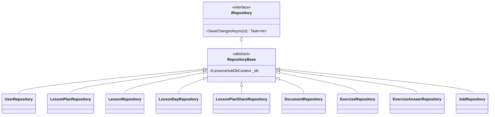
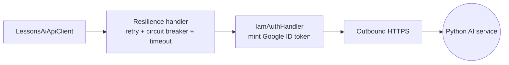
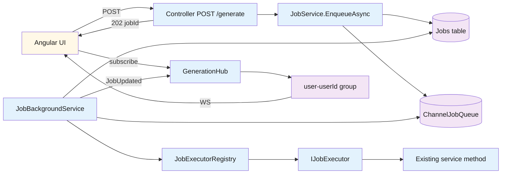

# Backend — 04 Infrastructure

[LessonsHub.Infrastructure/](../../LessonsHub.Infrastructure/) — the bridge between Application abstractions and the outside world (Postgres, Google OAuth, the AI service, GCS, SignalR).

> **Source files**: [Data/](../../LessonsHub.Infrastructure/Data/), [Repositories/](../../LessonsHub.Infrastructure/Repositories/), [Services/](../../LessonsHub.Infrastructure/Services/), [Realtime/](../../LessonsHub.Infrastructure/Realtime/), [Auth/](../../LessonsHub.Infrastructure/Auth/), [Migrations/](../../LessonsHub.Infrastructure/Migrations/).

## DbContext

[LessonsHubDbContext](../../LessonsHub.Infrastructure/Data/LessonsHubDbContext.cs) is the single EF Core DbContext. `OnModelCreating` configures the unique index on `User.GoogleId`, the `LessonPlan → Lesson → Exercise → ExerciseAnswer` cascade chain, the `Lesson → LessonDay` `SetNull` rule, and the JSON value-converter for `Lesson.KeyPoints` (`List<string>` ↔ jsonb).

## Repositories

Nine concrete repos extend [RepositoryBase.cs](../../LessonsHub.Infrastructure/Repositories/RepositoryBase.cs), which holds the `_db` field and the `SaveChangesAsync` implementation. Read-only methods use `AsNoTracking()`; methods that load entities for mutation leave tracking on. There is no separate `IUnitOfWork` — all repos share one `LessonsHubDbContext` per request scope, which is already the unit of work.

## External clients

| Class | Purpose |
|---|---|
| `TokenService` | Sign JWTs from `JwtSettings` |
| `GoogleTokenValidator` | Validate the One-Tap id_token via `Google.Apis.Auth` |
| `CurrentUser` | Reads `UserContext.UserId` first (BG-job scope), then JWT claim (HTTP scope) |
| `UserApiKeyProvider` | Returns current user's `GoogleApiKey` for AI calls |
| `AiCostLogger` | Writes `AiRequestLog` after each AI call; pricing from `ModelPricingResolver` |
| `LessonsAiApiClient` / `RagApiClient` | Typed HTTP clients to the Python AI service |
| `IamAuthHandler` | `DelegatingHandler` mints a Google ID token per outbound request (audience = AI service URL) |
| `GcsDocumentStorage` | `gs://<project>-documents/<userId>/<docId>/<fileName>` writes |

## Resilience pipeline (Polly)

Both AI HTTP clients chain `.AddStandardResilienceHandler(...)` after `.AddHttpMessageHandler<IamAuthHandler>()`. Resilience runs *outside* `IamAuthHandler`, so a retry re-mints a fresh ID token if the original expired mid-request.

| Policy | Setting |
|---|---|
| Retry | 1 attempt, 2s base, exponential backoff with jitter (5xx / 408 / 429 / network failures) |
| Circuit breaker | open after 50% failures over 5-min sampling window, 30s break |
| Per-attempt timeout | 2 minutes |
| Total timeout | `LessonsAiApiSettings.TimeoutMinutes` |

The 5-minute sampling window is required by Polly (must be ≥ 2× per-attempt timeout). 4xx other than 408/429 are not retried — programming bugs shouldn't loop.

## Realtime — SignalR + background worker

All AI generation endpoints are fire-and-forget: the controller validates, persists a `Job` row, enqueues its id, and returns `202 Accepted { jobId }`. A `BackgroundService` pumps the queue and pushes lifecycle events to the SignalR hub. Browsers subscribe to a per-user group and update UI as `Status` transitions.

| Class | Responsibility |
|---|---|
| `GenerationHub` | `[Authorize]` SignalR hub at `/hubs/generation`. On connect joins `user-{userId}` group. Server-only — no client-callable methods. |
| `IJobQueue` / `ChannelJobQueue` | Unbounded `Channel<Guid>`, single-reader, singleton. |
| `JobBackgroundService` | At startup re-enqueues `Pending` jobs and marks orphaned `Running` rows `Failed`. Main loop reads channel → opens DI scope → loads `Job` → sets `UserContext.UserId` → resolves executor → runs → writes result/error → pushes `JobUpdated` to the user's group. |
| `IJobExecutor` / `JobExecutorRegistry` | Strategy pattern keyed on `Job.Type`. One executor per `JobType` constant. Each executor deserializes its payload and calls the existing service method. |
| `JobService` | Controller-facing API: `EnqueueAsync` (idempotency probe + DB insert + queue), lookup methods. |
| `UserContext` | Mutable scoped holder. The BG worker writes `Job.UserId` here so `CurrentUser` resolves correctly outside any HTTP request. |

**JWT on the WebSocket handshake**: the JS SignalR client can't set headers on the WS upgrade. It sends `?access_token=<jwt>` on the URL and `JwtBearerEvents.OnMessageReceived` extracts the token only when the path starts with `/hubs/`, so the query-token escape hatch isn't exposed on regular API endpoints.

**Idempotency**: every controller endpoint accepts `X-Idempotency-Key`. `EnqueueAsync` looks up `(UserId, Type, Key)` first and returns the existing job's id if one exists. Backed by a unique filtered index — see [03-database.md](../03-database.md).

**In-flight recovery**: jobs survive UI navigation because the BG worker doesn't care about subscribers. `GET /api/jobs/in-flight` and `/in-flight-for-entity` let the UI repaint banners on revisit; the Angular client wraps these in `JobsService.findInFlight()` / `listInFlightForEntity()` and falls through to `subscribeToExistingJob(jobId)` for the streaming half.

**Cloud Run constraint**: the queue is in-process, so the .NET service runs `--max-instances=1 --min-instances=1 --no-cpu-throttling` until a Redis backplane is added.

## Configuration

[LessonsHub.Infrastructure/Configuration/](../../LessonsHub.Infrastructure/Configuration/) — plain settings classes bound at startup as singletons:

| Class | Bound from |
|---|---|
| `JwtSettings` | `JwtSettings:*` |
| `GoogleAuthSettings` | `GoogleAuth:*` |
| `LessonsAiApiSettings` | `LessonsAiApi:*` |
| `DocumentStorageSettings` | `DocumentStorage:*` |

EF Core code-first migrations under [Migrations/](../../LessonsHub.Infrastructure/Migrations/) are auto-applied at startup by `db.Database.Migrate()` (with a 10× retry loop for cold-start Cloud SQL availability).
