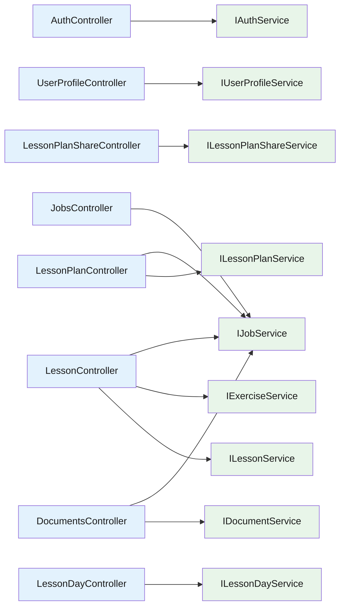

# Backend — 05 API Controllers

Eight controllers in [LessonsHub/Controllers/](../../LessonsHub/Controllers/). Each is a thin HTTP adapter — bind request → call facade → translate `ServiceResult<T>` → return `IActionResult`. Every controller is ≤ 60 lines.

> **Source files**: [LessonsHub/Controllers/](../../LessonsHub/Controllers/), [LessonsHub/Extensions/ServiceResultExtensions.cs](../../LessonsHub/Extensions/ServiceResultExtensions.cs).

## Two response patterns

| Pattern | Used by | Shape |
| --- | --- | --- |
| **Sync** — `200 OK { value }` | Reads + sync mutations (login, save, edit, share, delete, schedule, complete) | Returns the body inline. |
| **Async (job)** — `202 Accepted { jobId }` | All AI-generation endpoints + document ingest | Validates synchronously then enqueues; result lands via SignalR (`/hubs/generation`) or polling on `GET /api/jobs/{id}`. |

Async endpoints accept an optional `X-Idempotency-Key` header. Same `(UserId, Type, Key)` returns the existing job's id rather than enqueueing a duplicate. See [04-infrastructure.md](04-infrastructure.md) for the executor + queue + hub pipeline.

## `ToActionResult()` translation

[ServiceResultExtensions.cs](../../LessonsHub/Extensions/ServiceResultExtensions.cs):

| `ServiceErrorKind` | Maps to | Notes |
| --- | --- | --- |
| `None` | `200 OkObjectResult` | Happy path |
| `NotFound` (no message) | `404` empty body | "exists but not yours" — same shape as "doesn't exist" so we don't leak existence |
| `NotFound` (with message) | `404 { message }` | When leaking existence is fine (e.g. "no user with that email") |
| `BadRequest(msg)` | `400 { message }` | Validation failure |
| `Unauthorized(msg)` | `401 { message }` | Invalid Google token |
| `Conflict(msg)` | `409 { message }` | E.g. "already shared" |
| `Timeout(msg)` | `504 { message }` | AI service didn't respond |
| `Internal(msg)` | `500 { message }` | AI returned malformed/empty result |

`DocumentsController.Delete` is the only place that doesn't use `ToActionResult()` — it returns `204 NoContent` on success.

## Controller inventory

## Endpoint summary

`AuthController` — `POST /api/auth/google` (public). Validates id_token, upserts the User, issues a JWT.

`UserProfileController` `[Authorize]` — `GET/PUT /api/user/profile`. Currently only the `googleApiKey` field is editable.

`LessonPlanController` `[Authorize]`:

- `GET /api/lessonplan/{id}` — owner OR shared-with read access.
- `GET /api/lessonplan/shared-with-me`.
- `DELETE /api/lessonplan/{id}` — owner-only; cascades + cleans up empty `LessonDay` rows.
- `PUT /api/lessonplan/{id}` — owner-only; lesson reconciliation (add/remove/update).
- `POST /api/lessonplan/generate` — **async (job)**. Validates synchronously, enqueues `LessonPlanGenerate`.
- `POST /api/lessonplan/save` — persists a previously-generated plan.

`LessonPlanShareController` `[Authorize]` — `GET/POST/DELETE /api/lessonplan/{id}/shares[/{userId}]`. Owner-only. 404/409/400 for unknown email / duplicate / self-share.

`LessonDayController` `[Authorize]` — calendar endpoints (`/plans`, `/plans/{id}/lessons`, `/{year}/{month}`, `/date/{date}`) plus `POST /assign` and `DELETE /unassign/{lessonId}` (owner-only on the lesson's plan).

`LessonController` `[Authorize]`:

- `GET /api/lesson/{id}` — pure read; filters Exercises to caller's only.
- `PUT /api/lesson/{id}` — owner-only.
- `POST /api/lesson/{id}/generate-content` / `regenerate-content` — **async (job)**.
- `PATCH /api/lesson/{id}/complete` — owner-only.
- `GET /api/lesson/{id}/siblings` — for prev/next nav.
- `POST /api/lesson/{id}/generate-exercise` / `retry-exercise` — **async (job)**, anyone with read access.
- `POST /api/lesson/exercise/{exerciseId}/check` — **async (job)**, exercise owner only.

`DocumentsController` `[Authorize]` — `GET /api/documents`, `GET /{id}`, `POST /upload` (multipart, max 32 MB, ingest is the **async (job)** part), `DELETE /{id}` (best-effort GCS cleanup, returns `204`).

`JobsController` `[Authorize]` — polling fallback + in-flight listing for the SignalR pipeline:

- `GET /api/jobs/{id}` — single job (404 if not owned).
- `GET /api/jobs?status=…`.
- `GET /api/jobs/in-flight?type=X&relatedEntityType=Y&relatedEntityId=Z` — single in-flight job (or `null`). Used by single-job pages on load to re-attach a banner.
- `GET /api/jobs/in-flight-for-entity?...` — array. Used by detail pages to repaint every active banner.
