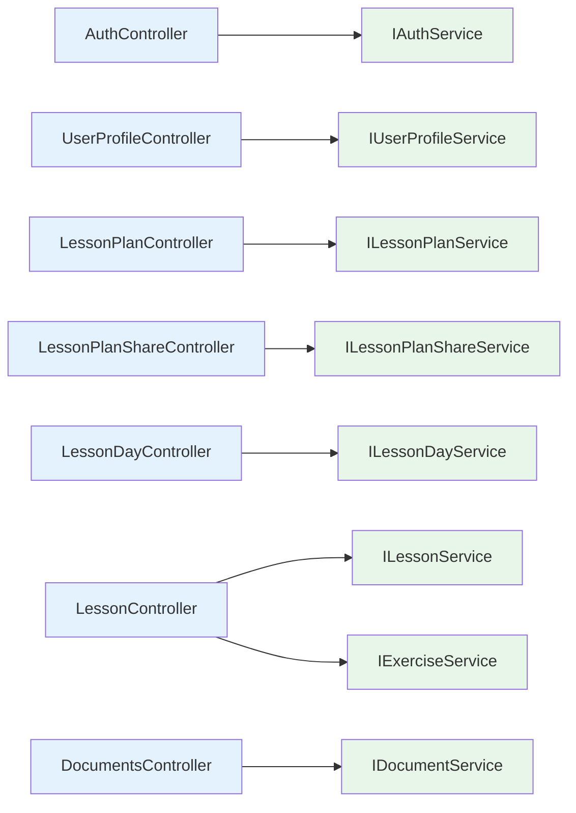

# Backend — 05 API Controllers

Seven controllers in [LessonsHub/Controllers/](../../LessonsHub/Controllers/). Each is a thin HTTP adapter — bind request → call facade → translate `ServiceResult<T>` → return `IActionResult`.

> **Source files**: [LessonsHub/Controllers/](../../LessonsHub/Controllers/), [LessonsHub/Extensions/ServiceResultExtensions.cs](../../LessonsHub/Extensions/ServiceResultExtensions.cs).

## The `ToActionResult()` extension

All controllers share the same translation table. Defined in [ServiceResultExtensions.cs](../../LessonsHub/Extensions/ServiceResultExtensions.cs):

| `ServiceErrorKind` | Maps to | Notes |
|---|---|---|
| `None` | `OkObjectResult(value)` (200) | Happy path |
| `NotFound` (no message) | `NotFoundResult` (404, empty body) | Used for "exists but not yours" — same response shape as "doesn't exist" so we don't leak existence |
| `NotFound` (with message) | `NotFoundObjectResult({ message })` (404) | Used when leaking existence is fine (e.g. "no user with that email") |
| `BadRequest(msg)` | `BadRequestObjectResult({ message })` (400) | Validation failure |
| `Unauthorized(msg)` | `ObjectResult({ message })` (401) | Invalid Google token in `AuthService.LoginWithGoogleAsync` |
| `Forbidden(msg)` | `ObjectResult({ message })` (403) | Currently unused — `[Authorize]` covers most cases |
| `Conflict(msg)` | `ConflictObjectResult({ message })` (409) | E.g. "already shared with this user" |
| `Timeout(msg)` | `ObjectResult({ message })` (504) | AI service didn't respond in time |
| `Internal(msg)` | `ObjectResult({ message })` (500) | AI returned malformed/empty result, etc. |

`DocumentsController.Delete` is the only place that doesn't use `ToActionResult()` — it returns `204 NoContent` on success (REST convention for delete) and `ToActionResult()` for errors.

## Controller inventory

## Endpoint table

### [AuthController](../../LessonsHub/Controllers/AuthController.cs)

| Method | Route | Body | Returns | Notes |
|---|---|---|---|---|
| POST | `/api/auth/google` | `GoogleLoginRequest` (`idToken`) | `LoginResponseDto` (`{ token, user }`) | Public (no `[Authorize]`). Validates id_token, upserts the User, issues a JWT. |

### [UserProfileController](../../LessonsHub/Controllers/UserProfileController.cs)  `[Authorize]`

| Method | Route | Body | Returns | Notes |
|---|---|---|---|---|
| GET | `/api/user/profile` | — | `UserProfileDto` | Includes `googleApiKey` so the user can see whether they've set one. |
| PUT | `/api/user/profile` | `UpdateUserProfileRequest` | `UserProfileDto` | Currently only updates the `googleApiKey` field. |

### [LessonPlanController](../../LessonsHub/Controllers/LessonPlanController.cs)  `[Authorize]`

| Method | Route | Body | Returns | Notes |
|---|---|---|---|---|
| GET | `/api/lessonplan/{id}` | — | `LessonPlanDetailDto` | Owner OR shared-with — read access via `HasReadAccessAsync`. |
| GET | `/api/lessonplan/shared-with-me` | — | `List<LessonPlanSummaryDto>` | All plans where the current user is in `LessonPlanShare`. |
| DELETE | `/api/lessonplan/{id}` | — | `200 { message }` | Owner-only. Cleans up empty `LessonDay` rows. |
| PUT | `/api/lessonplan/{id}` | `UpdateLessonPlanRequestDto` | `LessonPlanDetailDto` | Owner-only. Adds/removes/updates lessons, updates plan-level fields including `LanguageToLearn` / `UseNativeLanguage`. |
| POST | `/api/lessonplan/generate` | `LessonPlanRequestDto` | `LessonPlanResponseDto` | Calls Python AI to generate (stateless — doesn't save). |
| POST | `/api/lessonplan/save` | `SaveLessonPlanRequestDto` | `SaveLessonPlanResponseDto` | Persists a previously-generated plan. |

### [LessonPlanShareController](../../LessonsHub/Controllers/LessonPlanShareController.cs)  `[Authorize]`

| Method | Route | Body | Returns | Notes |
|---|---|---|---|---|
| GET | `/api/lessonplan/{id}/shares` | — | `List<LessonPlanShareDto>` | Owner-only. Lists who the plan is shared with. |
| POST | `/api/lessonplan/{id}/shares` | `AddShareRequestDto` (`email`) | `LessonPlanShareDto` | Owner-only. 404 if email unknown, 409 if already shared, 400 if shared with self. |
| DELETE | `/api/lessonplan/{id}/shares/{shareUserId}` | — | `200 { message }` | Owner-only. |

### [LessonDayController](../../LessonsHub/Controllers/LessonDayController.cs)  `[Authorize]`

| Method | Route | Body | Returns | Notes |
|---|---|---|---|---|
| GET | `/api/lessonday/plans` | — | `List<LessonPlanSummaryDto>` | Plans the user *owns* (used by the calendar lesson-picker). |
| GET | `/api/lessonday/plans/{lessonPlanId}/lessons` | — | `List<AvailableLessonDto>` | All lessons in a plan, with `IsAssigned` flag — for calendar drag-and-drop UI. |
| GET | `/api/lessonday/{year}/{month}` | — | `List<LessonDayDto>` | Calendar month view for the user. |
| POST | `/api/lessonday/assign` | `AssignLessonRequestDto` | `200 { message }` | Owner-only on the lesson's plan. Upserts a `LessonDay` for the user. |
| DELETE | `/api/lessonday/unassign/{lessonId}` | — | `200 { message }` | Owner-only. Cleans up empty `LessonDay`. |
| GET | `/api/lessonday/date/{date}` | — | `LessonDayDto?` | Single-day view; null if no day for that user/date. |

### [LessonController](../../LessonsHub/Controllers/LessonController.cs)  `[Authorize]`

| Method | Route | Body | Returns | Notes |
|---|---|---|---|---|
| GET | `/api/lesson/{id}` | — | `LessonDetailDto` | Lazy-generates `Content` on first read by calling Python AI. Filters Exercises to caller's only. |
| PUT | `/api/lesson/{id}` | `UpdateLessonInfoDto` | `LessonDetailDto` | Owner-only. Edit lesson metadata. |
| POST | `/api/lesson/{id}/regenerate-content` | — | `LessonDetailDto` | Owner-only. Forces a fresh Python AI call. `?bypassDocCache=true` skips the doc-search cache. |
| PATCH | `/api/lesson/{id}/complete` | — | `LessonDetailDto` | Owner-only. Toggles `IsCompleted` + sets `CompletedAt`. |
| GET | `/api/lesson/{id}/siblings` | — | `SiblingLessonsDto` (`{ prevLessonId, nextLessonId }`) | For prev/next nav in the UI. |
| POST | `/api/lesson/{id}/generate-exercise` | — (query: `?difficulty=medium&comment=…`) | `ExerciseDto` | Anyone with read access. Tagged with the caller's `UserId`. |
| POST | `/api/lesson/{id}/retry-exercise` | — (query: `?difficulty&comment&review`) | `ExerciseDto` | Same; uses the prior `review` to refine. |
| POST | `/api/lesson/exercise/{exerciseId}/check` | string answer | `ExerciseAnswerDto` | Caller must own the exercise. AI scores + reviews the answer. |

### [DocumentsController](../../LessonsHub/Controllers/DocumentsController.cs)  `[Authorize]`

| Method | Route | Body | Returns | Notes |
|---|---|---|---|---|
| GET | `/api/documents` | — | `List<DocumentDto>` | The user's own uploads, newest first. |
| GET | `/api/documents/{id:int}` | — | `DocumentDto` | Owner-only. |
| POST | `/api/documents/upload` | multipart `file` | `DocumentDto` | Owner-only. Uploads to GCS/local FS, then calls Python RAG ingest. Max 32 MB. |
| DELETE | `/api/documents/{id:int}` | — | `204 NoContent` | Best-effort cleanup of GCS blob; row is the source of truth. |

## Class diagram (controllers)

```mermaid
classDiagram
  class ControllerBase {
    <<ASP.NET>>
  }

  class AuthController {
    -IAuthService _auth
    +GoogleLogin(GoogleLoginRequest) IActionResult
  }

  class UserProfileController {
    -IUserProfileService _profile
    +GetProfile() IActionResult
    +UpdateProfile(UpdateUserProfileRequest) IActionResult
  }

  class LessonPlanController {
    -ILessonPlanService _plans
    +GetLessonPlanDetail(int) IActionResult
    +GetSharedWithMe() IActionResult
    +DeleteLessonPlan(int) IActionResult
    +UpdateLessonPlan(int, UpdateLessonPlanRequestDto) IActionResult
    +GenerateLessonPlan(LessonPlanRequestDto) IActionResult
    +SaveLessonPlan(SaveLessonPlanRequestDto) IActionResult
  }

  class LessonPlanShareController {
    -ILessonPlanShareService _shares
    +GetShares(int) IActionResult
    +AddShare(int, AddShareRequestDto) IActionResult
    +RemoveShare(int, int) IActionResult
  }

  class LessonDayController {
    -ILessonDayService _days
    +GetLessonPlans() IActionResult
    +GetAvailableLessons(int) IActionResult
    +GetLessonDaysByMonth(int, int) IActionResult
    +AssignLesson(AssignLessonRequestDto) IActionResult
    +UnassignLesson(int) IActionResult
    +GetLessonDayByDate(DateTime) IActionResult
  }

  class LessonController {
    -ILessonService _lessons
    -IExerciseService _exercises
    +GetLesson(int) IActionResult
    +UpdateLesson(int, UpdateLessonInfoDto) IActionResult
    +RegenerateContent(int, bool) IActionResult
    +GenerateExercise(int, string, string?) IActionResult
    +RetryExercise(int, string, string?, string) IActionResult
    +CheckExerciseReview(int, string) IActionResult
    +GetSiblingLessonIds(int) IActionResult
    +ToggleLessonComplete(int) IActionResult
  }

  class DocumentsController {
    -IDocumentService _documents
    +List() IActionResult
    +Get(int) IActionResult
    +Upload(IFormFile, ct) IActionResult
    +Delete(int, ct) IActionResult
  }

  ControllerBase <|-- AuthController
  ControllerBase <|-- UserProfileController
  ControllerBase <|-- LessonPlanController
  ControllerBase <|-- LessonPlanShareController
  ControllerBase <|-- LessonDayController
  ControllerBase <|-- LessonController
  ControllerBase <|-- DocumentsController
```

Every controller is ≤ 60 lines after the repo + facade refactor — they're pure HTTP plumbing now.
