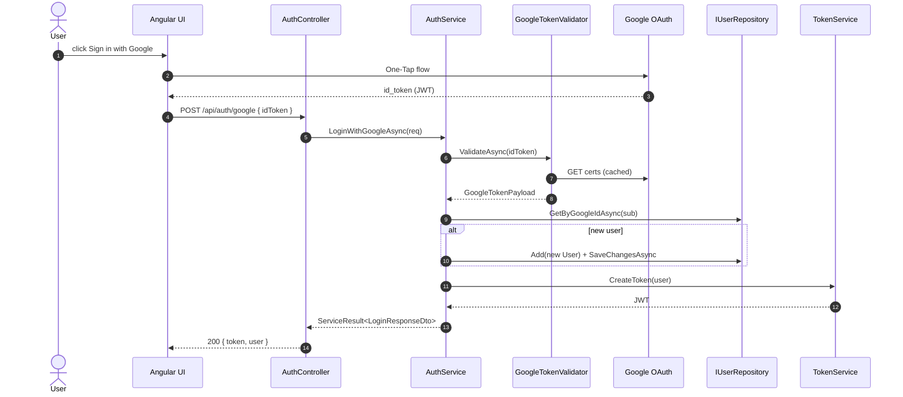
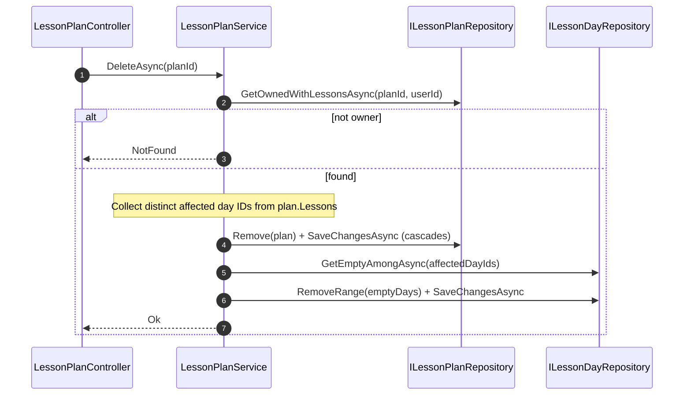
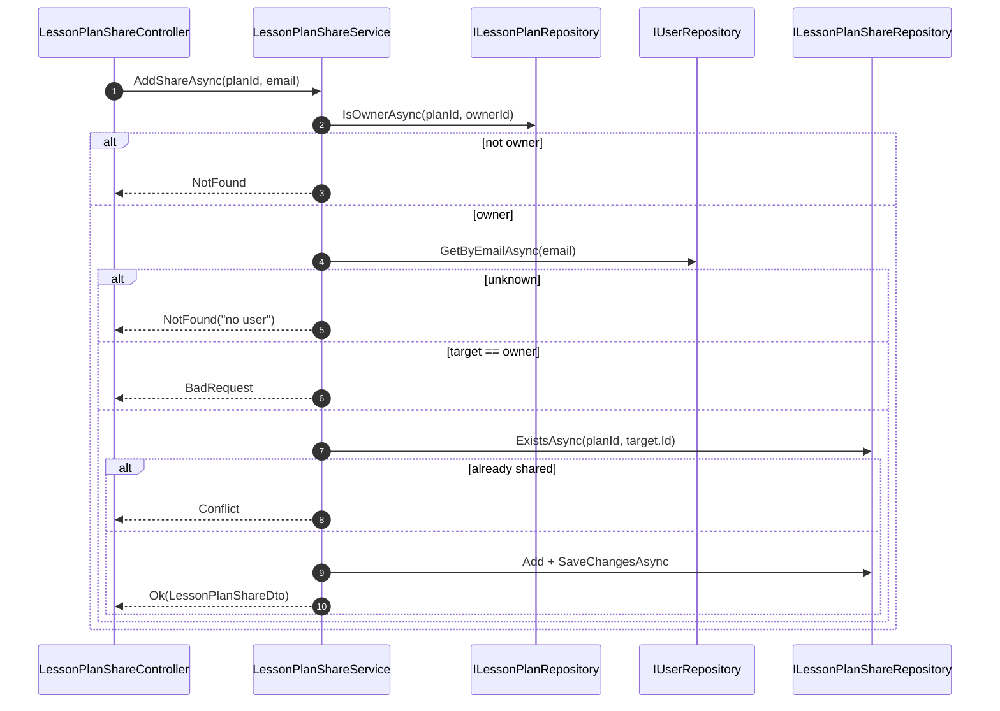
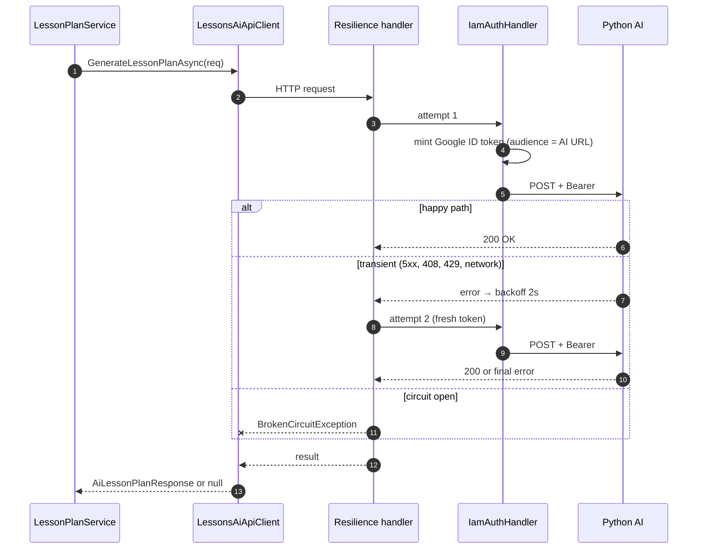

# Backend — 06 Flows

End-to-end sequences for the .NET API. AI-orchestrated flows (lesson plan / content / exercise) live in [../flows/](../flows/). This file covers .NET-only paths plus the orchestration boundary.

## Auth: Google One-Tap → JWT



Subsequent authenticated requests carry `Authorization: Bearer <jwt>`; the JWT bearer middleware validates, populates `HttpContext.User`, and `ICurrentUser` reads `Id` from there. SignalR uses `?access_token=<jwt>` on the WS upgrade URL since browsers can't set headers on WS handshakes — `JwtBearerEvents.OnMessageReceived` extracts it only on `/hubs/*` paths.

## Plan delete with day cleanup



`Lesson → LessonDay` cascade is `SetNull` (two users may share a day), so empty `LessonDay` rows are cleaned up explicitly after the cascade.

## Sharing flow



## Document upload + ingest

```mermaid
sequenceDiagram
  autonumber
  actor User
  participant DC as DocumentsController
  participant DS as DocumentService
  participant DR as IDocumentRepository
  participant Storage as IDocumentStorage
  participant Job as JobBackgroundService
  participant RAG as IRagApiClient
  participant AI as Python AI

  User->>DC: POST /api/documents/upload (multipart)
  DC->>DS: UploadAsync(input)
  DS->>DR: Add(Document {Status=Pending}) + SaveChangesAsync
  DS->>Storage: SaveAsync → gs://...
  DS->>DR: doc.StorageUri = gs://...; SaveChangesAsync
  DS-->>DC: Ok(DocumentDto)
  DC-->>User: 202 { document, jobId }

  Note over Job: async — DocumentIngest job
  Job->>RAG: IngestAsync(docId, storageUri, apiKey)
  RAG->>AI: POST /api/rag/ingest
  AI-->>RAG: { chunkCount }
  Job->>DR: doc.IngestionStatus="Ingested"; ChunkCount=N
```

If RAG ingestion fails, the executor sets `IngestionStatus = "Failed"` + truncates the error to `IngestionError`. The document row stays so the user can see what went wrong and re-upload.

## AI hand-off boundary

The deeper details of plan/content/exercise generation live in [../flows/](../flows/). On the .NET side, the executor calls the existing service method, which calls `LessonsAiApiClient` through the resilience pipeline:



Resilience wraps *outside* `IamAuthHandler` so each retry mints a fresh Google ID token — important when the original is mid-expiry. See [04-infrastructure.md](04-infrastructure.md) for the policy table.
