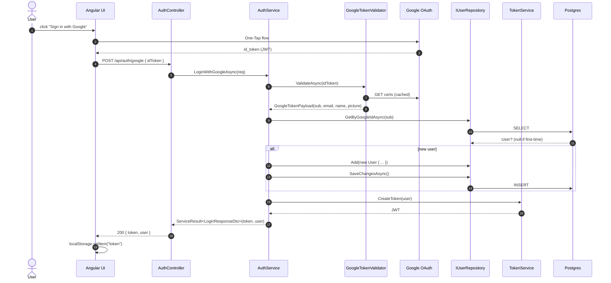
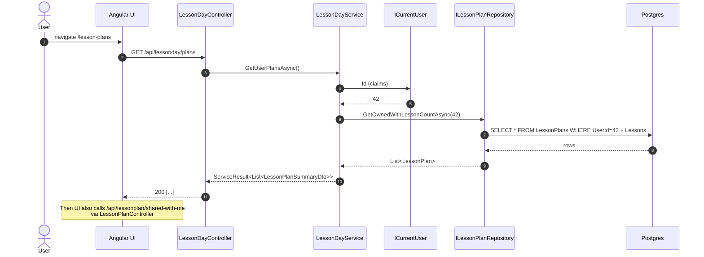
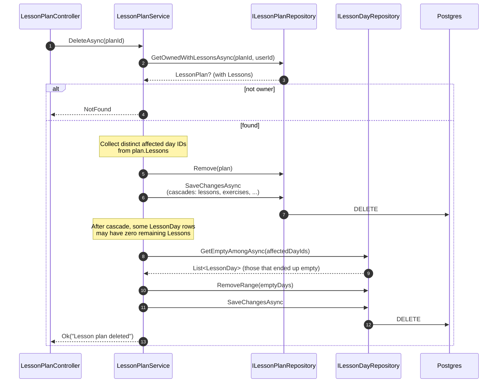
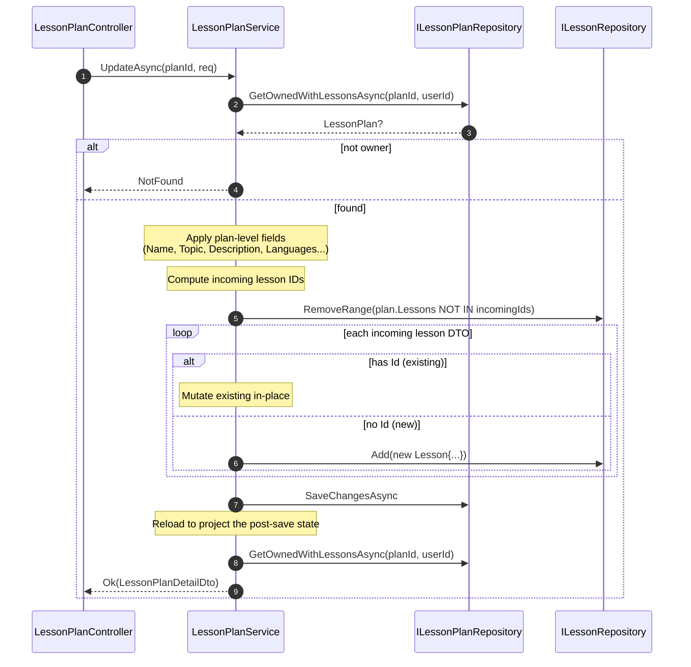
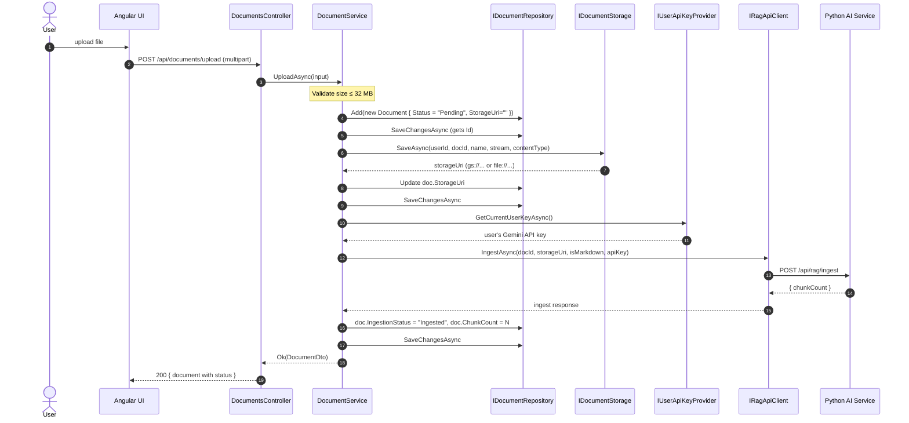
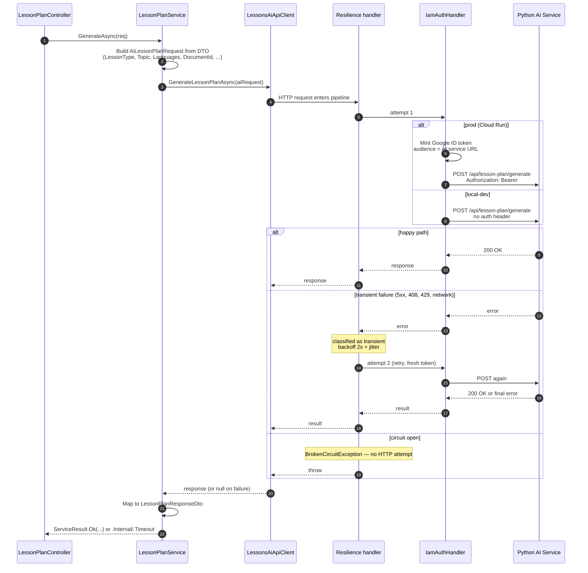

# Backend — 06 Flows

End-to-end sequences for the .NET API. AI-orchestrated flows (lesson plan / content / exercise generation) live in [../flows/](../flows/) — those involve the Python service. This file covers .NET-only paths plus the orchestration *boundary* (where .NET calls into Python).

## Auth: Google One-Tap → JWT

Subsequent authenticated requests carry `Authorization: Bearer <jwt>`; the JWT bearer middleware validates the signature + claims, populates `HttpContext.User`, and `ICurrentUser` reads `Id` from there.

## Plan list (owned + shared)

## Plan delete (owner-only) with day cleanup

## Plan update (owner-only, lesson reconciliation)

## Sharing flow

```mermaid
sequenceDiagram
  autonumber
  actor Owner
  participant API as LessonPlanShareController
  participant Svc as LessonPlanShareService
  participant LPR as ILessonPlanRepository
  participant UR as IUserRepository
  participant SR as ILessonPlanShareRepository

  Owner->>API: POST /api/lessonplan/{id}/shares { email }
  API->>Svc: AddShareAsync(planId, email)
  Svc->>LPR: IsOwnerAsync(planId, ownerId)
  alt not owner
    Svc-->>API: NotFound("Lesson plan not found.")
  else owner
    Svc->>UR: GetByEmailAsync(email)
    alt unknown email
      Svc-->>API: NotFound("No user found...")
    else known
      alt target == owner
        Svc-->>API: BadRequest("You already own...")
      else
        Svc->>SR: ExistsAsync(planId, target.Id)
        alt already shared
          Svc-->>API: Conflict("Already shared...")
        else
          Svc->>SR: Add(new LessonPlanShare)
          Svc->>SR: SaveChangesAsync
          Svc-->>API: Ok(LessonPlanShareDto)
        end
      end
    end
  end
```

## Document upload + ingest trigger

If RAG ingestion fails, the catch block sets `IngestionStatus = "Failed"` + truncates the error to `IngestionError`. The document row stays so the user can see what went wrong (and re-upload).

## Lesson generation hand-off (boundary)

The deeper details of plan/content/exercise generation are in [../flows/](../flows/), but here's the .NET-side hand-off:

The resilience handler wraps **outside** `IamAuthHandler` so each retry mints a fresh Google ID token — important when the original is mid-expiry. See [04-infrastructure.md#resilience-pipeline-microsoftextensionshttpresilience--polly-v8](04-infrastructure.md#resilience-pipeline-microsoftextensionshttpresilience--polly-v8) for the policy table and tuning rationale.

Lazy lesson-content generation works the same way but is triggered by `LessonController.GetLesson` when `lesson.Content` is empty — the user pays the latency on their first read of each lesson. Subsequent reads return the saved markdown directly.
