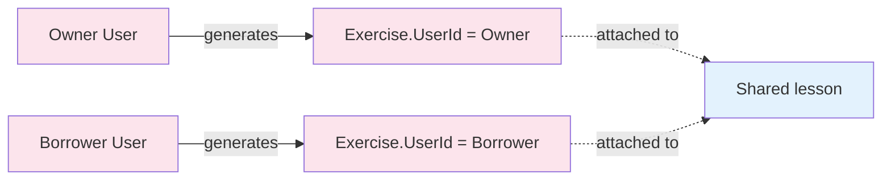

# Flow — Exercise Generation

Anyone with read access (owner or borrower) can generate an exercise on a lesson. Each exercise is per-user — borrowers get their own, not the owner's.

> **Source files**: [LessonsHub.Application/Services/ExerciseService.cs](../../LessonsHub.Application/Services/ExerciseService.cs) (`GenerateAsync`), [routes/lessons.py:generate_lesson_exercise](../../lessons-ai-api/routes/lessons.py), [services/exercise_service.py](../../lessons-ai-api/services/exercise_service.py), [crews/exercise_crew.py](../../lessons-ai-api/crews/exercise_crew.py), [tasks/exercise_generation_tasks.py](../../lessons-ai-api/tasks/exercise_generation_tasks.py).

## End-to-end

```mermaid
sequenceDiagram
  autonumber
  actor User
  participant UI as Angular
  participant LC as LessonController
  participant ES as ExerciseService (.NET)
  participant LR as ILessonRepository
  participant LPR as ILessonPlanRepository
  participant ER as IExerciseRepository
  participant Client as LessonsAiApiClient
  participant Route as routes/lessons.py
  participant CS_AI as ExerciseService (Python)
  participant Crew as run_exercise_crew
  participant FDC as _fetch_document_context
  participant EC as exercise_creator agent
  participant LLM as Exercise LLM
  participant QC as run_quality_check

  User->>UI: GenerateExerciseDialog: difficulty=Hard, comment="focus on edge cases"
  UI->>LC: POST /api/lesson/42/generate-exercise?difficulty=Hard&comment=...
  LC->>ES: GenerateAsync(42, "Hard", "focus on edge cases")
  ES->>LR: GetWithPlanAsync(42)
  ES->>LPR: HasReadAccessAsync(planId, currentUserId)
  alt no access
    ES-->>LC: NotFound
  else
    Note over ES: lesson.Content must be non-empty
    ES->>ES: Build AiLessonExerciseRequest<br/>(LessonType, KeyPoints, Difficulty, Comment,<br/>NativeLanguage, LanguageToLearn, UseNativeLanguage,<br/>previous/next, DocumentId)
    ES->>Client: GenerateLessonExerciseAsync
    Client->>Route: POST /api/lesson-exercise/generate
    Route->>CS_AI: generate_exercise(plan, lesson, spec, ...)
    CS_AI->>Crew: run_exercise_crew

    Crew->>FDC: _fetch_document_context(plan, lesson, api_key)
    alt document_id + api_key present
      FDC->>FDC: embed query + rag_search top-k
      FDC-->>Crew: document_context (markdown)
    else
      FDC-->>Crew: ""
    end

    loop attempt = 0..max_quality_retries
      Crew->>Crew: build exercise_creator agent + task<br/>(template by agent_type)
      Crew->>LLM: invoke
      LLM-->>Crew: exercise markdown
      Crew->>QC: run_quality_check
      alt passed or last
        Crew-->>CS_AI: LessonExerciseResponse { exercise }
      else
        Note over Crew: append shortcomings to spec.comment; retry
      end
    end

    CS_AI-->>Route: response
    Route-->>Client: JSON
    Client-->>ES: response
    ES->>ER: Add(new Exercise { Text, Difficulty, LessonId, UserId=currentUserId })
    ES->>ER: SaveChangesAsync
    ES-->>LC: Ok(ExerciseDto)
    LC-->>UI: 200
  end
```

## Per-user tagging



When a borrower generates an exercise, the new `Exercise` row gets *their* `UserId`. The lesson is shared but each user's exercises are private to them — `LessonMapper.ToDetailDto(lesson, userId)` filters `Exercises` to only those matching `userId`.

## Lesson-content prerequisite

The `.NET` service rejects with `400 BadRequest("Lesson content must be generated first.")` if `lesson.Content` is empty when the user tries to generate an exercise. Otherwise the AI would have nothing to base the exercise on. The user has to view the lesson at least once (which lazy-generates content) before generating exercises.

## Difficulty levels

The frontend constrains `difficulty` to `easy | medium | hard | very-hard`, but the backend accepts any free-text string. The exercise template uses it verbatim:

```jinja
## Construction Requirements
2. **Difficulty**: {{ difficulty }}
```

So the LLM sees "easy" or "very-hard" or whatever, and adjusts.

## Optional comment

`comment` is the user's free-form guidance to the exercise-creator agent. Examples:

- "focus on edge cases like empty inputs"
- "make it a translation task, not multiple-choice"
- "use the vocabulary from lesson 3"

The template renders it conditionally:

```jinja

**User Comment** (Must be included in exercise context):
{{ comment }}

```

## Per-type templates

| Lesson type | Template | Special behaviour |
|---|---|---|
| Default | [exercise_generation_Default.jinja2](../../lessons-ai-api/templates/tasks/exercise_generation_Default.jinja2) | Open-ended exercise structure. |
| Technical | [exercise_generation_Technical.jinja2](../../lessons-ai-api/templates/tasks/exercise_generation_Technical.jinja2) | Demands code + clear acceptance criteria. |
| Language | [exercise_generation_Language.jinja2](../../lessons-ai-api/templates/tasks/exercise_generation_Language.jinja2) | Branches on `use_native_language`: in native mode, instructions in native + source-text in target; in immersive mode, both in target. Strict "no scaffolding" rule (no hints / vocabulary lists in the source text). |

All three templates require the output to end with `### Your Response` so the UI can render a clean answer-input field below the question.

## What's stored

- `Exercise` row with `Text`, `Difficulty`, `LessonId`, `UserId`.
- `AiRequestLog` rows for the writer + quality validator.

The exercise is rendered as markdown in the UI; users type their answer in a textarea below the `### Your Response` heading.
