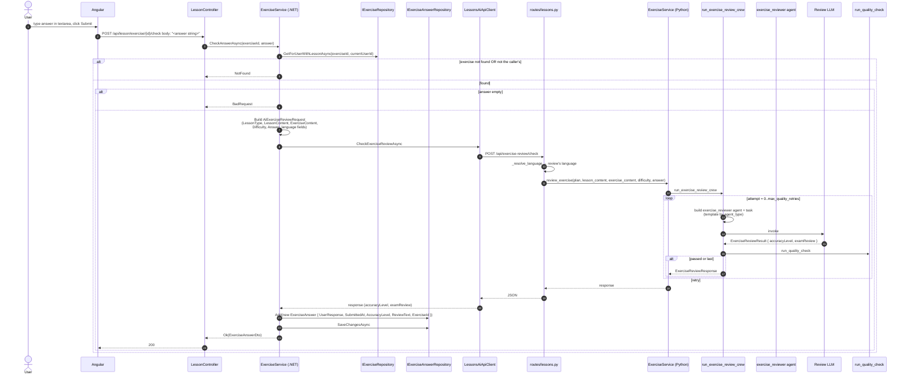
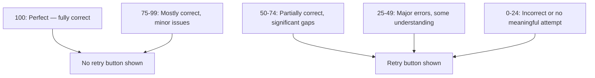

# Flow — Exercise Review (Submit Answer)

The user submits an answer; the AI scores it 0-100 and writes a markdown review. The score lives on `ExerciseAnswer.AccuracyLevel`; the review on `ExerciseAnswer.ReviewText`.

> **Source files**: [LessonsHub.Application/Services/ExerciseService.cs](../../LessonsHub.Application/Services/ExerciseService.cs) (`CheckAnswerAsync`), [routes/lessons.py:check_exercise_review](../../lessons-ai-api/routes/lessons.py), [crews/review_crew.py](../../lessons-ai-api/crews/review_crew.py), [tasks/exercise_review_tasks.py](../../lessons-ai-api/tasks/exercise_review_tasks.py), [templates/tasks/exercise_review_*.jinja2](../../lessons-ai-api/templates/tasks/).

## End-to-end



## Caller-must-own-exercise check

[ExerciseRepository.GetForUserWithLessonAsync](../../LessonsHub.Infrastructure/Repositories/ExerciseRepository.cs) joins on `Exercise.UserId == currentUserId` — so the `Exercise` is found only if the caller owns it. A borrower cannot submit answers to the owner's exercises (and vice versa).

## Pydantic structured output

[tasks/exercise_review_tasks.py](../../lessons-ai-api/tasks/exercise_review_tasks.py) uses CrewAI's `output_pydantic` parameter:

```python
class ExerciseReviewResult(BaseModel):
    accuracyLevel: int = Field(..., description="Score from 0 to 100 ...")
    examReview: str = Field(..., description="Detailed feedback ...")

return Task(
    description=description,
    expected_output="...",
    output_pydantic=ExerciseReviewResult,
    agent=agent,
)
```

CrewAI parses the agent's output into the Pydantic model automatically. If parse fails, the task retries up to the agent's `max_iter`.

## Score distribution and retry trigger



The frontend renders a `Retry` button beneath answers with `accuracyLevel < 80`. See [exercise-retry.md](exercise-retry.md) for what happens when the user clicks it.

## Per-type templates

[exercise_review_Default.jinja2](../../lessons-ai-api/templates/tasks/exercise_review_Default.jinja2), [exercise_review_Technical.jinja2](../../lessons-ai-api/templates/tasks/exercise_review_Technical.jinja2), [exercise_review_Language.jinja2](../../lessons-ai-api/templates/tasks/exercise_review_Language.jinja2):

| Type | Distinguishing instruction |
|---|---|
| Default | Generic "explain what's right and wrong" |
| Technical | "Check for bugs, edge cases, idiomatic usage" |
| Language | "Check grammar, spelling, vocabulary choice, sentence structure, natural expression" — review written in `native_language` if `useNativeLanguage`, else `language_to_learn` |

The Language template branches the same way as the plan/content templates — review feedback in native (helpful for low-CEFR) vs target (immersive correction).

## What's stored

- `ExerciseAnswer` row: `UserResponse` (the student's answer), `SubmittedAt`, `AccuracyLevel`, `ReviewText`, `ExerciseId`.
- `AiRequestLog` rows for the reviewer + quality validator.

The frontend renders the review markdown beneath the user's answer, with the `accuracyLevel` shown as a colored badge (red <50, amber 50-79, green ≥80).
