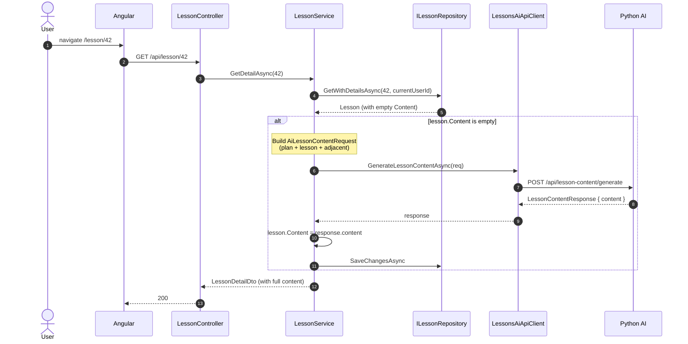
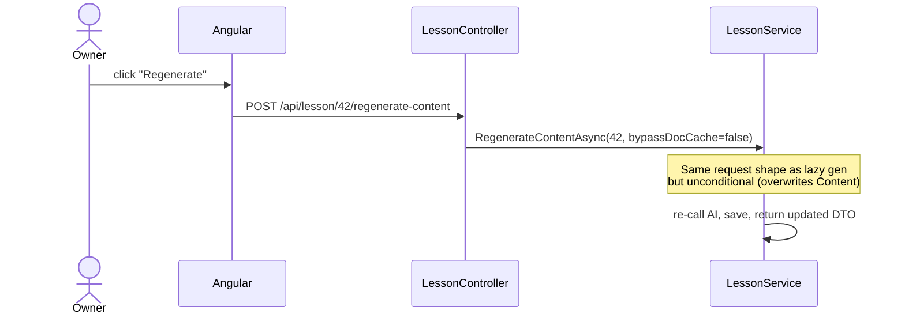

# Flow — Lesson Content Generation (Default)

Triggered lazily when a user opens a lesson whose `Content` is empty (first read), or explicitly via the regenerate button (owner-only). The Default flow has no framework grounding and no language toggle.

> **Source files**: [LessonsHub.Application/Services/LessonService.cs](../../LessonsHub.Application/Services/LessonService.cs) (`GetDetailAsync`, `RegenerateContentAsync`), [routes/lessons.py:generate_lesson_content](../../lessons-ai-api/routes/lessons.py), [services/content_service.py](../../lessons-ai-api/services/content_service.py), [crews/content_crew.py](../../lessons-ai-api/crews/content_crew.py), [templates/tasks/content_generation_Default.jinja2](../../lessons-ai-api/templates/tasks/content_generation_Default.jinja2).

## Lazy generation on first read



The user pays the latency on their first view. Subsequent reads return the saved markdown directly — no AI call.

## Explicit regenerate (owner-only)



Regenerate goes through the same endpoint; the only difference is no "if empty" guard. Owner-only — the controller checks `lesson.LessonPlan?.UserId == userId` before allowing.

## AI-side flow

```mermaid
sequenceDiagram
  autonumber
  participant Route as routes/lessons.py
  participant CS as ContentService
  participant Crew as run_content_crew
  participant CW as content_writer_Default
  participant LLM as Content LLM
  participant QC as run_quality_check

  Route->>CS: generate_content(plan, lesson, ...)
  CS->>Crew: run_content_crew(llm, plan, lesson, ...)

  Note over Crew: agent_type != Technical → skip analyzer<br/>document_id is None → skip RAG fetch

  loop attempt = 0..max_quality_retries
    Crew->>Crew: build content_writer_Default agent + task<br/>(template: content_generation_Default.jinja2)
    Crew->>LLM: invoke
    LLM-->>Crew: lesson markdown
    Crew->>QC: run_quality_check(generation_type="lesson content", ...)
    alt passed or last
      Crew-->>CS: LessonContentResponse { content }
    else
      Note over Crew: append shortcomings to plan.description; retry
    end
  end
```

## Template (`content_generation_Default.jinja2`)

The Default content template is concise — it gives the writer the lesson context (lesson name, topic, key points, plan description, adjacent lessons) and asks for a comprehensive markdown body. No `` branching, no `## Reference Documentation` block.

```jinja
Write all content in {{ language }}.
You are an expert educator writing a lesson body in Markdown.

Course: {{ topic }}
Plan overview: {{ plan_description }}

Lesson #{{ lesson_number }}: {{ lesson_name }} ({{ lesson_topic }})
Goal: {{ lesson_description }}
Key points: {{ key_points }}
Previous: {{ previous_lesson.name }} — {{ previous_lesson.description }}
Next: {{ next_lesson.name }} — {{ next_lesson.description }}

Write a clear, structured Markdown body covering all key points...

```

The `_document_context.jinja2` partial is included — but renders empty when `document_context` is `""`, which is the case for plain Default plans.

## Adjacent-lesson context

```mermaid
flowchart LR
  classDef l fill:#e3f2fd,color:#1a1a1a

  prev[Lesson 4<br/>Lists & Tuples]:::l
  cur[Lesson 5<br/>Dictionaries]:::l
  next[Lesson 6<br/>Sets]:::l

  prev -. previous .-> cur
  next -. next .-> cur

  cur --> prompt[content_writer<br/>sees prev/next as<br/>AdjacentLesson{name, description}]
```

[`LessonRepository.GetAdjacentAsync`](../../LessonsHub.Infrastructure/Repositories/LessonRepository.cs) finds the lessons with `LessonNumber < / > current` in the same plan. The writer uses these to (a) avoid repeating concepts the previous lesson covered and (b) foreshadow what's coming next when natural.

## What gets stored

After generation:

- `Lesson.Content` — the full markdown body.
- `AiRequestLog` rows — one per LLM call (writer + each quality-check iteration), including `InputTokens`, `OutputTokens`, `TotalCost` from `ModelPricingResolver`.

The lesson markdown is stored verbatim — no further processing on the .NET side. The frontend renders it with `ngx-markdown`.
