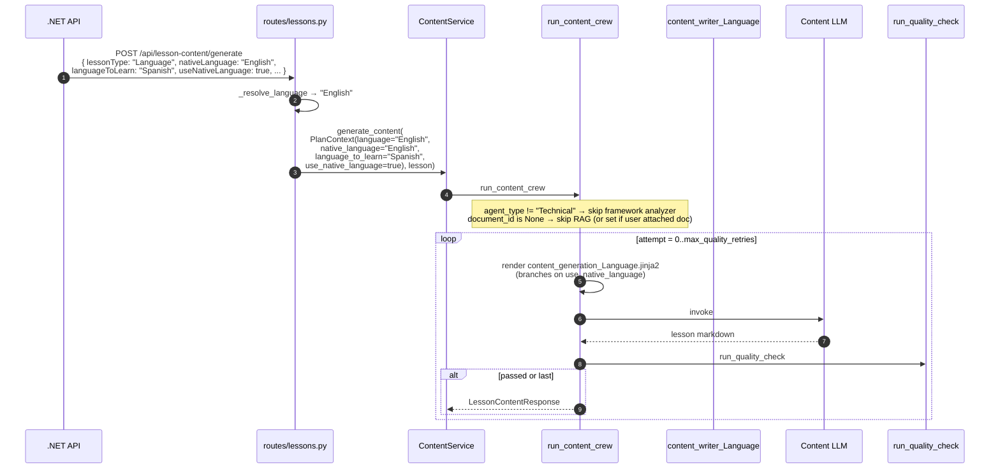
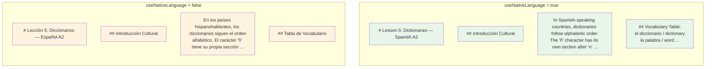

# Flow — Lesson Content Generation (Language)

The Language content flow uses the same three language fields as the plan flow — `nativeLanguage`, `languageToLearn`, `useNativeLanguage` — but applies them per lesson with a richer template (cultural notes, dialogues, vocabulary tables, common pitfalls).

> **Source files**: [routes/lessons.py:_resolve_language](../../lessons-ai-api/routes/lessons.py), [crews/content_crew.py](../../lessons-ai-api/crews/content_crew.py), [tasks/content_generation_tasks.py](../../lessons-ai-api/tasks/content_generation_tasks.py), [templates/tasks/content_generation_Language.jinja2](../../lessons-ai-api/templates/tasks/content_generation_Language.jinja2).

## End-to-end



## Template structure ([content_generation_Language.jinja2](../../lessons-ai-api/templates/tasks/content_generation_Language.jinja2))

### Top-of-prompt language directive

```jinja

Write the lesson in {{ native_language }}. The student is studying
**{{ language_to_learn }}**, but the explanatory prose, headings, and
analysis must be in {{ native_language }}. Example dialogues and
vocabulary tables stay in {{ language_to_learn }} (with translations
into {{ native_language }}).

Write the entire lesson in **{{ language_to_learn }}** (immersive mode).
Use simple, accessible {{ language_to_learn }}; only fall back to
{{ native_language }} when a concept genuinely cannot be expressed at
the student's current level.

```

### Required sections

The template demands a five-part structure:

1. **Introduction** + Cultural Note about the target-language-speaking world.
2. **Core Concepts** (Grammar & Vocabulary) — with comparative logic between target and native languages.
3. **Scenarios & Dialogues** — formal + casual dialogues (6-10 lines each) in `language_to_learn`, plus phrase-level analysis.
4. **Common Pitfalls** — false friends, pronunciation traps that `native_language`-speakers fall into.
5. **Summary** — concise recap.

The "stay in target language" rule is enforced by the `` branching at the top, then the section structure tells the LLM exactly what should be in which language regardless of mode.

## Mode-by-mode example output



In native mode, prose and headings are in English; example phrases and the vocabulary list have target-language entries with English translations.

In immersive mode, even the headings are translated into the target language.

## Per-template variables

[tasks/content_generation_tasks.py:create_content_generation_task](../../lessons-ai-api/tasks/content_generation_tasks.py) renders the template with these context values:

```python
description_rendered = tm.render(
    template_path,                     # picked by agent_type ("Language" → content_generation_Language.jinja2)
    topic=plan.topic,                  # plan-level topic
    lesson_topic=lesson.topic,
    key_points=', '.join(lesson.key_points),
    plan_description=plan.description,
    lesson_number=lesson.number,
    lesson_name=lesson.name,
    lesson_description=lesson.description,
    language=language,                 # rendering language (resolved at boundary)
    native_language=plan.native_language,
    language_to_learn=plan.language_to_learn,
    use_native_language=plan.use_native_language,
    previous_lesson=lesson.previous,
    next_lesson=lesson.next,
    document_context=document_context, # RAG chunks if document attached, else ""
)
```

## Cross-flow consistency

The same three language fields drive **both** the plan template ([lesson_plan_Language.jinja2](../../lessons-ai-api/templates/tasks/lesson_plan_Language.jinja2)) and the content template ([content_generation_Language.jinja2](../../lessons-ai-api/templates/tasks/content_generation_Language.jinja2)). A Language plan generated in immersive mode will lazy-generate its lessons in immersive mode unless the plan is updated. There's no per-lesson override — the plan's `useNativeLanguage` setting is the source of truth.

Exercise generation + review for Language lessons follow the same pattern — see [exercise-generate.md](exercise-generate.md), [exercise-review.md](exercise-review.md). The exercise template does its own native-vs-target branching for *what the student needs to produce* (translate-from-native vs respond-in-target).

## Failure modes

- **Translation drift in immersive mode** — the LLM may slip back into the native language for complex concepts. Acceptable; quality validator usually catches it.
- **Vocabulary tables missing translations in immersive mode** — the prompt explicitly demands them; if missing, regenerate.
- **Cultural notes biased to one country** — Spanish has many varieties (Spain vs Mexico vs Argentina). The template doesn't currently distinguish; users wanting a specific variety should put it in the plan description.
