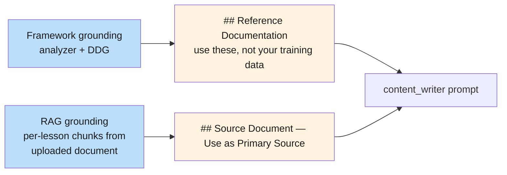
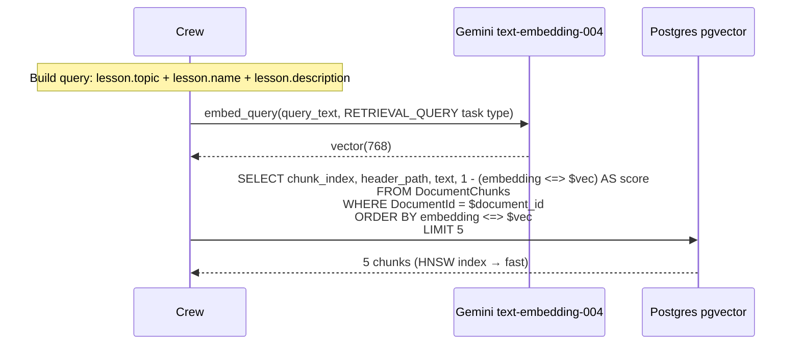
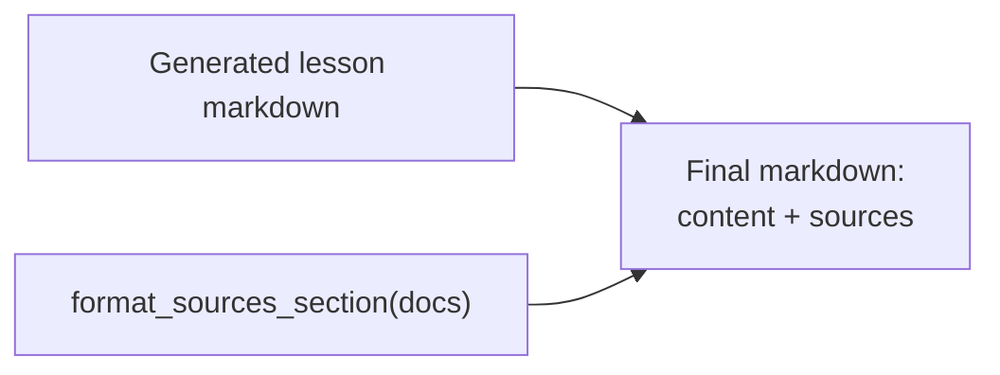

# Flow — Lesson Content Generation (Technical)

The richest content flow. Per-lesson framework analyzer + DDG search + (optionally) per-lesson RAG chunks fetched from an attached document. Result: writer prompt that includes both fresh framework docs *and* user-provided document chunks, scoped to the lesson's specific topic.

> **Source files**: [crews/content_crew.py](../../lessons-ai-api/crews/content_crew.py), [crews/framework_analysis_crew.py](../../lessons-ai-api/crews/framework_analysis_crew.py), [tools/documentation_search.py](../../lessons-ai-api/tools/documentation_search.py), [tools/rag_embedder.py](../../lessons-ai-api/tools/rag_embedder.py), [tools/rag_store.py](../../lessons-ai-api/tools/rag_store.py), [tools/document_context.py](../../lessons-ai-api/tools/document_context.py), [templates/tasks/content_generation_Technical.jinja2](../../lessons-ai-api/templates/tasks/content_generation_Technical.jinja2).

## End-to-end

```mermaid
sequenceDiagram
  autonumber
  participant Route as routes/lessons.py
  participant CS as ContentService
  participant Crew as run_content_crew
  participant FA as analyze_for_search_queries
  participant DS as search_for_queries
  participant Embed as embed_query
  participant Store as rag_store.search
  participant Format as format_chunks_for_lesson
  participant CW as content_writer_Technical
  participant LLM as Content LLM
  participant QC as run_quality_check

  Route->>CS: generate_content(plan, lesson, google_api_key, bypass_doc_cache)
  CS->>Crew: run_content_crew

  Note over Crew: 1) Framework grounding<br/>(only if agent_type == "Technical")
  Crew->>FA: analyze_for_search_queries(plan, lesson)
  FA-->>Crew: ["fastapi pydantic v2 site:fastapi.tiangolo.com",<br/>"pydantic v2 validators site:docs.pydantic.dev"]
  Crew->>DS: search_for_queries(queries, bypass_doc_cache)
  DS-->>Crew: docs[] (from cache or DDG)

  Note over Crew: 2) RAG grounding<br/>(only if document_id set)
  alt document_id present and api_key present
    Crew->>Crew: query_text = lesson.topic + lesson.name + lesson.description
    Crew->>Embed: embed_query(query_text, api_key)
    Embed-->>Crew: query vector (768 dims)
    Crew->>Store: search(document_id, query_vec, top_k=5)
    Store-->>Crew: top-5 chunks
    Crew->>Format: format_chunks_for_lesson(hits)
    Format-->>Crew: document_context (markdown block)
  else
    Note over Crew: document_context = ""
  end

  loop attempt = 0..max_quality_retries
    Crew->>Crew: render content_generation_Technical.jinja2<br/>with document_context (RAG chunks if any)
    Crew->>Crew: append docs_block from format_docs_for_prompt(docs)<br/>(framework docs)
    Crew->>LLM: invoke
    LLM-->>Crew: content markdown
    Crew->>QC: run_quality_check(..., doc_sources=docs)
    alt passed or last attempt
      Crew->>Crew: append format_sources_section(docs) to content
      Crew-->>CS: LessonContentResponse
    else
      Note over Crew: feedback to plan.description; retry
    end
  end
```

## Two grounding sources, orthogonal



The two are independent:

- **Framework docs** come from public web. Always relevant for Technical lessons.
- **Document chunks** come from the user's upload. Only present when the plan was generated against an attached `Document`. Orthogonal to lesson type — Default + Language plans can also be document-grounded.

A Technical lesson on a topic with both an attached document AND a recognizable framework gets both blocks in its prompt.

## Per-lesson RAG search



`top_k = settings.rag_top_k_per_lesson` (default 5). Higher values give more context but more tokens. The HNSW index makes the search ~ms even on 100k+ chunks.

## Sources section

After successful generation, the crew appends a `## Sources` markdown section to the content body, listing the URLs the writer was given (from the framework grounding). This is what users see at the bottom of every Technical lesson — a reading list of authoritative references.



`format_sources_section` dedupes by URL and renders a clean bulleted list:

```markdown
## Sources
- [Standalone components](https://angular.dev/guide/standalone-components)
- [Pipes](https://angular.dev/guide/pipes)
- [RxJS map operator](https://rxjs.dev/api/operators/map)
```

Without this, users have no way to verify the writer's claims or dive deeper. With it, the lesson is auditable.

## Caching strategy

```mermaid
flowchart LR
  classDef c fill:#bbdefb,color:#1a1a1a

  q[Analyzer query]:::c
  k[cache key:<br/>q|<lowercased query>]:::c
  hit{cached and<br/>not expired?}:::c
  ddg[DDG + page fetch]:::c
  cache[(DocumentationCache)]:::c

  q --> k --> hit
  hit -- yes --> ret[Return cached]
  hit -- no --> ddg --> ret
  ddg --> cache
  cache --> hit
```

**TTL**: 30 days (`doc_cache_ttl_days`). The user can force-refresh per request via `bypassDocCache: true`.

**Hit rate**: high — multiple lessons in the same plan tend to produce overlapping queries (same framework, different sub-topics; the analyzer naturally clusters around the framework's site). After the first lesson generates, subsequent lessons hit cache for most queries.

## What's stored

After generation:

- `Lesson.Content` — markdown body + Sources section.
- `AiRequestLog` — rows for analyzer + writer + quality validator + (per-iteration) retries.
- `DocumentationCache` rows — one per unique analyzer query.
- (No new RAG chunks are written; reading-side only.)
