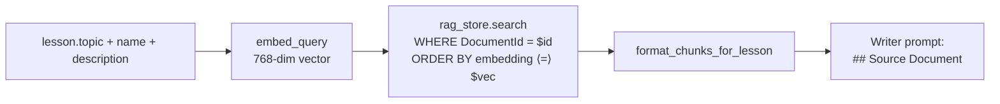

# Flow — Lesson Content Generation

Triggered explicitly via `POST /api/lesson/{id}/generate-content` (which enqueues a Job). Content runs the same job + SignalR pipeline as plan generation. The `lessonType` field on the parent plan picks the template: `Default`, `Technical`, or `Language`.

> **Source files**: [LessonsHub.Application/Services/LessonService.cs](../../LessonsHub.Application/Services/LessonService.cs), [routes/lessons.py](../../lessons-ai-api/routes/lessons.py), [services/content_service.py](../../lessons-ai-api/services/content_service.py), [crews/content_crew.py](../../lessons-ai-api/crews/content_crew.py), [templates/tasks/content_generation_*.jinja2](../../lessons-ai-api/templates/tasks/).

## End-to-end

```mermaid
sequenceDiagram
  autonumber
  participant UI as Angular
  participant Net as .NET API
  participant Job as JobBackgroundService
  participant Route as routes/lessons.py
  participant Crew as run_content_crew
  participant LLM as Content LLM
  participant QC as run_quality_check

  UI->>Net: POST /api/lesson/{id}/generate-content
  Net-->>UI: 202 { jobId }
  Net->>Job: pick up
  Job->>Route: POST /api/lesson-content/generate
  Route->>Crew: run_content_crew(plan, lesson, ...)

  opt agent_type == Technical
    Crew->>Crew: framework analyzer + DDG (per-lesson queries)
  end
  opt document_id present and api_key
    Crew->>Crew: embed_query + rag_store.search top_k=5
  end

  loop quality retry
    Crew->>LLM: render content_generation_{type}.jinja2 + invoke
    LLM-->>Crew: lesson markdown
    Crew->>QC: run_quality_check
    alt passed
      Crew->>Crew: append Sources section (Technical only)
      Crew-->>Route: LessonContentResponse
    else
      Crew->>Crew: append feedback, retry
    end
  end

  Route-->>Job: response
  Job->>UI: SignalR JobUpdated; lesson.Content saved
```

## Type-specific behavior

| Aspect | Default | Technical | Language |
|---|---|---|---|
| Adjacent-lesson context (prev/next) | ✓ | ✓ | ✓ |
| Framework analyzer + DDG | — | ✓ | — |
| RAG document chunks | optional | optional | optional |
| `useNativeLanguage` branching | — | — | ✓ |
| Template | `content_generation_Default.jinja2` | `content_generation_Technical.jinja2` | `content_generation_Language.jinja2` |
| Sources section appended | — | ✓ | — |

The framework grounding and RAG grounding are *orthogonal* — a Technical lesson with an attached document gets both blocks in its prompt. A Default plan with an attached document gets only RAG. A Language plan branches on `useNativeLanguage` (native mode = prose in mother tongue, target-language examples; immersive mode = entire lesson in target language).

## Per-lesson RAG search

When the parent plan has a `document_id`, the crew builds a query string from `lesson.topic + lesson.name + lesson.description`, embeds it via Gemini `text-embedding-004` (`RETRIEVAL_QUERY` task type), and runs cosine top-k search on `DocumentChunks` scoped to that document. HNSW index makes this ms-fast even on 100k+ chunks. `top_k = settings.rag_top_k_per_lesson` (default 5).



## Cache strategy (Technical)

Analyzer queries are cached in `DocumentationCache` (key = lowercased query, TTL = `doc_cache_ttl_days`, default 30). Hit rate is high — multiple lessons in the same plan tend to produce overlapping queries because the analyzer clusters around the framework's site. The user can force-refresh per request via `bypassDocCache: true`.

## Adjacent-lesson context

[`LessonRepository.GetAdjacentAsync`](../../LessonsHub.Infrastructure/Repositories/LessonRepository.cs) fetches the lessons with `LessonNumber < / > current` in the same plan. The writer uses these to avoid repeating concepts the previous lesson covered and to foreshadow what's coming next.

## What gets stored

- `Lesson.Content` — markdown body, plus a `## Sources` section for Technical lessons (deduped URLs from the framework grounding).
- `AiRequestLog` — one row per LLM call (analyzer + writer + each quality-check iteration).
- `DocumentationCache` — one row per unique analyzer query.

The frontend renders `Lesson.Content` with `ngx-markdown`. No further processing on the .NET side.
