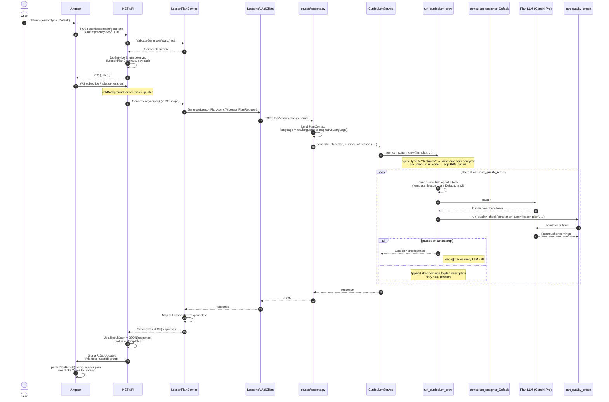

# Flow — Lesson Plan Generation (Default)

The simplest path: no framework grounding, no language toggle. Used for non-technical, non-language plans (e.g. history, business, philosophy).

> **Source files**: [routes/lessons.py:generate_lesson_plan](../../lessons-ai-api/routes/lessons.py), [services/curriculum_service.py](../../lessons-ai-api/services/curriculum_service.py), [crews/curriculum_crew.py](../../lessons-ai-api/crews/curriculum_crew.py), [tasks/lesson_plan_tasks.py](../../lessons-ai-api/tasks/lesson_plan_tasks.py), [templates/tasks/lesson_plan_Default.jinja2](../../lessons-ai-api/templates/tasks/lesson_plan_Default.jinja2).

## End-to-end



This is the same SignalR job pattern every AI-generation endpoint follows — see [backend/04-infrastructure.md#realtime--job-pipeline-signalr--background-worker](../backend/04-infrastructure.md#realtime--job-pipeline-signalr--background-worker) for the executor + queue + hub plumbing. Other flow docs in this folder focus on the AI-side detail (CrewAI agents + tasks + Python services) and abstract the .NET-side hand-off as `Net → AI → Net → SignalR`; the envelope is identical.

## Task prompt (Default)

[templates/tasks/lesson_plan_Default.jinja2](../../lessons-ai-api/templates/tasks/lesson_plan_Default.jinja2) renders with these context vars:

```jinja
Write all content in {{ language }}.
Topic: {{ topic }}

Required Lessons: {{ number_of_lessons }}

Additional Context/User Level: {{ description }}
```

The `_document_context.jinja2` partial is included but renders empty when `document_context` is `""` (which it is for plain Default plans without an attached document).

## Quality retry feedback

If the validator returns `score < 80`, the crew appends the shortcomings to `plan.description`:

```text
[QUALITY FEEDBACK - Attempt 1]: Lesson 3 doesn't have a clear learning outcome; revise.
```

Next iteration, the writer sees this in the description field of its prompt and (hopefully) addresses it. After `max_quality_retries`, the crew gives up and returns the last attempt regardless.

## What the user sees

- The frontend's `LessonPlan` form returns a `LessonPlanResponse` with `topic`, `lessons[]`, plus optional `qualityCheck` and `usage[]`.
- The user reviews + edits the generated lessons inline, then clicks **Save to Library** (`POST /api/lessonplan/save`) which persists the plan via `LessonPlanService.SaveAsync`.
- A separate flow (the "lazy content generation" hit on first lesson read) generates each lesson's body — see [lesson-content-default.md](lesson-content-default.md).
