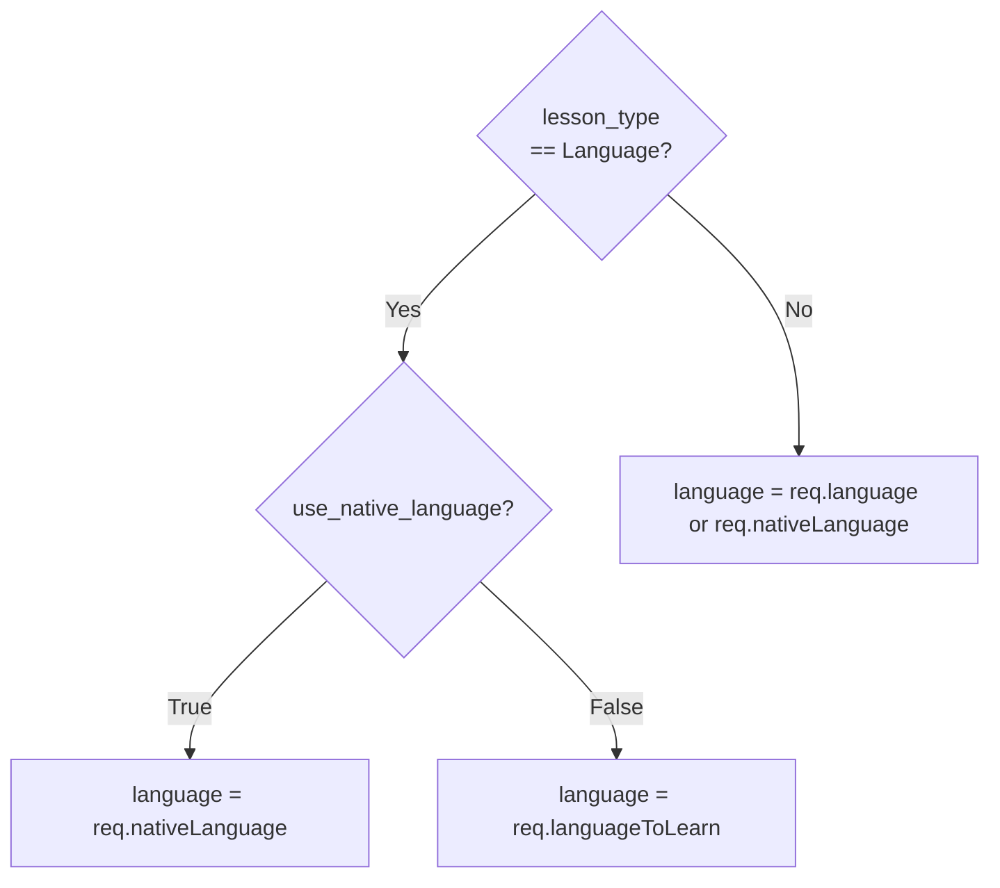
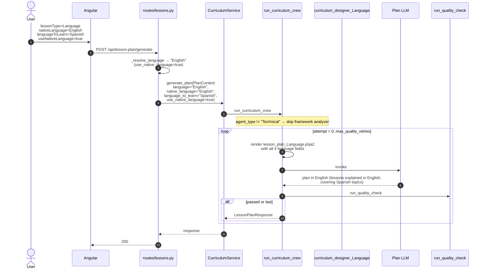
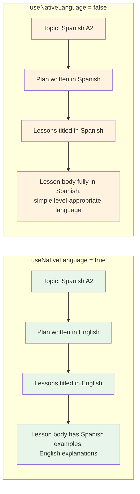

# Flow — Lesson Plan Generation (Language)

For language-learning plans. Three language fields shape the prompt:

- `nativeLanguage` — the user's mother tongue.
- `languageToLearn` — the target language.
- `useNativeLanguage` — boolean toggle deciding whether the lesson is rendered in the native tongue (with target-language examples) or fully immersive in the target language.

> **Source files**: [routes/lessons.py:_resolve_language](../../lessons-ai-api/routes/lessons.py), [crews/curriculum_crew.py](../../lessons-ai-api/crews/curriculum_crew.py), [tasks/lesson_plan_tasks.py](../../lessons-ai-api/tasks/lesson_plan_tasks.py), [templates/tasks/lesson_plan_Language.jinja2](../../lessons-ai-api/templates/tasks/lesson_plan_Language.jinja2).

## Language resolution at the boundary



The resulting `language` is what gets bound to `{{ language }}` in templates — the *rendering* language. `nativeLanguage` and `languageToLearn` are passed through separately so templates can branch on them and refer to both explicitly.

## End-to-end



## Template branching ([lesson_plan_Language.jinja2](../../lessons-ai-api/templates/tasks/lesson_plan_Language.jinja2))

```jinja

Write the lesson plan in {{ native_language }}. The student is studying
**{{ language_to_learn }}**, but explanations and lesson titles must be in
{{ native_language }}.

Write the lesson plan in **{{ language_to_learn }}** (immersive mode).
The student wants to be exposed to {{ language_to_learn }} from the start.


Topic: {{ topic }}
Native language: {{ native_language }}
Language being studied: {{ language_to_learn }}

Required Lessons: {{ number_of_lessons }}

Additional Context/User Level: {{ description }}

Instructions:
1. **Determine Baseline**: Based on the context, identify the learner's
   starting point in {{ language_to_learn }}.
2. **Curate Skeleton**: ...
3. **Logical Sequencing**: Focus on 'Structure → Usage → Conversational Context'.
```

The branching is at the *top* of the prompt so the LLM sees the language directive before any other instructions.

## Mode comparison



Native mode is the safer default — beginners benefit from explanations they fully understand. Immersive mode works for higher-CEFR levels where the student can already parse the target language well enough to learn *in* it.

## Per-lesson follow-up

After the plan is saved, lesson content generation uses the same three language fields per-lesson — see [lesson-content-language.md](lesson-content-language.md). The branching is consistent across the curriculum and content templates.

## Failure modes

- **`useNativeLanguage=false` with very low CEFR** — the LLM may still fall back to English because the target-language vocabulary at A1 is too limited to express plan-level concepts. The plan ends up bilingual. Acceptable; the user can re-prompt with native mode.
- **Missing `nativeLanguage` or `languageToLearn`** — Pydantic accepts them as optional, the template renders the literal placeholder text "(not provided)". The lesson plan still generates but with weaker context. The Angular form requires both for `lessonType=Language`, so this only happens via direct API calls.
- **Same value in both fields** — e.g. nativeLanguage=Spanish, languageToLearn=Spanish. Not validated; the LLM produces a confused plan. Edge case not worth special-casing.
