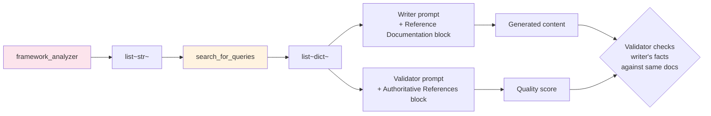

# Flow — Lesson Plan Generation (Technical)

For technical/coding plans. Adds a framework-analyzer agent that produces concrete search queries, then DDG fetches their docs, and the writer (and the quality validator) get those docs in their prompt.

> **Source files**: [crews/curriculum_crew.py](../../lessons-ai-api/crews/curriculum_crew.py), [crews/framework_analysis_crew.py](../../lessons-ai-api/crews/framework_analysis_crew.py), [agents/framework_analyzer_agent.py](../../lessons-ai-api/agents/framework_analyzer_agent.py), [tools/documentation_search.py](../../lessons-ai-api/tools/documentation_search.py), [templates/tasks/lesson_plan_Technical.jinja2](../../lessons-ai-api/templates/tasks/lesson_plan_Technical.jinja2).

## End-to-end

```mermaid
sequenceDiagram
  autonumber
  actor User
  participant UI as Angular
  participant Net as .NET API
  participant Route as routes/lessons.py
  participant CS as CurriculumService
  participant Crew as run_curriculum_crew
  participant FA as analyze_for_search_queries
  participant FAA as framework_analyzer agent
  participant DS as documentation_search.search_for_queries
  participant Cache as doc_cache
  participant DDG as DuckDuckGo
  participant CD as curriculum_designer_Technical
  participant LLM as Plan LLM
  participant QC as run_quality_check

  User->>UI: lessonType=Technical, topic="Modern Angular 20+"
  UI->>Net: POST /api/lessonplan/generate
  Net->>Route: → AI service
  Route->>CS: generate_plan(plan, number_of_lessons, ...)
  CS->>Crew: run_curriculum_crew

  Note over Crew: agent_type == "Technical" → run analyzer
  Crew->>FA: analyze_for_search_queries(plan, lesson=None)
  FA->>FAA: build inline agent
  FAA->>LLM: produce 1-5 site:-anchored queries
  LLM-->>FAA: ["angular standalone components site:angular.dev",<br/>"angular signals site:angular.dev",<br/>"rxjs operators site:rxjs.dev"]
  FAA-->>FA: FrameworkAnalysis
  FA-->>Crew: list[str] (deduped, ≤5)

  Crew->>DS: search_for_queries(queries, bypass_cache)
  loop per query (concurrent)
    DS->>Cache: get(q|<query>)
    alt cache hit
      Cache-->>DS: cached results
    else miss
      DS->>DDG: search
      DDG-->>DS: 3 hits per query
      DS->>DS: trafilatura.extract per URL (concurrent)
      DS->>Cache: put(q|<query>, results)
    end
  end
  DS-->>Crew: docs[] (flattened {url, title, content_excerpt})

  loop attempt = 0..max_quality_retries
    Crew->>Crew: build curriculum agent + task<br/>(template: lesson_plan_Technical.jinja2)
    Crew->>Crew: append docs_block to task.description<br/>via format_docs_for_prompt(docs)
    Crew->>LLM: invoke (sees ## Reference Documentation block)
    LLM-->>Crew: plan markdown
    Crew->>QC: run_quality_check(..., doc_sources=docs)
    QC->>LLM: validator with same docs in its prompt
    LLM-->>QC: { score, shortcomings }
    alt passed or last attempt
      Crew-->>CS: LessonPlanResponse
    else
      Note over Crew: append shortcomings to plan.description; retry
    end
  end

  CS-->>Route: response
  Route-->>Net: response (with usage[] tracking analyzer + writer + validator)
  Net-->>UI: 200
```

## Why an analyzer agent?

The previous design hardcoded a `KNOWN_FRAMEWORK_DOC_SITES` map of 12 frameworks → doc hosts plus a separate Context7 backend. Maintenance burden + frequent drift + false matches (the regex matched substrings, so "react" → reactor / reaction / etc.).

Replacing it with a small LLM call gives:

- **No hardcoded list** — any framework the LLM knows about is supported.
- **Per-lesson queries** — the writer of "Standalone Components" gets results scoped to that topic, not generic "Angular".
- **`site:` anchoring** — the agent's backstory tells it to bias toward official docs (`site:angular.dev` for Angular, `site:react.dev` for React, etc.). Off-topic Stack Overflow rarely makes the cut.

Cost: one extra cheap LLM call per generation (`quality_llm`, ~$0.0001 per call), zero infra dependencies.

## Quality validator gets the same docs



Without sharing docs, the validator falls back to its training data and may flag accurate-but-recent claims as wrong, or accept hallucinations as correct. Sharing the source-of-truth means the validator does *fact-checking* rather than *vibe-checking*.

## Failure modes

- **Analyzer returns `[]`** — happens for non-technical topics that snuck through. Crew skips DDG and the writer runs ungrounded. Failing soft.
- **DDG rate-limits** — `_ddg_search` retries once after 2s; if still failing, returns `[]` for that query. Other queries continue.
- **Page fetch fails** — the snippet from the DDG result body is used instead of the full page content. Lower quality but not zero.
- **All sources fail** — writer runs ungrounded; quality validator may flag missing references.
- **Quality validator times out** — `run_quality_check` returns a `passed=True` result with `score=0` so the user still gets the generated content.
