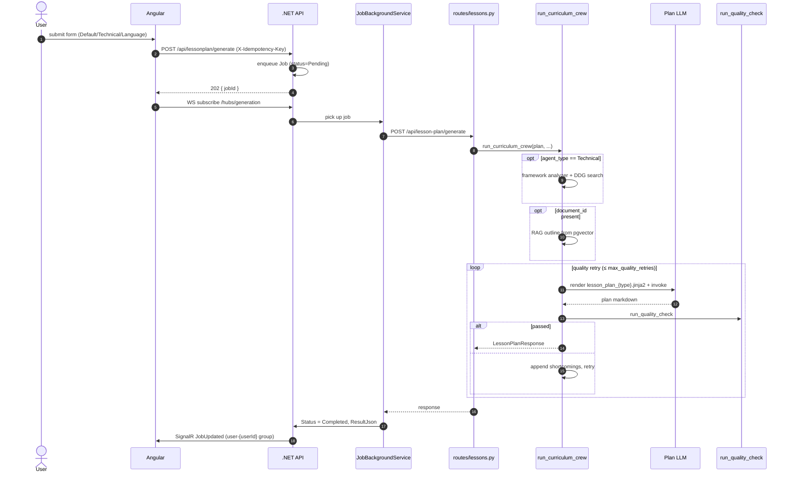
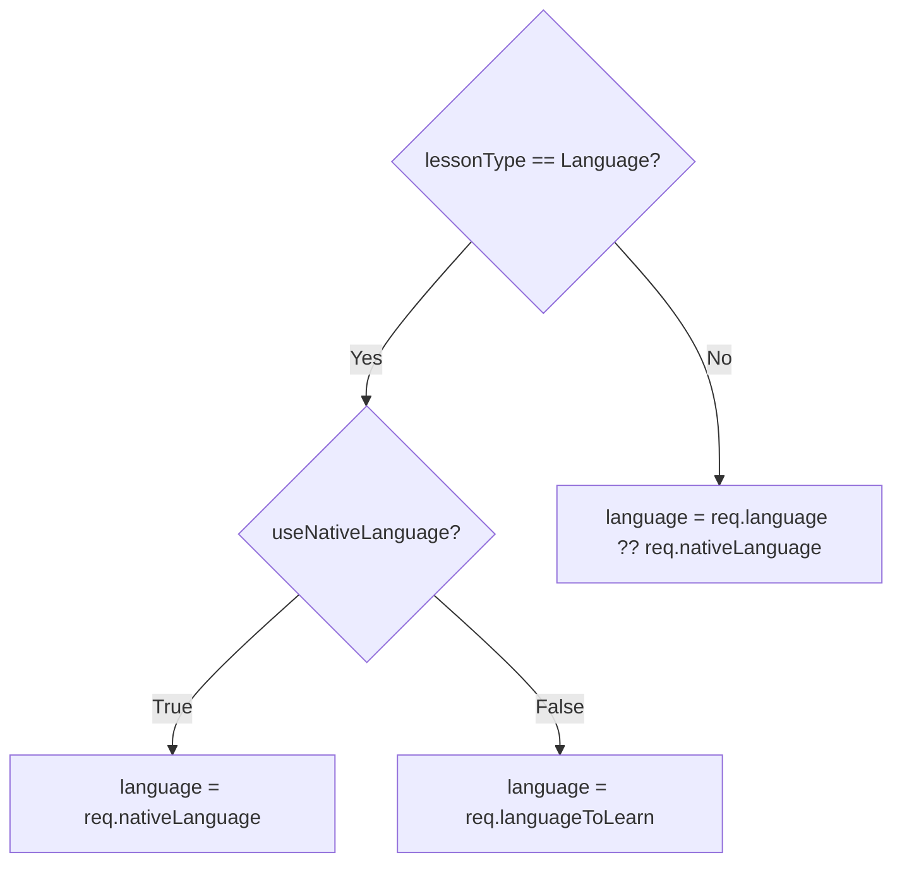

# Flow — Lesson Plan Generation

The `lessonType` field on the request shapes the prompt: `Default`, `Technical`, or `Language`. The transport, queueing, and SignalR handoff are identical across all three.

> **Source files**: [routes/lessons.py](../../lessons-ai-api/routes/lessons.py), [services/curriculum_service.py](../../lessons-ai-api/services/curriculum_service.py), [crews/curriculum_crew.py](../../lessons-ai-api/crews/curriculum_crew.py), [crews/framework_analysis_crew.py](../../lessons-ai-api/crews/framework_analysis_crew.py), [templates/tasks/lesson_plan_*.jinja2](../../lessons-ai-api/templates/tasks/).

## End-to-end (any lesson type)

This SignalR job pattern is shared by every AI generation endpoint — see [backend/04-infrastructure.md](../backend/04-infrastructure.md) for the executor + queue + hub plumbing.

## Type-specific behavior

| Aspect | Default | Technical | Language |
|---|---|---|---|
| Framework analyzer + DDG | — | ✓ | — |
| Reference docs in writer prompt | — | ✓ | — |
| `_resolve_language` boundary | `req.language ?? req.nativeLanguage` | same | branches on `useNativeLanguage` |
| Template | `lesson_plan_Default.jinja2` | `lesson_plan_Technical.jinja2` | `lesson_plan_Language.jinja2` |
| Extra prompt fields | topic, description | + framework docs block | + nativeLanguage, languageToLearn, useNativeLanguage |

## Technical: framework grounding

A small LLM call (`framework_analyzer`) produces 1–5 `site:`-anchored search queries. [`documentation_search.py`](../../lessons-ai-api/tools/documentation_search.py) runs them through DDG with a 30-day TTL cache, fetches pages with `trafilatura`, and the resulting `docs[]` is injected into both the writer's and the validator's prompts. Without sharing the same docs, the validator falls back to its training data and may flag accurate-but-recent claims as wrong.

The previous design hardcoded a `KNOWN_FRAMEWORK_DOC_SITES` map; replacing it with an LLM call removed maintenance burden and expanded coverage to any framework the model knows.

## Language: `_resolve_language` at the API boundary

The resolved `language` binds to `{{ language }}` in templates (the *rendering* language). `nativeLanguage` and `languageToLearn` are passed through separately so templates can branch and reference both explicitly. Native mode = explanations in the user's mother tongue with target-language examples; immersive mode = entire lesson in the target language.

## Quality retry feedback

If the validator returns `score < 80`, the crew appends shortcomings to `plan.description` (e.g. *"Lesson 3 doesn't have a clear learning outcome"*). Next iteration, the writer sees this in its prompt and addresses it. After `max_quality_retries`, the last attempt is returned regardless.

## What gets persisted

The frontend renders the response and the user clicks **Save to Library** to call `POST /api/lessonplan/save`. Lesson bodies are not generated yet — the [lesson-content](lesson-content.md) flow runs on first read.
