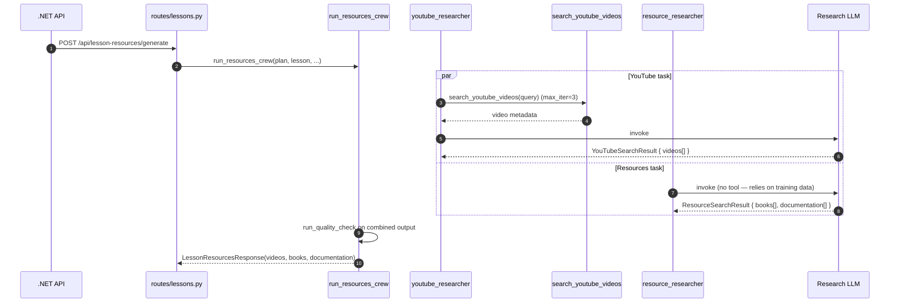

# Flow — Lesson Resources (Videos / Books / Documentation)

Two-agent crew. YouTube research and book/docs research run in parallel, returning curated lists for the lesson detail page.

> **Source files**: [crews/research_crew.py](../../lessons-ai-api/crews/research_crew.py), [tasks/resource_research_tasks.py](../../lessons-ai-api/tasks/resource_research_tasks.py), [agents/youtube_researcher_agent.py](../../lessons-ai-api/agents/youtube_researcher_agent.py), [agents/resource_researcher_agent.py](../../lessons-ai-api/agents/resource_researcher_agent.py), [tools/youtube_search_tool.py](../../lessons-ai-api/tools/youtube_search_tool.py).

## End-to-end

## Why two agents?

- **YouTube researcher** has a *tool* — it actively searches the YouTube Data API for real videos that exist *right now*.
- **Resource researcher** is *tool-less* — it draws on training data for canonical books / textbooks / documentation. Well-known books don't change (the Cambridge "In Use" series is still a top language reference, "Designing Data-Intensive Applications" is still a top distributed-systems book).

A single agent would either burn API quota looking up books on YouTube or produce hallucinated YouTube URLs.

## Limits + per-type personas

Settings cap returns at `youtube_videos_limit=2`, `books_limit=2`, `documentation_limit=1` — five resources per lesson. CrewAI's structured output enforces the count.

The resource-researcher persona is selected per `agent_type`:

| Type | Bias |
| --- | --- |
| Default | classic textbooks + top-rated digital |
| Technical | official docs + RFCs + O'Reilly/Manning |
| Language | Cambridge "In Use" + corpora + drills |

Personas are inline Python dicts in [resource_researcher_agent.py](../../lessons-ai-api/agents/resource_researcher_agent.py).

## Output

The .NET side maps `YouTubeVideo` / `Book` / `Documentation` to `Video` / `Book` / `Documentation` entities (see [Domain/Entities/](../../LessonsHub.Domain/Entities/)) and persists them per-lesson. The frontend's `LessonDetail` shows a "Resources" section once they exist. Currently the .NET API doesn't auto-call this on lesson read — the user triggers it manually via a "Find Resources" button.
