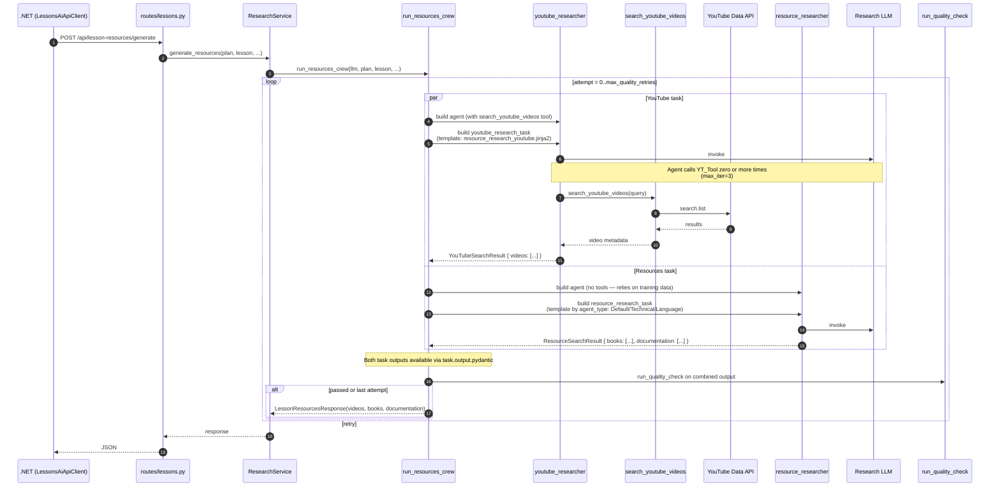
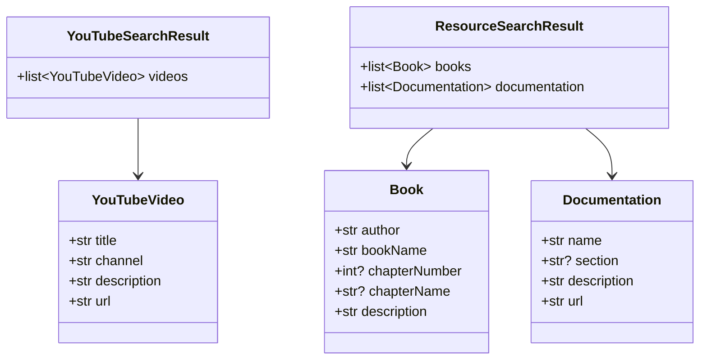

# Flow — Lesson Resources (Videos / Books / Documentation)

Two-agent crew. Runs YouTube research and book/docs research sequentially, returns curated lists of `VideoItem` / `BookItem` / `DocumentationItem` for the lesson detail page.

> **Source files**: [crews/research_crew.py](../../lessons-ai-api/crews/research_crew.py), [tasks/resource_research_tasks.py](../../lessons-ai-api/tasks/resource_research_tasks.py), [agents/youtube_researcher_agent.py](../../lessons-ai-api/agents/youtube_researcher_agent.py), [agents/resource_researcher_agent.py](../../lessons-ai-api/agents/resource_researcher_agent.py), [tools/youtube_search_tool.py](../../lessons-ai-api/tools/youtube_search_tool.py).

## End-to-end



## Why two agents?

- **YouTube researcher** has a *tool* — it actively searches the YouTube Data API for real videos that exist *right now*.
- **Resource researcher** is *tool-less* — it draws on its training data for canonical books/textbooks/documentation. This is fine because well-known books don't change (the Cambridge "In Use" series is still a top language reference, "Designing Data-Intensive Applications" is still a top distributed-systems book, etc.).

A single agent doing both would either burn API quota looking up books on YouTube (wrong tool) or produce hallucinated YouTube URLs (no tool).

## Limits (from settings)

```python
youtube_videos_limit: int = 2     # videos returned
books_limit: int = 2              # books returned
documentation_limit: int = 1      # doc/articles returned
```

Each agent is told the limit in its prompt; CrewAI's structured output enforces the count. Five resources per lesson — enough to be useful, few enough that users actually click them.

## Per-type templates ([resource_research_*.jinja2](../../lessons-ai-api/templates/tasks/))

```mermaid
flowchart LR
  classDef d fill:#e8f5e9,color:#1a1a1a
  classDef t fill:#fff3e0,color:#1a1a1a
  classDef l fill:#fce4ec,color:#1a1a1a

  default[resource_research_Default<br/>Agent: Expert Academic Researcher<br/>Bias: classic textbooks + top-rated digital]:::d
  tech[resource_research_Technical<br/>Agent: Senior Technical Librarian<br/>Bias: official docs + RFCs + O'Reilly/Manning]:::t
  lang[resource_research_Language<br/>Agent: Linguistic Resource Curator<br/>Bias: Cambridge "In Use" + corpora + drills]:::l
```

The agent personas are inline Python (see [resource_researcher_agent.py](../../lessons-ai-api/agents/resource_researcher_agent.py)) — three sets of `(role, goal, backstory)` selected by `agent_type`.

## Output models

[tasks/resource_research_tasks.py](../../lessons-ai-api/tasks/resource_research_tasks.py):



The .NET side maps these to `Video` / `Book` / `Documentation` entities (see [Domain/Entities/](../../LessonsHub.Domain/Entities/)) and persists them per-lesson.

## Where users see this

The frontend's [LessonDetail](../../lessonshub-ui/src/app/lesson-detail/) component shows a "Resources" section with three subsections (Videos, Books, Documentation) once they exist. Currently the .NET API doesn't auto-call the resources crew on lesson read — the user has to trigger it manually (a "Find Resources" button on the lesson page, which posts to `/api/lesson-resources/generate` with the lesson context).

## Failure modes

- **YouTube API quota exceeded** — the YT tool returns an error; the agent retries up to `max_iter=3`. If still failing, the response has empty `videos` array.
- **Hallucinated books** — the resource researcher relies on training data, so it can produce plausible-sounding but fictitious book titles. Quality validator usually catches obvious fakes; subtle ones may slip through. Users see a citation but no verifiable URL for books.
- **Documentation links go stale** — the agent recommends URLs that may have moved. No periodic re-validation; users hit broken links occasionally.
