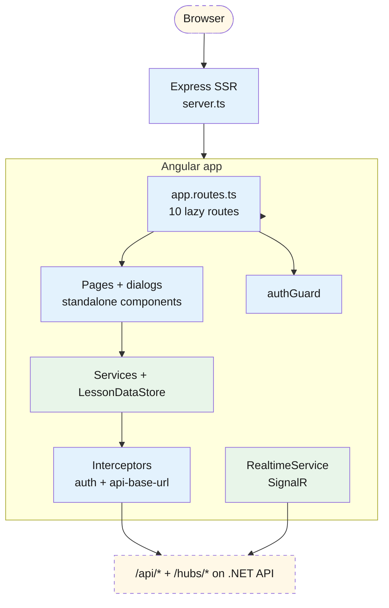

# Frontend — 01 Architecture

Angular 21 with full SSR (Node-rendered first paint, then browser hydration). Standalone components, signals for reactive state, Material Design for UI primitives.

> **Source files**: [lessonshub-ui/src/app/](../../lessonshub-ui/src/app/), specifically [app.config.ts](../../lessonshub-ui/src/app/app.config.ts), [app.config.server.ts](../../lessonshub-ui/src/app/app.config.server.ts), [app.routes.ts](../../lessonshub-ui/src/app/app.routes.ts), [server.ts](../../lessonshub-ui/src/server.ts).

## High-level

`appConfig` ([app.config.ts](../../lessonshub-ui/src/app/app.config.ts)) provides: `provideRouter(routes)`, `provideHttpClient(withInterceptorsFromDi(), withFetch())`, `provideClientHydration()`, `provideAnimationsAsync()`, `provideNativeDateAdapter()`, and the `API_BASE_URL` injection token. `appConfigServer` extends it with `provideServerRendering()` and `provideServerRoutesConfig` (every route is `RenderMode.Server` — SSR for all pages, no SSG, since content is per-user behind auth).

## Component pattern

Every component is **standalone** (no `NgModule`s). Lifecycle: `ngOnInit` for initial data load. State held in `signal()`s; UI binds via the template's `()` invocation syntax (`@if (isLoading()) { … }`).

`LessonDataStore` is the cross-component cache: each page that needs lesson data injects the store and reads its signals (`plans`, `sharedPlans`, `todayLessons`). Components call `loadPlans` (cache-aware) on mount and `refreshPlans` after mutations.

## Real-time updates (SignalR)

Long-running AI generations return `202 { jobId }` and stream lifecycle events through SignalR. `RealtimeService` lazily connects to `/hubs/generation` (sending `?access_token=<jwt>` since browsers can't set headers on WS upgrades). `JobsService.postAndStream<TBody>(url, body, opts?)` is the central helper — POST + auto-injected `X-Idempotency-Key` + WS subscribe + filter-on-terminal. Each per-domain service method (`generateLessonPlan`, `generateContent`, …) is ~3 lines.

`JobsService.findInFlight()` / `listInFlightForEntity()` are called on page load to repaint banners for jobs that survived navigation. `subscribeToExistingJob(jobId)` polls the job once before opening the WS to handle the race where the executor finished between page load and the SignalR connect.

## Server-Side Rendering specifics

Services inject `PLATFORM_ID` and gate browser-only calls (`localStorage`, `window`) behind `isPlatformBrowser(this.platformId)`. Without this, the SSR pass crashes — see [auth.service.ts](../../lessonshub-ui/src/app/services/auth.service.ts) for the canonical example. `server.ts` runs an Express app; `NG_ALLOWED_HOSTS=*` is set on the Cloud Run service because Angular 21's SSR has SSRF protection that rejects unknown `Host` headers.

## Interceptors and guards

[interceptors/](../../lessonshub-ui/src/app/interceptors/):

- **`apiBaseUrlInterceptor`** — if the URL is relative (`/api/...`), prepend the injected `API_BASE_URL`. The Angular SSR server reads `API_BASE_URL` from env and injects it into rendered HTML as `<meta name="api-base-url">`; browser-side code reads that meta tag.
- **`authInterceptor`** — if a token is in `localStorage` (key: `auth_token`), add `Authorization: Bearer <token>`. Skips on the SSR pass (no `localStorage`) — the first server-side render produces no auth header, then the browser hydrates with the token attached.

`authGuard` ([guards/auth.guard.ts](../../lessonshub-ui/src/app/guards/auth.guard.ts)) is a functional `CanActivateFn`: redirects to `/login` if `AuthService.isLoggedIn()` is `false`.

## Material UI surface

Cards, buttons, icons, chips on every page. Forms use `MatFormFieldModule` + `MatInputModule` + `MatSelectModule`. `MatProgressSpinnerModule` / `MatProgressBarModule` for loading + upload progress. `MatDialogModule` for confirm/share/regenerate/generate-exercise dialogs. `MatDatepickerModule` on the calendar page.

Lesson markdown is rendered by `ngx-markdown` (`<markdown [data]="lesson()?.content">`). KaTeX/Prism are wired up too for math + code highlighting.
