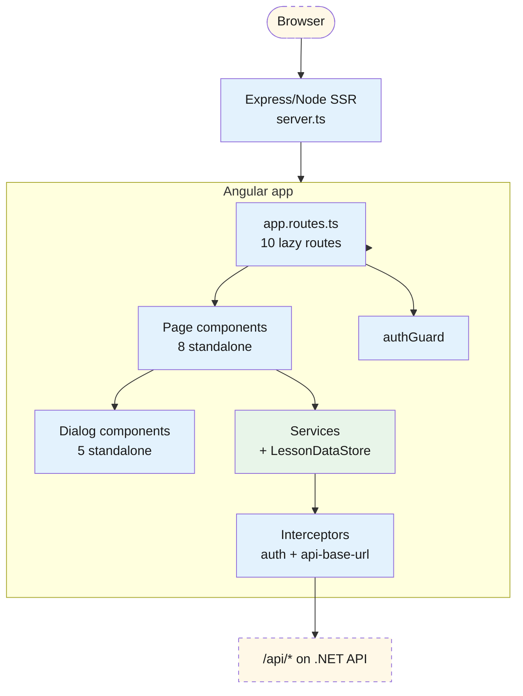
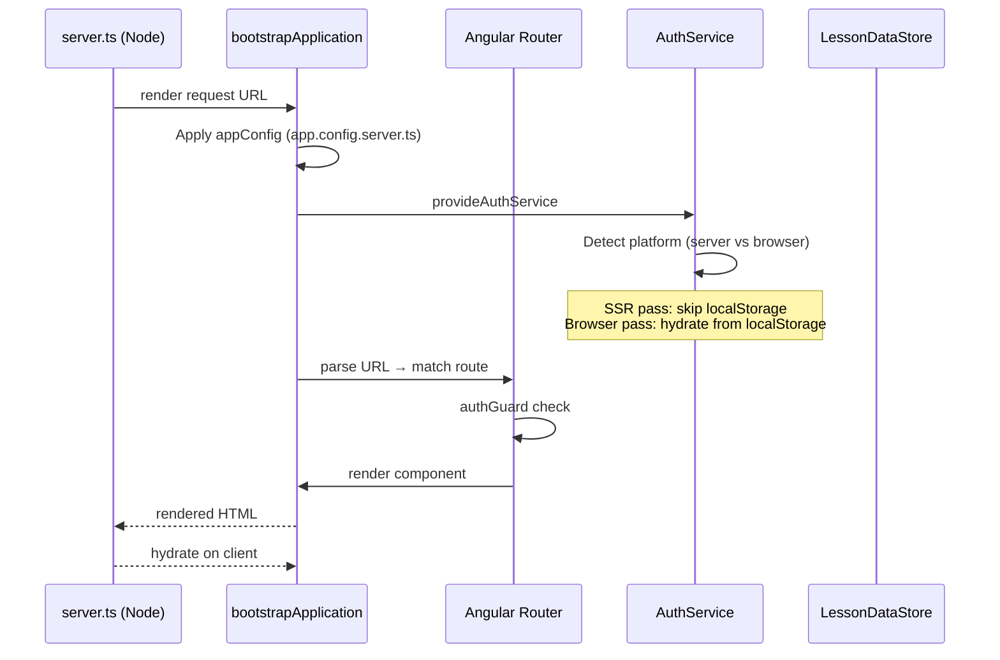
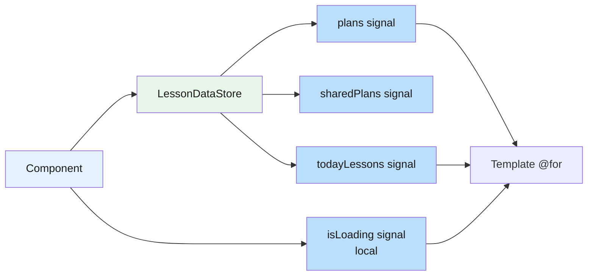
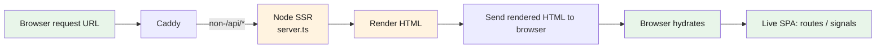

# Frontend — 01 Architecture

Angular 21 with full SSR (Node-rendered first paint, then browser hydration). Standalone components, signals for reactive state, Material Design for UI primitives.

> **Source files**: [lessonshub-ui/src/app/](../../lessonshub-ui/src/app/), specifically [app.config.ts](../../lessonshub-ui/src/app/app.config.ts), [app.config.server.ts](../../lessonshub-ui/src/app/app.config.server.ts), [app.routes.ts](../../lessonshub-ui/src/app/app.routes.ts), [main.ts](../../lessonshub-ui/src/main.ts), [main.server.ts](../../lessonshub-ui/src/main.server.ts), [server.ts](../../lessonshub-ui/src/server.ts).

## High-level architecture



## Application bootstrap



`appConfig` (in [app.config.ts](../../lessonshub-ui/src/app/app.config.ts)) provides:

- `provideRouter(routes)` — the lazy route table
- `provideHttpClient(withInterceptorsFromDi(), withFetch())` — HTTP plumbing with the two interceptors
- `provideClientHydration()` — for SSR → CSR seamless handoff
- `provideAnimationsAsync()` — Material's animations
- `provideNativeDateAdapter()` — Material datepicker
- `API_BASE_URL` — InjectionToken used by `api-base-url.interceptor`

`appConfigServer` (in [app.config.server.ts](../../lessonshub-ui/src/app/app.config.server.ts)) extends `appConfig` with:

- `provideServerRendering()`
- `provideServerRoutesConfig(serverRoutes)` — every route is `RenderMode.Server` (SSR for all pages, no SSG)

## Component pattern

Every component is **standalone** — no `NgModule`s. Imports declare the components/directives/pipes directly:

```typescript
@Component({
  selector: 'app-lesson-plan',
  standalone: true,                          // (default in Angular 21)
  imports: [CommonModule, ReactiveFormsModule, MatFormFieldModule, ...],
  templateUrl: './lesson-plan.html',
  styleUrl: './lesson-plan.css',
})
export class LessonPlan implements OnInit { ... }
```

Lifecycle: `ngOnInit` for initial data load (services). State held in `signal()`s; UI binds to them via the template's `()` invocation syntax (`@if (isLoading()) { … }`).

## Reactivity model



`LessonDataStore` is the cross-component cache. Each page that needs lesson data injects the store and reads its signals. The store provides `loadPlans()` / `refreshPlans()` etc. — components call `loadPlans` (cache-aware) on mount and `refreshPlans` after mutations.

## Material UI surface

Imports across pages (most-to-least common):

- `MatCardModule`, `MatButtonModule`, `MatIconModule`, `MatChipsModule` — every page
- `MatFormFieldModule`, `MatInputModule`, `MatSelectModule` — forms
- `MatProgressSpinnerModule`, `MatProgressBarModule` — loading states + upload progress
- `MatDialogModule` — confirmation, share, regenerate, generate-exercise dialogs
- `MatTooltipModule` — hover hints on icon buttons
- `MatDatepickerModule` + `MatNativeDateModule` — calendar picker on `lesson-days`

The lesson markdown content is rendered by `ngx-markdown` (`<markdown [data]="lesson()?.content">`). KaTeX/Prism are wired up too for math + code highlighting in lesson content.

## Server-Side Rendering specifics



**Platform-aware code**: services inject `PLATFORM_ID` and gate browser-only calls (`localStorage`, `window`) behind `isPlatformBrowser(this.platformId)`. Without this, the SSR pass crashes — see [auth.service.ts](../../lessonshub-ui/src/app/services/auth.service.ts) for the canonical example.

`server.ts` runs an Express app. `NG_ALLOWED_HOSTS=*` is set in docker-compose because Angular 21's SSR has SSRF protection that rejects unknown `Host` headers — Caddy proxies arbitrary `Host` values, so we accept all.

## Interceptors and guards

[interceptors/](../../lessonshub-ui/src/app/interceptors/):

| Interceptor | Order | Behaviour |
|---|---|---|
| `apiBaseUrlInterceptor` | first | If the URL is relative (`/api/...`), prepend the injected `API_BASE_URL`. In docker-compose Caddy this is `''` (relative-to-origin); in dev SSR running on a different port, it's the .NET API URL. |
| `authInterceptor` | second | If a token is in `localStorage`, add `Authorization: Bearer <token>` to every outgoing request. Skips auth-issuing endpoints. |

[guards/auth.guard.ts](../../lessonshub-ui/src/app/guards/auth.guard.ts) is a functional guard:

```typescript
export const authGuard: CanActivateFn = (route, state) => {
  const auth = inject(AuthService);
  const router = inject(Router);
  if (auth.isLoggedIn()) return true;
  router.navigate(['/login']);
  return false;
};
```

## Routes by render mode

All 10 routes share `RenderMode.Server` per [app.routes.server.ts](../../lessonshub-ui/src/app/app.routes.server.ts) — no static prerendering. Each component is lazy-loaded via dynamic import in [app.routes.ts](../../lessonshub-ui/src/app/app.routes.ts), so the initial bundle stays small.

## Folder layout

```
lessonshub-ui/src/app/
├── app.ts                        # Root component (RouterOutlet + nav shell)
├── app.html / app.css            # Root template + global styles
├── app.config.ts                 # appConfig (browser)
├── app.config.server.ts          # appConfigServer (SSR)
├── app.routes.ts                 # Route table
├── app.routes.server.ts          # Server-side route render modes
├── api-base-url.ts               # InjectionToken for the API base URL
├── confirm-dialog/               # Confirmation modal
├── documents/                    # /documents page
├── generate-exercise-dialog/     # Modal: difficulty + comment
├── guards/auth.guard.ts          # authGuard
├── interceptors/                 # auth + api-base-url
├── lesson-day{s,s.html,s.ts}/    # /lesson-days calendar page
├── lesson-detail/                # /lesson/:id reader page
├── lesson-plan/                  # /lesson-plan generator page
├── lesson-plan-detail/           # /lesson-plans/:id editor page
├── lesson-plans/                 # /lesson-plans list page
├── login/                        # /login Google one-tap
├── models/                       # TS interfaces
├── profile/                      # /profile settings page
├── regenerate-lesson-dialog/     # Modal: regenerate options
├── services/                     # 8 services + LessonDataStore
├── share-dialog/                 # Modal: share with email
└── todays-lessons/               # /today dashboard
```
