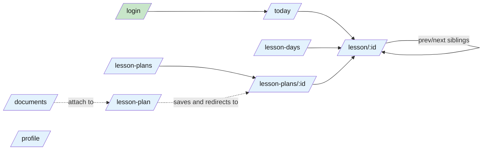
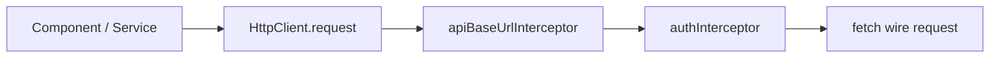

# Frontend — 02 Routing

10 lazy-loaded routes. All authenticated except `/login`. All rendered server-side.

> **Source files**: [app.routes.ts](../../lessonshub-ui/src/app/app.routes.ts), [app.routes.server.ts](../../lessonshub-ui/src/app/app.routes.server.ts), [guards/auth.guard.ts](../../lessonshub-ui/src/app/guards/auth.guard.ts), [interceptors/](../../lessonshub-ui/src/app/interceptors/).

## Route table

| Path | Component | Guard |
|---|---|---|
| `/login` | `Login` | none |
| `/` | redirect → `/today` | — |
| `/today` | `TodaysLessons` | `authGuard` |
| `/lesson/:id` | `LessonDetail` | `authGuard` |
| `/lesson-plan` | `LessonPlan` | `authGuard` |
| `/lesson-plans` | `LessonPlans` | `authGuard` |
| `/lesson-plans/:id` | `LessonPlanDetail` | `authGuard` |
| `/lesson-days` | `LessonDays` | `authGuard` |
| `/documents` | `Documents` | `authGuard` |
| `/profile` | `Profile` | `authGuard` |

Every component is lazy-loaded via dynamic import in [app.routes.ts](../../lessonshub-ui/src/app/app.routes.ts) so the initial bundle stays small. Wildcard `**` falls through (no 404 component).

## Navigation graph

## `authGuard` and SSR

`authGuard` calls `AuthService.isLoggedIn()`. On the SSR pass, `localStorage` doesn't exist, so the guard returns `false` and redirects to `/login`. The browser then hydrates with the real auth state. On slow networks this is a brief flash for valid users.

## Interceptor chain

- **`apiBaseUrlInterceptor`** prefixes relative `/api/...` URLs with the `API_BASE_URL` injection token (set from `<meta name="api-base-url">` on the SSR-rendered HTML).
- **`authInterceptor`** reads `localStorage.getItem('auth_token')` and adds `Authorization: Bearer <token>` when present. Gated by `isPlatformBrowser` so the SSR pass doesn't crash.

`RealtimeService` doesn't go through the HTTP interceptors — it builds its own `HubConnection` and supplies the JWT via `accessTokenFactory` (which routes through `AuthService.getToken()`).
