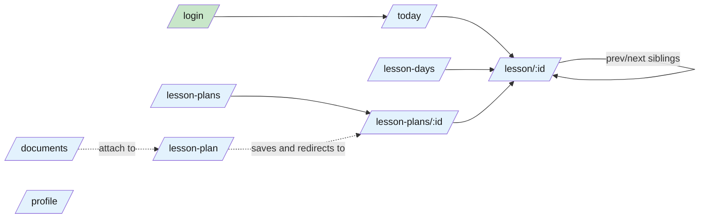
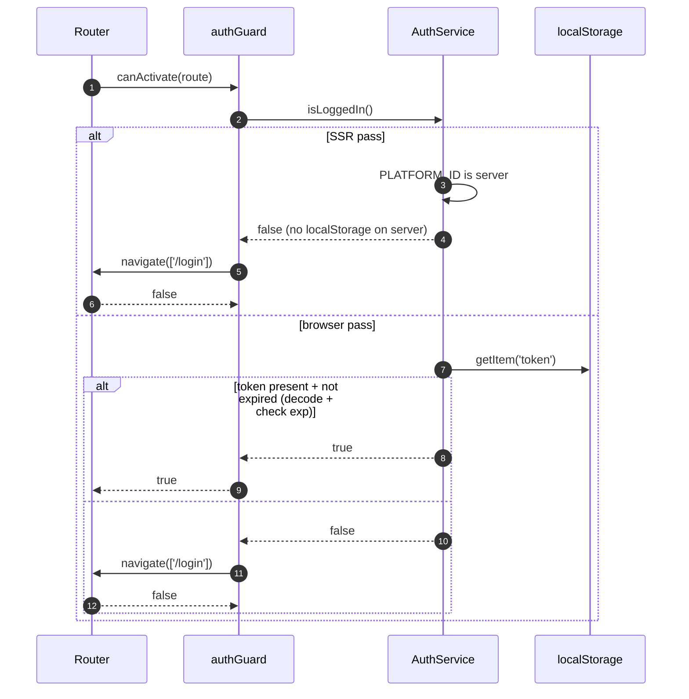
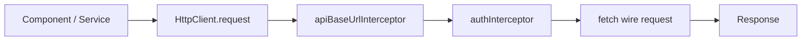

# Frontend — 02 Routing

10 lazy-loaded routes. All authenticated except `/login`. All rendered server-side.

> **Source files**: [app.routes.ts](../../lessonshub-ui/src/app/app.routes.ts), [app.routes.server.ts](../../lessonshub-ui/src/app/app.routes.server.ts), [guards/auth.guard.ts](../../lessonshub-ui/src/app/guards/auth.guard.ts), [interceptors/](../../lessonshub-ui/src/app/interceptors/).

## Route table

| Path | Component | Guard | Lazy-load |
|---|---|---|---|
| `/login` | `Login` | none | `() => import('./login/login').then(m => m.Login)` |
| `/` | redirect to `/today` | — | — |
| `/today` | `TodaysLessons` | `authGuard` | `() => import('./todays-lessons/todays-lessons').then(m => m.TodaysLessons)` |
| `/lesson/:id` | `LessonDetail` | `authGuard` | `() => import('./lesson-detail/lesson-detail').then(m => m.LessonDetail)` |
| `/lesson-plan` | `LessonPlan` | `authGuard` | `() => import('./lesson-plan/lesson-plan').then(m => m.LessonPlan)` |
| `/lesson-plans` | `LessonPlans` | `authGuard` | `() => import('./lesson-plans/lesson-plans').then(m => m.LessonPlans)` |
| `/lesson-plans/:id` | `LessonPlanDetail` | `authGuard` | `() => import('./lesson-plan-detail/lesson-plan-detail').then(m => m.LessonPlanDetail)` |
| `/lesson-days` | `LessonDays` | `authGuard` | `() => import('./lesson-days/lesson-days').then(m => m.LessonDays)` |
| `/documents` | `Documents` | `authGuard` | `() => import('./documents/documents').then(m => m.Documents)` |
| `/profile` | `Profile` | `authGuard` | `() => import('./profile/profile').then(m => m.Profile)` |

The wildcard `**` falls through (no 404 component currently — Angular logs a warning and shows nothing).

## Navigation graph



## `authGuard` behaviour



A subtle SSR consequence: every authenticated route initially renders as a redirect to `/login` on the server, then the browser hydrates with the real auth state. If the user has a valid token, this looks like a brief flash on slow networks.

## Interceptor chain



### `apiBaseUrlInterceptor` ([interceptors/api-base-url.interceptor.ts](../../lessonshub-ui/src/app/interceptors/api-base-url.interceptor.ts))

Reads the `API_BASE_URL` injection token and prefixes every relative URL (those starting with `/api/...`). In docker-compose the value is empty (Caddy proxies same-origin). In standalone dev the value is the .NET API URL.

### `authInterceptor` ([interceptors/auth.interceptor.ts](../../lessonshub-ui/src/app/interceptors/auth.interceptor.ts))

```typescript
const token = isPlatformBrowser(platformId) ? localStorage.getItem('token') : null;
if (token) {
  req = req.clone({ headers: req.headers.set('Authorization', `Bearer ${token}`) });
}
return next(req);
```

`isPlatformBrowser` matters — on the SSR pass `localStorage` doesn't exist, so we skip the header. The first authenticated server-side render produces no `Authorization` header → the .NET API responds 401, the SSR pass renders the public/no-data state, then the browser hydrates with the token attached and re-renders correctly.

## SSR render-mode config

[app.routes.server.ts](../../lessonshub-ui/src/app/app.routes.server.ts):

```typescript
import { RenderMode, ServerRoute } from '@angular/ssr';

export const serverRoutes: ServerRoute[] = [
  { path: '**', renderMode: RenderMode.Server }
];
```

Wildcard pattern: every route ends up as `RenderMode.Server` (SSR every request). No SSG (`RenderMode.Prerender`) since the content is per-user and behind auth — prerendering would just produce login redirects.
