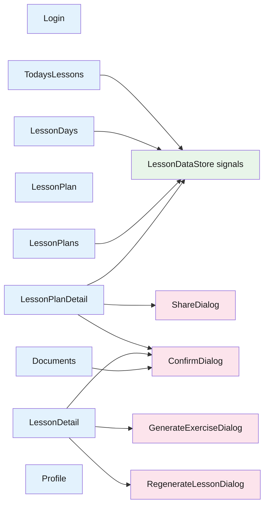

# Frontend — 03 Components

13 components — 8 page-level + 5 dialogs. All standalone.

> **Source files**: [lessonshub-ui/src/app/](../../lessonshub-ui/src/app/) (each subfolder).

## Component graph

`ConfirmDialog` is shared — used wherever a destructive action needs confirmation.

## Pages

| Component | What it shows | Key interactions |
|---|---|---|
| `Login` | Google One-Tap button | Triggers OAuth → `AuthService.loginWithGoogle` → redirects to `/today`. |
| `TodaysLessons` | Today's scheduled lessons | Reads `LessonDataStore.todayLessons`. |
| `LessonPlan` | Form to generate a plan | `lessonType` select switches conditional fields (Technical adds `bypassDocCache`; Language adds `languageToLearn` + `useNativeLanguage`). Optional document picker. Streams generation via SignalR; persists pending plan to `localStorage` (24h TTL) so the user can recover after navigation. |
| `LessonPlans` | List of plans (owned + shared-with-me) | Two sections; each item links to detail page. |
| `LessonPlanDetail` | Plan editor + lesson list | Edit metadata (incl. all language fields), add/remove lessons, delete plan, open `ShareDialog`. Borrowers see read-only. |
| `LessonDetail` | Markdown lesson + exercises + resources + nav | Generates content explicitly via the SignalR job pipeline. Sibling nav. Generate/retry exercise → `GenerateExerciseDialog`. Toggles complete; regenerates via `RegenerateLessonDialog`. Restores in-flight banners on load via `JobsService.listInFlightForEntity`. |
| `LessonDays` | Month calendar + day editor | Pick a date, see/edit assigned lessons; assign new ones from a dropdown of available lessons across owned plans. |
| `Documents` | Upload + list user's docs | Upload progress via `MatProgressBar`. Status chips (`Pending`/`Ingested`/`Failed`). Each row has a "Generate Plan from this" link. |
| `Profile` | Email + name + Gemini API key field | Show/hide toggle on the API key. Save triggers `UserProfileService.updateProfile`. |

## Dialogs

| Dialog | Inputs | Returns |
|---|---|---|
| `ConfirmDialog` | `{ title, message, confirmText?, cancelText? }` | `boolean` |
| `ShareDialog` | `{ planId, planName }` | `void` (mutates via `LessonPlanShareService`) |
| `GenerateExerciseDialog` | none | `{ difficulty, comment? }` |
| `RegenerateLessonDialog` | none | `{ bypassDocCache, comment? }` |

## Shared `GenerationBanner`

[generation-banner/](../../lessonshub-ui/src/app/generation-banner/) is a small standalone component used by every page that displays AI-generation progress. Inputs: `phase`, `label`, `etaHint`. Subscription cleanup uses `takeUntilDestroyed(this.destroyRef)` so component re-creation doesn't accumulate listeners.

## Notes on key components

- **`LessonPlan`** form controls: `lessonType, planName, topic, numberOfDays, description, nativeLanguage, languageToLearn, useNativeLanguage, bypassDocCache`. `bypassDocCache` is visible only for `Technical`; `languageToLearn` + `useNativeLanguage` only for `Language`; the `nativeLanguage` label switches between "Language" and "Native Language" depending on type.
- **`LessonDetail`** subscribes to `route.paramMap` so `/lesson/:id` URL changes (prev/next nav) reload without a full re-render.
- **`LessonPlanDetail`** edit form uses a `FormArray` of `{ id?, lessonNumber, name, shortDescription, lessonTopic }` for inline lesson editing. Sharing/delete are owner-only and gated by `plan().isOwner`.
- **`LessonDays`** picker shows lessons from the user's *owned* plans only — you can only schedule what you own. Already-assigned lessons render disabled.
- **`Documents`** upload uses `DocumentService.upload()` which emits `HttpEventType.UploadProgress`; the component drives `uploadProgress` (0-100) for the progress bar.
