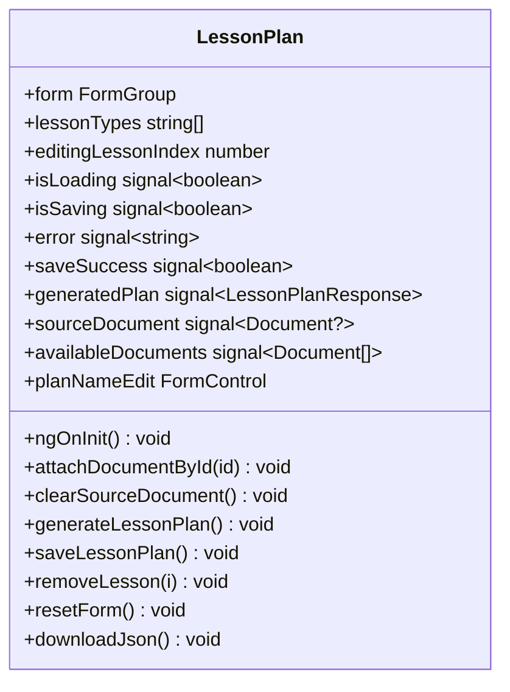
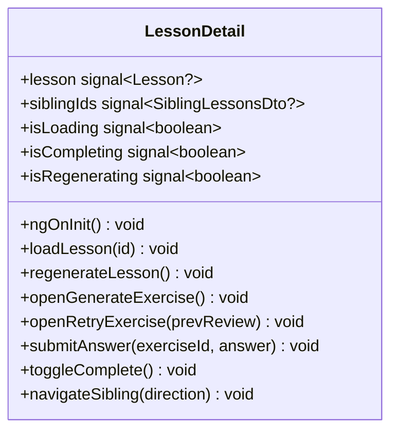
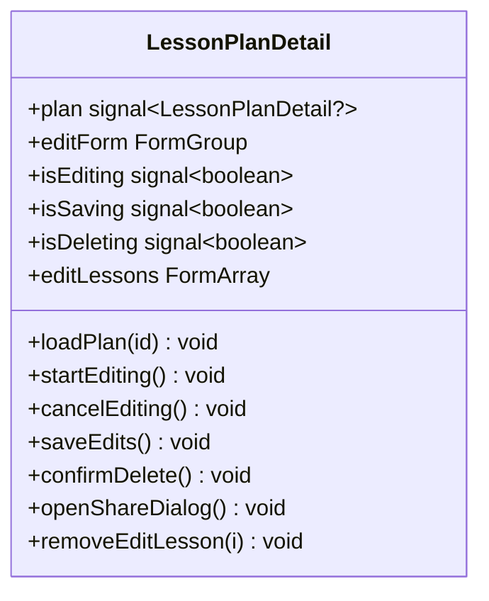
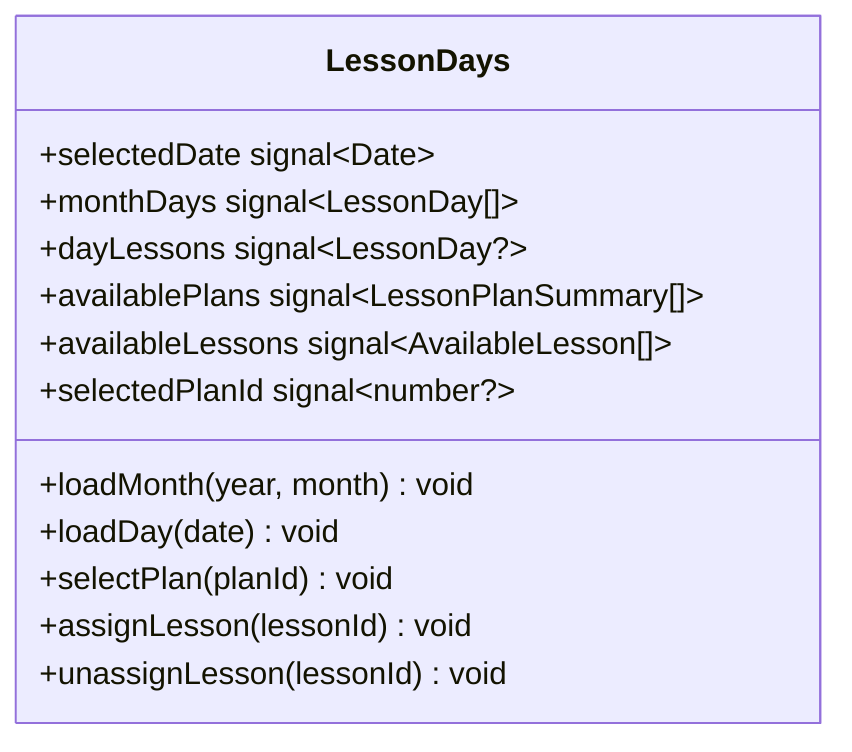
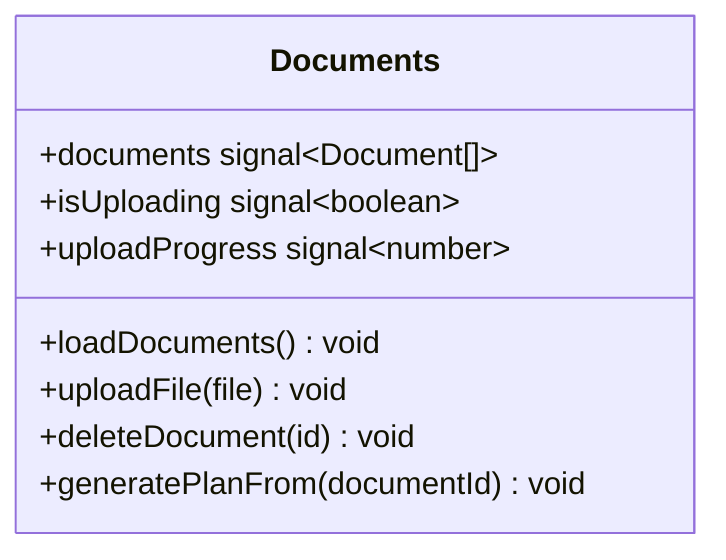

# Frontend — 03 Components

13 components — 8 page-level + 5 dialogs. All standalone.

> **Source files**: [lessonshub-ui/src/app/](../../lessonshub-ui/src/app/) (each subfolder).

## Component graph

`ConfirmDialog` is shared — used wherever a destructive action needs confirmation (delete plan, delete document, remove share).

## Per-component quick reference

### Pages

| Component | File | What it shows | Key interactions |
|---|---|---|---|
| `Login` | [login/](../../lessonshub-ui/src/app/login/) | Google One-Tap button | Triggers OAuth flow → `AuthService.loginWithGoogle` → redirects to `/today` |
| `TodaysLessons` | [todays-lessons/](../../lessonshub-ui/src/app/todays-lessons/) | Today's scheduled lessons (cards) | Reads `LessonDataStore.todayLessons`. Empty state links to `/lesson-days`. |
| `LessonPlan` | [lesson-plan/](../../lessonshub-ui/src/app/lesson-plan/) | Form to generate a plan | `lessonType` select switches the form (Technical adds `bypassDocCache`; Language adds `languageToLearn` + `useNativeLanguage`). Optional document picker. Calls `LessonPlanService.generateLessonPlan` then `.saveLessonPlan`. |
| `LessonPlans` | [lesson-plans/](../../lessonshub-ui/src/app/lesson-plans/) | List of plans (owned + shared-with-me) | Two sections; each item links to detail page. |
| `LessonPlanDetail` | [lesson-plan-detail/](../../lessonshub-ui/src/app/lesson-plan-detail/) | Plan editor + lesson list | Edit plan metadata (incl. all language fields), add/remove lessons, delete plan, open `ShareDialog`. Shared-mode users see read-only. |
| `LessonDetail` | [lesson-detail/](../../lessonshub-ui/src/app/lesson-detail/) | Markdown lesson + exercises + resources + nav | Lazy-generates content on first view. Sibling nav (`/api/lesson/:id/siblings`). Generate/retry exercise → `GenerateExerciseDialog`; submit answer; toggle complete; regenerate via `RegenerateLessonDialog`. |
| `LessonDays` | [lesson-days/](../../lessonshub-ui/src/app/lesson-days/) | Month calendar + day editor | Pick a date, see/edit assigned lessons; assign new ones from a dropdown of available lessons across owned plans. |
| `Documents` | [documents/](../../lessonshub-ui/src/app/documents/) | Upload + list user's docs | File input with `MatProgressBar` for upload. Status chips (`Pending`/`Ingested`/`Failed`). Each row has a "Generate Plan from this" link. |
| `Profile` | [profile/](../../lessonshub-ui/src/app/profile/) | Email + name + Gemini API key field | The API key field has a show/hide toggle. Save button triggers `UserProfileService.updateProfile`. |

### Dialogs

| Dialog | File | Inputs | Returns |
|---|---|---|---|
| `ConfirmDialog` | [confirm-dialog/](../../lessonshub-ui/src/app/confirm-dialog/) | `{ title, message, confirmText?, cancelText? }` | `boolean` |
| `ShareDialog` | [share-dialog/](../../lessonshub-ui/src/app/share-dialog/) | `{ planId, planName }` | `void` (mutates via `LessonPlanShareService`; lists existing shares + adds/removes) |
| `GenerateExerciseDialog` | [generate-exercise-dialog/](../../lessonshub-ui/src/app/generate-exercise-dialog/) | none | `{ difficulty, comment? }` |
| `RegenerateLessonDialog` | [regenerate-lesson-dialog/](../../lessonshub-ui/src/app/regenerate-lesson-dialog/) | none | `{ bypassDocCache, comment? }` |

## Class diagrams (key components)

### `LessonPlan` — the generator form

Form controls: `lessonType, planName, topic, numberOfDays, description, nativeLanguage, languageToLearn, useNativeLanguage, bypassDocCache`.

Conditional fields:
- `bypassDocCache` toggle visible only when `lessonType === 'Technical'`.
- `languageToLearn` field + `useNativeLanguage` toggle visible only when `lessonType === 'Language'`.
- `nativeLanguage` label switches between "Language" (Default/Technical) and "Native Language" (Language).

### `LessonDetail` — the reader

The component subscribes to `route.paramMap` so `/lesson/:id` URL changes (prev/next nav) trigger a reload without a full re-render.

### `LessonPlanDetail` — the editor

Edit form: `name, topic, description, nativeLanguage, languageToLearn, useNativeLanguage` plus a `FormArray` of per-lesson `{ id?, lessonNumber, name, shortDescription, lessonTopic }`. Sharing/delete are owner-only and gated by `plan().isOwner`.

### `LessonDays` — the calendar

The picker on the right shows lessons from the user's *owned* plans (you can only schedule what you own). Already-assigned lessons are visibly disabled (`isAssigned: true`).

### `Documents`

Upload uses `DocumentService.upload()` which emits `HttpEventType.UploadProgress`. The component drives `uploadProgress` (0-100) for a `MatProgressBar`.
