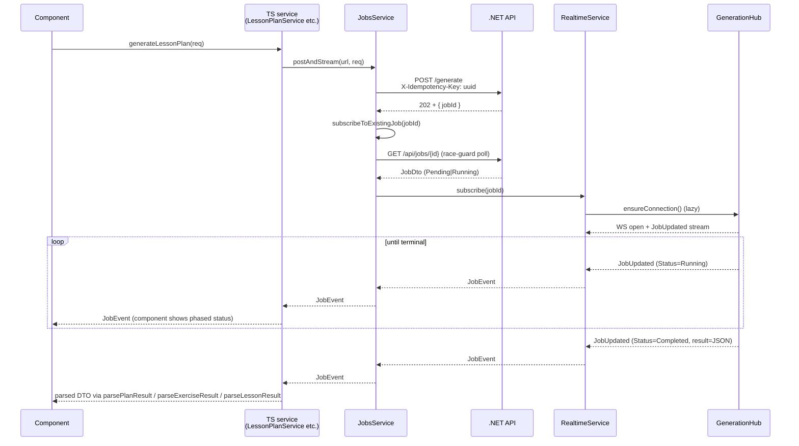
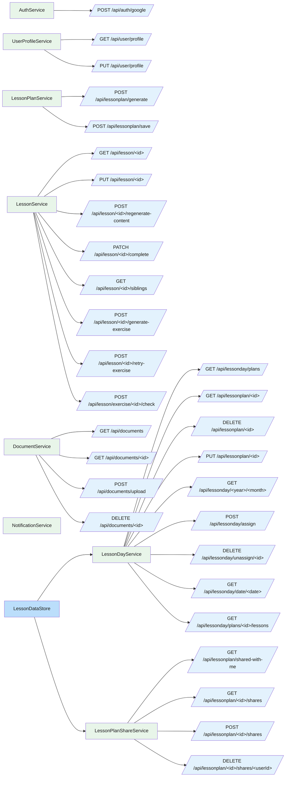
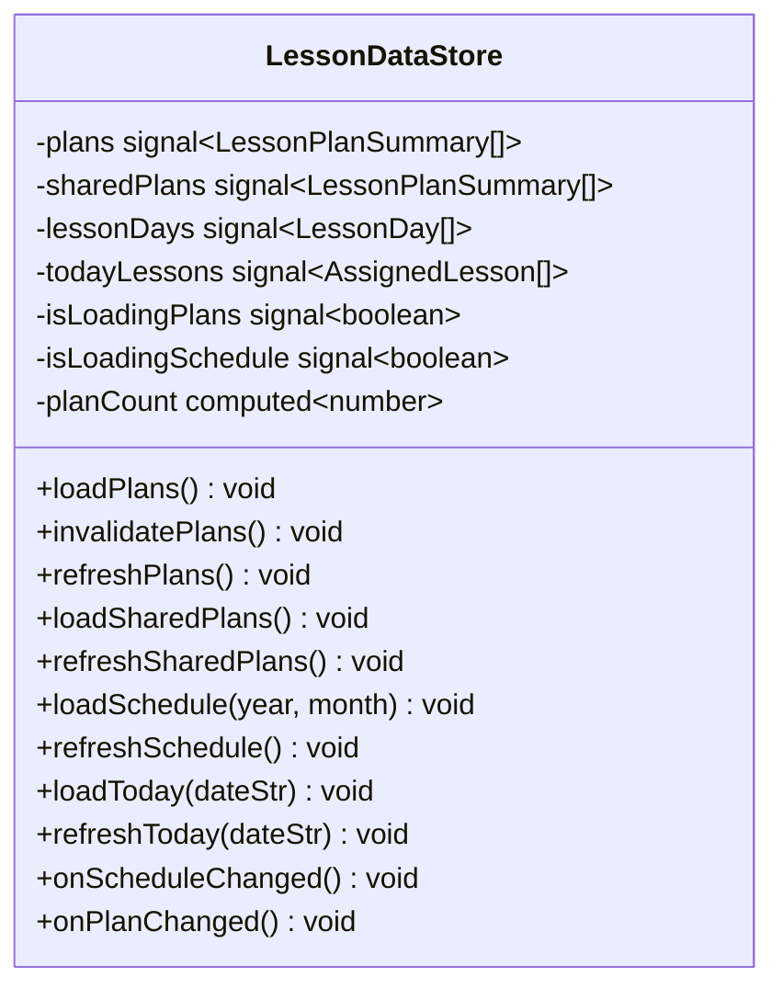
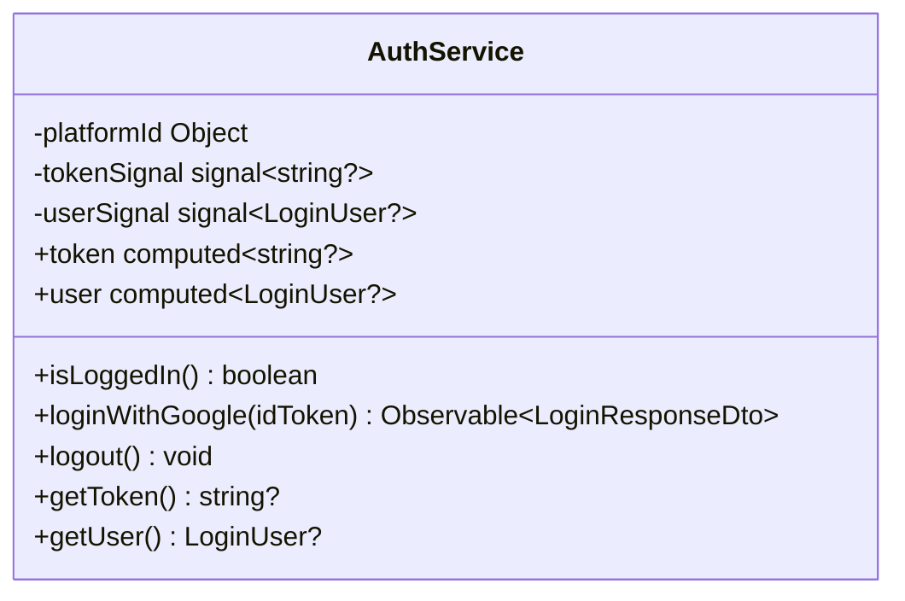

# Frontend — 04 Services

10 services + 1 in-memory state store ([LessonDataStore](../../lessonshub-ui/src/app/services/lesson-data.store.ts)). 8 are HTTP-facing, 1 ([RealtimeService](../../lessonshub-ui/src/app/services/realtime.service.ts)) owns the SignalR connection, and 1 ([JobsService](../../lessonshub-ui/src/app/services/jobs.service.ts)) is the central client for the `/api/jobs/*` surface — every async-generation endpoint goes through it.

> **Source files**: [lessonshub-ui/src/app/services/](../../lessonshub-ui/src/app/services/).

## SignalR job pipeline (`RealtimeService` + `JobsService`)

All AI-generation calls are async. The browser POSTs, gets `202 + jobId`, subscribes to the hub, then renders progress + final result as `JobEvent`s arrive. `JobsService.postAndStream` collapses that whole sequence — POST + subscribe + filter on terminal status + throw on failure — into one call so each AI-facing service method stays at ~3 lines.



Each AI-touching TS service (`LessonPlanService`, `LessonService`, `DocumentService`) returns `Observable<JobEvent>` from its generate-style methods. Components filter for `JobStatus.Completed`, parse `event.result` (JSON string) into the expected DTO via the service's `parse___Result` helper, and update their state. `JobStatus.Failed` causes the observable to error with the server's message. JWT is forwarded on the WS handshake via `accessTokenFactory: () => this.auth.getToken()`; the .NET side accepts `?access_token=…` only on `/hubs/*` paths.

### `JobsService` API

| Method | Purpose |
| --- | --- |
| `postAndStream<TBody>(url, body, opts?)` | The standard "fire-and-forget then stream" entry point. Auto-injects `X-Idempotency-Key`. Returns `Observable<JobEvent>` that emits per status transition, errors on `Failed`. |
| `subscribeToExistingJob(jobId)` | Resume tracking by id. Polls `GET /api/jobs/{id}` first to handle the race where the executor finished between page load and the WS handshake (emits a synthetic `Completed`/`Failed` event in that case). |
| `findInFlight(type, entityType?, entityId?)` | Single-job page-load probe. Returns the matching `JobDto` or `null`. |
| `listInFlightForEntity(entityType, entityId)` | All jobs the user has on one entity. Detail pages call this on load to repaint every active banner with one query. |
| `get(jobId)` | Polling fallback (used internally by `subscribeToExistingJob`). |

### In-flight recovery (revisit-after-navigation)

Jobs are decoupled from the UI lifecycle: the BG worker keeps running regardless of subscribers. So if the user navigates away mid-generation and comes back:

- **Lesson plan generate** — `LessonPlan.ngOnInit` calls `findInFlight('LessonPlanGenerate')`. If found, banner re-attaches and stream resumes. If the job already **completed** while the user was away, the result is also persisted to `localStorage['lessonshub:pendingPlan']` (24h TTL) so the form repopulates and the user can still hit Save without re-paying for generation.
- **Lesson detail** (content gen / regen / exercise gen / retry) — `LessonDetail.loadLesson` calls `listInFlightForEntity('Lesson', id)` (one query per page load) and dispatches each returned job to the matching banner via a `resumeJobByType` switch.
- **Other endpoints** — exercise review and document ingest don't restore banners on revisit (low value; data still lands correctly, page reload shows new state).

## Service → endpoint map



## `LessonDataStore`

The cross-component cache. Owns four signals and provides cache-aware loaders.



`loadX` checks the signal — if already populated and not stale, it's a no-op. `refreshX` is the explicit "I just mutated something, fetch again" call. The mutators (`onScheduleChanged`, `onPlanChanged`) reset the relevant signals so the next `loadX` call re-fetches.

## Per-service class summaries

### `AuthService` ([services/auth.service.ts](../../lessonshub-ui/src/app/services/auth.service.ts))



`isLoggedIn()` decodes the JWT, checks `exp`, and returns false if expired. SSR-aware: returns `false` when running on the server (no `localStorage`).

### `LessonPlanService` ([services/lesson-plan.service.ts](../../lessonshub-ui/src/app/services/lesson-plan.service.ts))

```typescript
class LessonPlanService {
  generateLessonPlan(request: LessonPlanRequest): Observable<LessonPlanResponse>
  saveLessonPlan(
    plan, description, lessonType,
    nativeLanguage?, documentId?, languageToLearn?, useNativeLanguage?
  ): Observable<any>
}
```

The save signature carries the trio of language fields so the component can send only the relevant ones (Language → all three, Default/Technical → just `nativeLanguage`).

### `LessonService` ([services/lesson.service.ts](../../lessonshub-ui/src/app/services/lesson.service.ts))

```typescript
class LessonService {
  getLessonById(id): Observable<Lesson>
  generateExercise(id, difficulty, comment?): Observable<Exercise>
  retryExercise(id, difficulty, comment?, review): Observable<Exercise>
  submitExerciseAnswer(exerciseId, answer): Observable<ExerciseAnswer>
  updateLesson(id, info: UpdateLessonInfo): Observable<Lesson>
  regenerateContent(id, bypassDocCache): Observable<Lesson>
  completeLesson(id): Observable<Lesson>
  getSiblingLessonIds(id): Observable<SiblingLessons>
}
```

### `LessonDayService` ([services/lesson-day.service.ts](../../lessonshub-ui/src/app/services/lesson-day.service.ts))

```typescript
class LessonDayService {
  getLessonPlans(): Observable<LessonPlanSummary[]>
  getLessonPlanDetail(id): Observable<LessonPlanDetail>
  deleteLessonPlan(id): Observable<void>
  updateLessonPlan(id, request: UpdateLessonPlanRequest): Observable<LessonPlanDetail>
  getAvailableLessons(planId): Observable<AvailableLesson[]>
  getLessonDaysByMonth(year, month): Observable<LessonDay[]>
  assignLesson(request: AssignLessonRequest): Observable<void>
  unassignLesson(lessonId): Observable<void>
  getLessonDayByDate(date): Observable<LessonDay?>
}
```

### `DocumentService` ([services/document.service.ts](../../lessonshub-ui/src/app/services/document.service.ts))

```typescript
class DocumentService {
  list(): Observable<Document[]>
  get(id): Observable<Document>
  upload(file: File): Observable<UploadProgress>  // emits {progress: 0-100} or {document: Document}
  delete(id): Observable<void>
}
```

`upload` returns `Observable<UploadProgress>` instead of `Observable<Document>` because it surfaces `HttpEventType.UploadProgress` events for the progress bar.

### `LessonPlanShareService` ([services/lesson-plan-share.service.ts](../../lessonshub-ui/src/app/services/lesson-plan-share.service.ts))

```typescript
class LessonPlanShareService {
  getSharedWithMe(): Observable<LessonPlanSummary[]>
  getShares(planId): Observable<LessonPlanShareItem[]>
  addShare(planId, request: AddShareRequest): Observable<LessonPlanShareItem>
  removeShare(planId, userId): Observable<void>
}
```

### `UserProfileService` ([services/user-profile.service.ts](../../lessonshub-ui/src/app/services/user-profile.service.ts))

```typescript
class UserProfileService {
  getProfile(): Observable<UserProfile>
  updateProfile(request: UpdateUserProfileRequest): Observable<UserProfile>
}
```

### `NotificationService` ([services/notification.service.ts](../../lessonshub-ui/src/app/services/notification.service.ts))

Local-state only — emits toasts that the root `App` component renders. No HTTP.

```typescript
class NotificationService {
  success(message: string): void  // auto-dismiss 4s
  error(message: string): void    // auto-dismiss 6s
  clear(): void
  current = signal<Notification | null>(null);
}
```

## Service injection patterns

All services are `@Injectable({ providedIn: 'root' })` — single shared instance per app.

Components inject via the constructor or `inject()`:

```typescript
constructor(private lessonPlanService: LessonPlanService) {}
// or
private docs = inject(DocumentService);
```

Modern code prefers `inject()` (used in functional guards + standalone components), but constructor injection still works fine for class components.

## Error handling pattern

Components subscribe with `next` + `error` callbacks. The error path typically:

1. Sets a local `error` signal to display in the template.
2. Calls `notify.error('user-friendly message: ' + (err.error?.message || err.message))`.
3. Resets any loading signals.

There's no global error interceptor — errors surface where the call originated.
